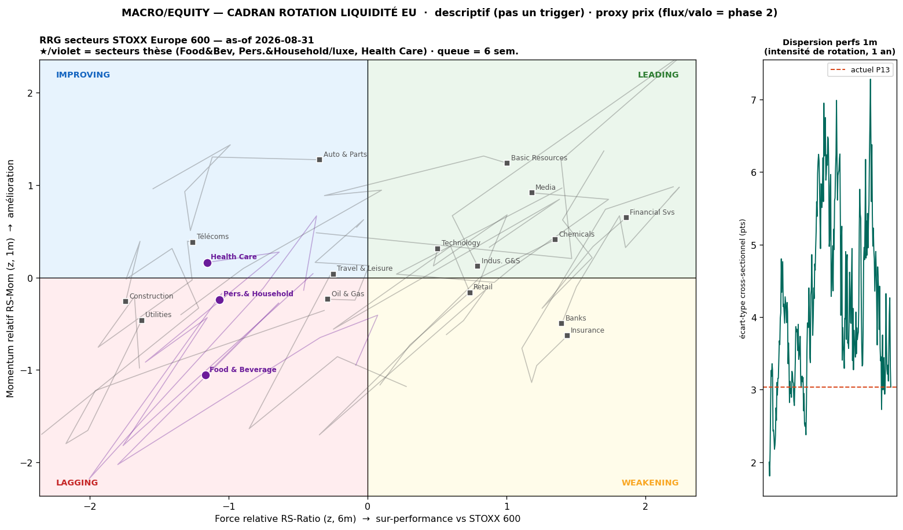
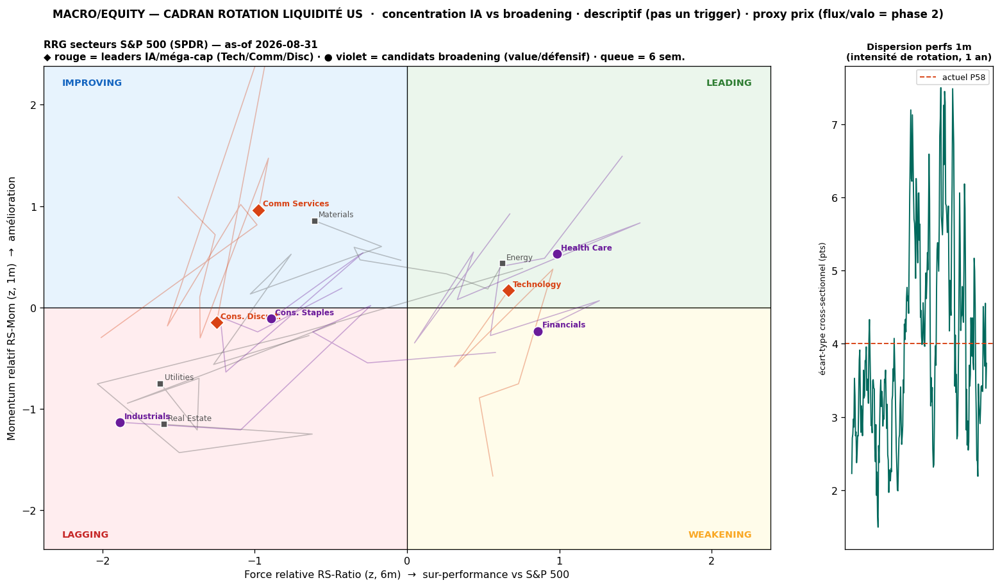
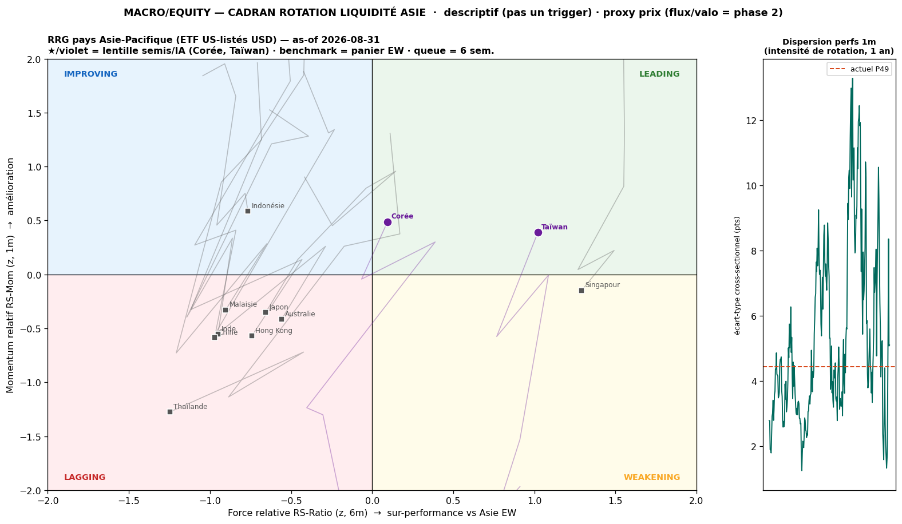

# 🎛️ Cockpit Rotation

> Poste de pilotage **fixe & glanceable** de la rotation de liquidité sectorielle. Figures = `*_latest.png` (nom stable → **toujours le dernier run**, aucun re-pointage). Cadrans **DESCRIPTIFS, pas des triggers** · proxy **PRIX** (flux ETF / valo = dette phase 2).
> **Dernier run : EU as-of 2026-08-31 · US as-of 2026-08-31 · Asie as-of 2026-08-31** (clôtures Yahoo) — rerun hebdo. ⚡ Franchissements du 31/08 (watcher daily) intégrés.

---

## 🚦 État en un coup d'œil

| Zone | Régime | État rotation | Dispersion | 🚦 |
|---|---|---|---|:--:|
| 🇪🇺 **EU** (STOXX 600) | ⚡ **1ère brique** — Health Care LAGGING→IMPROVING (2ᵉ tentative) | rotation-IN **1 / 3** (Health Care IMPROVING) | P13 (très basse) | 🟡 |
| 🇺🇸 **US** (S&P 500) | **re-concentration IA** — Comm Services rejoint l'IA ; broadening resté **défensif** | broadening risk-on **0 / 4** (Health Care LEADING mais défensif) | P58 (modérée) | 🔴 |
| 🌏 **Asie** (pays, USD) | **semis/IA (Corée/Taïwan) en tête** — mais par rebond ; Chine/Inde/Japon LAGGING | KR/TW LEADING, ADR TSM/BABA LAGGING | P49 (modérée) | 🟡 |

**🧭 Cross-asset** : EU esquisse une **1ère brique** (Health Care IMPROVING) mais en régime **dispersion P13 ≈ nulle** → fragile ; US voit l'**IA se re-concentrer** (Comm Services rejoint, MAGS IMPROVING) et son seul relais de force est **défensif** (Health Care LEADING), pas cyclique — small caps (IWM) toujours LAGGING. **L'Asie confirme le driver IA** : semis KR/TW en tête mais **non validés par les ADR** (TSM/BABA LAGGING). *Rien à sur-sizer : rotations défensives/IA, pas de broadening risk-on sain.*

---

## 🇪🇺 EU — STOXX Europe 600


- **Secteurs-thèse** : ⚡ **Health Care LAGGING→IMPROVING** (RS −1,16 / Mom +0,16, rel3m −1,0 %) = **1ère brique rotation-IN** (2ᵉ tentative après le faux départ d'août) ; Food&Bev & Pers.&Household **toujours LAGGING**.
- **Noms** : le **luxe se réveille** — **Hermès IMPROVING (Mom +1,51)**, EssilorLuxottica IMPROVING (Mom +0,84) ; côté cognac RCO →WEAKENING (Mom −0,97), PR →LAGGING.
- **Action** : franchissement à **CONFIRMER 2-3 sem** — dispersion **P13 (très basse)** = rotation pas encore activée, ne pas sur-sizer sur une seule brique.

→ Détail : [[Research/2026-08-14 - Cadran Rotation Liquidite EU (secteurs STOXX 600)]] · alertes : [[Macro/Quant/analysis/eu-rotation/ALERTES rotation EU]]

## 🇺🇸 US — S&P 500 (SPDR)


- **◆ IA/méga-cap** : ⚡ **Comm Services LAGGING→IMPROVING** (rebond IA), Technology **toujours LEADING**, MAGS IMPROVING (Mom +0,52) → re-concentration qui persiste ; Cons. Discret. IMPROVING→LAGGING (rebond IA avorté).
- **★ broadening** : ⚡ **Health Care WEAKENING→LEADING** (rel3m +16,0 %) mais leadership **défensif**, pas cyclique ; Financials WEAKENING, Staples/Industrials LAGGING, **IWM (small caps) LAGGING** → pas de broadening risk-on sain.
- **Action** : dispersion **P58** (modérée) ; IA + défensif mènent, cycliques/small caps à la traîne → **prudence haussière maintenue** sur le beta.

→ Détail : [[Research/2026-08-19 - Cadran Rotation Liquidite US (secteurs S&P 500)]] · alertes : [[Macro/Quant/analysis/us-rotation/ALERTES rotation US]]

## 🌏 Asie — pays Asie-Pacifique (ETF US-listés, USD)


- **★ Semis/IA** : **Taïwan LEADING** (RS +1,04) · **Corée LEADING** mais **de rebond** (1m +12,5 % / rel3m −15,4 %) → le thème IA mène l'Asie au niveau pays.
- **Nuance** : **ADR TSM & BABA LAGGING** → leadership porté par l'indice/rebond, pas par les méga-cap. **Chine/Inde/Japon LAGGING** ; Indonésie seule IMPROVING.
- **Benchmark** = panier equal-weight synthétique (« Asie EW »). Dispersion **P49** (l'Asie rotationne + que EU/US).
- **Action** : lecture de confirmation du driver IA ; pas de signal pays actionnable tant que KR/TW ne sont pas validés par les ADR.

→ Détail : [[Research/2026-08-31 - Cadran Rotation Liquidite Asie (pays Asie-Pacifique)]] · alertes : [[Macro/Quant/analysis/asia-rotation/ALERTES rotation ASIE]]

---

## ✅ Conditions à cocher (rerun hebdo)

**🇪🇺 EU — rotation-IN crédible**
- [ ] Un secteur-thèse **LAGGING→IMPROVING** *et tient 2-3 sem* (pas un aller-retour)
- [ ] Dispersion 1m **>P70**
- [ ] Catalyseur exogène : détente taxe cognac Chine / guidance RCO

**🇺🇸 US — broadening risk-on sain**
- [ ] **★ROT en IMPROVING accélérant** (Industrials/Staples franchissent vers le haut, tiennent 2-3 sem)
- [ ] **IWM (small caps) repasse LEADING**
- [ ] Dispersion **>P70**
- [ ] **◆IA bascule LAGGING** (Tech suit Comm Services) = rotation-OUT confirmée
- [ ] ⚠️ *Piège inverse (actif aujourd'hui)* : MAGS/Tech LEADING = **re-concentration**, broadening avorte

**🌏 Asie — signal semis validé / bascule**
- [ ] **KR/TW restent LEADING + TSM/BABA rejoignent IMPROVING/LEADING** = leadership semis validé au niveau des noms
- [ ] **Chine LAGGING→IMPROVING** (+ catalyseur relance/PBoC) = rotation-IN sur le plus délaissé
- [ ] Dispersion **>P70** = rotation asiatique qui s'active
- [ ] **Japon LAGGING→IMPROVING** (couplé BoJ/yen) = bascule du bloc développé

---

## ⚙️ Rafraîchir / maintenir
```bash
cd "Macro/Quant/engine/rotation"
python3 eu_rotation.py && python3 us_rotation.py && python3 asia_rotation.py
```
- Cadence **hebdo** (le daily n'ajoute que du bruit). Chaque run régénère `*_latest.png` (embarqué ici) + figure datée + report + log `rotation_history.csv`.
- Watchers quotidiens `*_rotation_watch.py` → alertent **uniquement** sur franchissement / dispersion >P70 (append dans `ALERTES rotation *.md`).
- **Après un rerun** : MAJ la ligne « Dernier run », le tableau 🚦 et les 3 puces de chaque zone (le reste est auto via `*_latest.png`).
