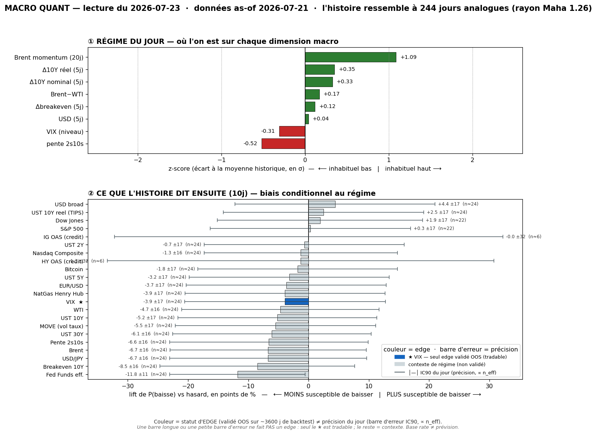

# 📊 Macro Quant Daily — Couche 2
**Run 2026-07-23 · régime as-of 2026-07-21** (dernière donnée FRED complète) · 244 analogues (rayon Maha 1,26)

> **Ce que dit cette note** : dans quels régimes historiquement comparables à aujourd'hui les marchés se sont trouvés, et **combien de fois** un asset a monté/baissé ensuite. **Base rate ≠ prévision.** Fiabilité forward = IC hold-out du [[2026-07-23 - Backtest Robustesse (DSR PBO Holdout)|backtest robustesse]] : **VIX seul est exploitable en direction**, le reste = contexte de régime.

> ⚠️ **Caveat latence oil** : FRED Brent/WTI s'arrêtent au **13/07**, la donnée complète est as-of **21/07**. `brent_mom` **+1,09σ** capte le début du melt-up mais **sous-estime** le live (Brent **$95** le 23/07, +4% 4ᵉ séance). La feature domine le matching → analogues pris sur « momentum oil fort » : **directionnellement aligné** avec le live (pas d'inversion comme le 14/07), mais légèrement en retard sur un move qui accélère encore.

---

## 1. Régime du jour (z-scores expanding, causaux)

| Feature | z | Lecture |
|---|---:|---|
| `brent_mom` (Brent 20j) | **+1,09** | momentum pétrole fort (melt-up) — **domine le matching** |
| `dreal_5` (Δ10Y réel) | +0,35 | taux réels se tendent |
| `d10_5` (Δ10Y nominal) | +0,33 | 10Y en hausse |
| `brwti` (Brent−WTI) | +0,17 | spread au-dessus de sa moyenne |
| `dbe_5` (Δbreakeven) | +0,12 | inflation anticipée en légère hausse |
| `dusd_5` (USD 5j) | +0,04 | USD à plat |
| `vix_lvl` | −0,31 | VIX sous sa moyenne — calme |
| `slope` (2s10s) | −0,52 | courbe plus plate que la moyenne |

**Signature** = *momentum pétrole fort + taux (réels & nominaux) qui se tendent + inflation anticipée qui monte + vol calme + courbe plate*. Analogue = **régime « reflation / inflation-oil » avec yields↑ et vol contenue**. PCA : PC1-5 = 24/23/16/13/9 %.

---

## 2. Base rates forward — horizon 10 jours

> `meanC` = rendement moyen conditionnel · `lift` = écart au baseline · `%neg` = fréq. de baisse conditionnelle. Unités : % (prix), bps (taux), pts (VIX/MOVE). **fiab. OOS** = IC hold-out (backtest).

| Asset | meanC | lift | %neg C | n_eff | tag | fiab. OOS |
|---|---:|---:|---:|---:|:--:|:--:|
| **VIX ★** | +0,57 pt | +0,55 | 50 | 24 | 🟡 | ✅ **IC +0,16** |
| Brent | +1,43% | +1,36 | 39 | 24 | 🟡 | ≈0 — contexte |
| WTI | +1,37% | +1,30 | 41 | 24 | 🟡 | ≈0 — contexte |
| Breakeven 10Y | +2,05 bps | +2,06 | 38 | 24 | 🟡 | ≈0 — contexte |
| UST 30Y | +0,91 bps | +0,89 | 43 | 24 | 🟡 | ≈0 — contexte |
| UST 10Y | +0,70 bps | +0,76 | 43 | 24 | 🟡 | ≈0 — contexte |
| Pente 2s10s | +0,82 bps | +0,73 | 43 | 24 | 🟡 | ≈0 — contexte |
| UST 10Y réel | −1,35 bps | −1,30 | 52 | 24 | 🟡 | ≈0 — contexte |
| MOVE (vol taux) | +0,52 pt | +0,50 | 47 | 24 | 🟡 | ≈0 — réfuté 23/07 |
| USD broad | −0,01% | −0,06 | 54 | 24 | 🟡 | ≈0 — contexte |
| S&P 500 | +0,40% | −0,10 | 35 | 22 | 🟡 | ≈0 — contexte |
| Nasdaq Comp. | +0,42% | −0,06 | 36 | 24 | 🟡 | ≈0 — contexte |
| Bitcoin | +3,23% | +1,52 | 43 | 24 | 🟡 | ≈0 — **réfuté 23/07** (overfit) |
| HY OAS (credit) | −0,37 bps | +1,17 | 55 | **6** | 🔴 | ≈0 — bruit (n faible) |

---

## 3. Conclusion statistique — filtrée par le hold-out

**Le seul read forward défendable :**
- ⚠️ **VIX** : pred **+0,57 pt @10j**, %neg 50 (**coin-flip**, contre-exemple 1 fois sur 2). Léger biais vol-up, **modeste**. Mais à croiser avec le live : **escalade géopol Iran (Couche 1) + VIX <20** = le seul signal validé penche *up* dans un contexte où la complaisance est vulnérable → **raison de ne PAS être short vol**, de dimensionner le risque, pas d'un long vol agressif.

**Base rates de contexte (PAS de skill OOS — ne pas trader la direction) :**
- **Oil** (Brent +1,4%, WTI +1,3%) : le régime « momentum oil fort » a historiquement continué up *contemporainement* — mais IC OOS ≈ 0 **et** donnée vintage → **contexte, pas un pari**. Confirme la *toile de fond*, ne trade pas.
- **Yields ↑** (10Y +0,7 bps, 30Y +0,9, breakeven +2,0) + **réel qui baisse** : régime reflation-oil cohérent (inflation anticipée monte, taux réels se détendent un peu forward). Contexte.
- **Actions** (S&P/NQ) : mean_cond légèrement + mais **lift ≈ 0** (au baseline) → le régime ne dit **rien** sur les indices. Muet.
- **Bitcoin** (nouveau, resp-only) : meanC +3,2% mais lift noyé dans une vol 10j de ±20-30% → **rien d'exploitable**. Backtest hold-out du 23/07 : IC in-sample +0,167 (bluffant, ≈ VIX) mais **s'effondre à −0,056 OOS** → **piège d'overfitting, réfuté**. Edge macro seulement en 2015-2016 (BTC immature), évaporé depuis. Contexte.

**Traduction conviction** : Couche 2 apporte une seule chose exploitable — un **léger biais vol-up**, pertinent vu la géopol live. Pour la direction oil/yields/actions : contexte de régime (reflation-oil), aucune conviction directionnelle propre. C'est la Couche 1 (niveaux/AMT + catalyseurs ECB/Intel) qui pilote.

---

## 4. Confrontation Couche 1 ↔ Couche 2

| Dimension | Couche 1 (daily live 23/07) | Couche 2 (quant as-of 21/07) | Verdict |
|---|---|---|---|
| **Oil** | melt-up Brent $95, 7-wk high, +4% 4ᵉ séance (géopol) | `brent_mom` +1,09σ, base rate +1,4% | ✅ **convergent** (oil enfin capté, léger lag) |
| **Yields** | rally duration, inflation-oil | taux réels/nominaux se tendent, breakeven +2 bps | ✅ **convergent** |
| **Vol** | VIX <20, contango présumé | VIX calme (−0,31σ) mais **forward +0,55 pt** | ✅ convergent sur le calme; ⚠️ C2 penche *up* forward |
| **Indices** | split semis > mega-cap capex | **muet** (lift ≈ 0 S&P/NQ) | ⚖️ C2 sans edge → priorité Couche 1 |
| **USD/Gold** | gold bid mais capé par taux, USD mixte | USD à plat, pas de signal | ⚖️ neutre |

> **Convergence forte cette fois sur le socle macro (oil/yields/vol)** — contrairement au run du 14/07 où l'oil était vintage-inversé. Là où les deux couches s'accordent (reflation-oil + yields↑ + vol calme mais fragile), la lecture de régime se **renforce**. Le seul apport *tradable* de la Couche 2 reste le **biais vol-up modeste** — cohérent avec le risque géopol live.

---

## 5. À rerunner
- Dès que FRED intègre Brent/WTI post-13/07 → `brent_mom` collera au live ($95), l'analogie « melt-up » se précisera.
- **Gold** toujours manquant (trou data FRED).
- Base perso : 1er run archivé (`db/`) → la lecture cross-day (`analyze_db.py`) deviendra parlante vers ~30-60 runs.
- Backtest OOS trimestriel (`macro_quant_backtest.py`) pour rafraîchir la liste des assets validés (VIX only à ce jour).
