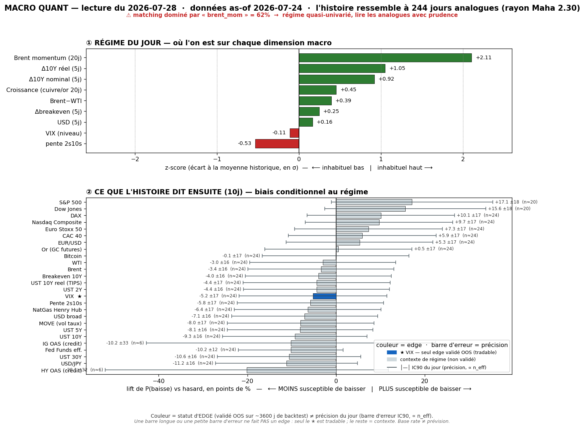

# 📊 Macro Quant Daily — Couche 2
**Run 2026-07-28 · régime as-of 2026-07-24** (dernière donnée FRED complète)

> **Ce que dit cette note** : dans quels régimes historiquement comparables à aujourd'hui se sont trouvés les marchés, et **combien de fois** un asset a monté/baissé ensuite — avec `n_eff`, **lift vs hasard**, IC bootstrap, tag. **Base rate ≠ prévision.** Dimensionne la conviction ; ne remplace pas la Couche 1 (niveaux/AMT du daily). Méthodo : [[Wiki/macro/Macro-Quant-Methodo]].

> ⚠️ **FILTRE OOS (dur)** — cf. [[Macro/Quant/research/2026-07-14 - Backtest Validation]] : **seul le VIX** a un IC hors-échantillon significatif (0,170, t=3,22). Pour **tout autre asset** (indices, USD, FX, taux, oil, crédit, or, BTC) le base rate est affiché **en contexte de régime uniquement** — *pas de skill OOS, direction non exploitable*. Ne jamais présenter ces lignes comme un pari.

> ⚠️ **CAVEAT VINTAGE MAJEUR (miroir inversé du 14/07)** : FRED oil s'arrête au **~24/07**, donc `brent_mom` = **+2,11σ** reflète le pétrole **APRÈS le spike Hormuz**, en pleine flambée. Or le live 28/07 montre l'**inverse** : Brent **déflate** (settle lundi $85,87, −6,3% ; désescalade Hormuz Oman/Iran ; Trump « good chance » deal Iran). La feature qui **domine** le matching est donc encore une fois **désalignée du live**, mais dans l'autre sens qu'au 14/07 → les analogues sont pris sur des épisodes de **reflation oil-up**, pas sur le repli en cours. **Cette Couche 2 sur-price un régime reflationniste** que le live est en train de défaire. Idem `dreal_5`/`d10_5` (+1σ, taux réels ↑ as-of 24/07) alors que l'US10 **reflue** à 4,63% le 28/07 (bonds bid).

---

## 1. Régime du jour (z-scores expanding, causaux)

| Feature | z | Lecture |
|---|---:|---|
| `brent_mom` (Brent 20j) | **+2,11** | ⚠️ **vintage 24/07** — oil post-spike en flambée, domine le matching, désaligné du repli live |
| `dreal_5` (Δ10Y réel) | **+1,05** | taux réels se tendent fort (as-of 24/07) — live 28/07 : yields refluent |
| `d10_5` (Δ10Y nominal) | +0,92 | 10Y en nette hausse (vintage) |
| `growth` | +0,45 | proxy croissance au-dessus de sa moyenne |
| `brwti` (Brent−WTI) | +0,39 | spread au-dessus de la moyenne |
| `dbe_5` (Δbreakeven) | +0,25 | inflation anticipée qui remonte un peu |
| `dusd_5` (USD 5j) | +0,16 | USD légèrement ferme |
| `vix_lvl` | −0,11 | VIX ~neutre, proche moyenne |
| `slope` (2s10s) | −0,53 | courbe plus plate que la moyenne |

**Signature** = *taux réels + nominaux qui se tendent + breakeven ↑ + momentum pétrole fortement positif + courbe plate* → analogue **reflation / rates-up + oil-up**. **Échantillon** : 2007-01 → 2026-07, **244 analogues** (rayon Maha 2,30), PCA : PC1-5 = 23/19/13/13/10 %.

> ⚠️ Rappel : cette signature est **backward** (as-of 24/07). Le driver **live** du 28/07 n'est PAS dans ces features — c'est un **risk-off chip-led / doute AI-capex ROI** (idiosyncratique tech), avec oil qui déflate et bonds bid. Le régime matché décrit un monde reflationniste que le marché est en train d'abandonner.

---

## 2. Base rates forward — horizon 10 jours

`meanC` = rendement moyen conditionnel · `lift` = écart au baseline · `%neg` = fréquence de baisse · **OOS** = direction exploitable hors-échantillon (VIX seul) · unités : **% pour prix, bps pour taux, points pour VIX**.

| Asset | meanC | baseline | lift | %neg C | %neg base | IC90 | n_eff | tag | OOS |
|---|---:|---:|---:|---:|---:|---|---:|:--:|:--:|
| **VIX** | **+0,62 pt** | +0,01 | **+0,60** | 48,4 | 53,5 | [+0,24 ; +0,99] | 24 | 🟡 | ✅ **exploitable** |
| MOVE (vol taux) | +2,46 | +0,02 | +2,43 | 44,7 | 52,7 | [+1,33 ; +3,65] | 24 | 🟡 | contexte |
| UST 30Y | +3,91 bps | +0,03 | +3,88 | 38,1 | 48,7 | [+2,57 ; +5,29] | 24 | 🟡 | contexte |
| UST 10Y | +3,41 bps | −0,05 | +3,47 | 39,3 | 48,6 | [+2,06 ; +4,80] | 24 | 🟡 | contexte |
| UST 5Y | +2,41 bps | −0,10 | +2,52 | 41,4 | 49,5 | [+1,01 ; +3,93] | 24 | 🟡 | contexte |
| UST 2Y | +1,99 bps | −0,15 | +2,14 | 42,6 | 47,0 | [+0,66 ; +3,35] | 24 | 🟡 | contexte |
| UST 10Y réel | +1,94 bps | −0,04 | +1,98 | 45,5 | 49,9 | [+0,39 ; +3,51] | 24 | 🟡 | contexte |
| Breakeven 10Y | +1,48 bps | −0,01 | +1,49 | 42,6 | 46,6 | [+0,57 ; +2,37] | 24 | 🟡 | contexte |
| Pente 2s10s | +1,42 bps | +0,10 | +1,33 | 43,4 | 49,2 | [+0,32 ; +2,48] | 24 | 🟡 | contexte |
| S&P 500 | −0,48% | +0,50 | −0,98 | 51,5 | 34,4 | [−0,83 ; −0,09] | **20** | 🟡 | contexte |
| Nasdaq Comp. | −0,34% | +0,48 | −0,83 | 47,5 | 37,8 | [−0,70 ; +0,04] | 24 | 🟡 | contexte |
| Dow Jones | −0,27% | +0,42 | −0,69 | 52,9 | 37,3 | [−0,59 ; +0,05] | **20** | 🟡 | contexte |
| DAX | −0,29% | +0,27 | −0,56 | 52,0 | 41,9 | [−0,59 ; −0,00] | 24 | 🟡 | contexte |
| Euro Stoxx 50 | −0,35% | +0,08 | −0,43 | 51,6 | 44,3 | [−0,67 ; −0,02] | 24 | 🟡 | contexte |
| Brent | +1,11% | +0,06 | +1,05 | 42,6 | 46,0 | [+0,33 ; +1,86] | 24 | 🟡 | contexte |
| WTI | +0,84% | +0,07 | +0,78 | 42,6 | 45,7 | [+0,03 ; +1,68] | 24 | 🟡 | contexte |
| USD broad | +0,21% | +0,04 | +0,17 | 42,2 | 49,3 | [+0,07 ; +0,35] | 24 | 🟡 | contexte |
| USD/JPY | +0,28% | +0,06 | +0,22 | 36,1 | 47,3 | [+0,12 ; +0,44] | 24 | 🟡 | contexte |
| EUR/USD | −0,22% | −0,03 | −0,20 | 55,7 | 50,4 | [−0,41 ; −0,04] | 24 | 🟡 | contexte |
| Or (GC) | +0,07% | +0,38 | −0,31 | 44,7 | 44,2 | [−0,27 ; +0,44] | 24 | 🟡 | contexte |
| Bitcoin | +1,92% | +1,70 | +0,22 | 44,7 | 44,8 | [+0,75 ; +2,99] | 24 | 🟡 | contexte |
| HY OAS (crédit) | +4,52 bps | −1,62 | +6,13 | 37,1 | 57,2 | [−0,31 ; +9,47] | **6** | 🔴 | contexte |
| IG OAS (crédit) | +1,00 bps | −0,62 | +1,62 | 41,9 | 52,1 | [+0,23 ; +1,77] | **6** | 🔴 | contexte |

### 2bis. Term-structure — VIX (seul asset OOS-exploitable)

La table ci-dessus fige l'horizon **10 j** pour tous (contexte). Mais l'horizon ne change une **décision** que là où l'asset a un skill OOS → le **VIX seul**. On y déroule donc les 3 horizons (les autres assets n'étant pas exploitables, tripler leur ligne = fausse précision). ⚠️ On ne « choisit » pas l'horizon a posteriori (= horizon-picking) : les 3 sont montrés, l'horizon de référence OOS reste **fixé par le backtest**.

| Horizon | lift | IC90 | n_eff | tag | Lecture |
|---|---:|---|---:|:--:|---|
| 5 j | +0,26 pt | [−0,02 ; +0,56] | 49 | 🟡 | **touche 0** → marginal ce jour (malgré n_eff le + haut) |
| **10 j** | **+0,60 pt** | **[+0,24 ; +0,99]** | 24 | 🟡 | **exclut le hasard nettement — le read le + propre du run** |
| 20 j | +0,54 pt | [−0,04 ; +1,10] | 12 | 🔴 | englobe 0, n_eff faible → indicatif |

> Term-structure **croissante puis fragile** : vol biaisée à la hausse, signal qui **se cristallise à 10 j** et se dissipe en robustesse à 20 j (n_eff s'effondre). Rappel backtest : le VIX est structurellement + propre à **5 j** en moyenne longue (t=3,99), mais **ce run précis** exclut mieux le zéro à 10 j. Les deux convergent sur le **sens** (vol ↑), seule l'amplitude/horizon varie.

---

## 3. Conclusion statistique (le chiffre, pas l'affirmation)

**Seule lecture forward défendable (filtre OOS) :**
- **VIX ↑ modeste : +0,6 pt à 10 j** (baseline ~0), IC90 [+0,24 ; +0,99] excluant le hasard, 🟡 n_eff≈24. C'est le **seul asset à IC OOS significatif** (0,170). Le régime a historiquement été suivi d'une **remontée modérée de vol**. À 5 j lift +0,26 mais IC [−0,02 ; +0,56] **touche 0** (marginal) ; à 20 j 🔴. → **la fenêtre 10 j est la plus propre.**

**Tout le reste = contexte de régime, PAS un pari** (IC OOS ≈ 0, cf. backtest) :
- Le régime reflationniste matché « raconte » : bonds qui se vendent (yields UST +3-4 bps mean), indices US/EU en repli (%neg 48-53% vs 34-44% baseline), oil qui monte, USD ferme, crédit qui s'écarte. **Mais ces directions ne sont pas exploitables OOS** — et surtout elles décrivent un monde **pré-repli oil** que le live défait.
- **Ne pas lire « oil +1,1% » ni « yields +3 bps » comme un signal** : ce sont des artefacts du régime vintage oil-up. Le live va exactement dans l'autre sens (oil ↓, yields ↓).
- Rappel contre-exemples : même sur le VIX, dans ~48% des analogues le VIX **baisse** à 10 j — biais, pas fatalité.

---

## 4. Confrontation Couche 1 ↔ Couche 2

| Dimension | Couche 1 (daily AMT/niveaux, live 28/07) | Couche 2 (quant, as-of 24/07) | Verdict |
|---|---|---|---|
| Vol | VIX 18,67 contenu <20, intraday ↑ probable sur chip rout | **VIX ↑ +0,6 pt @10j (🟡 ✅ OOS)** | ✅ **convergent** — seul signal tradeable, renforcé |
| Indices | risk-off chip-led, NQ1! 27 919 a perdu l'AVWAP CT, glisse vers VAL | biais baissier (NQ/SPX/DAX %neg↑) **mais contexte only** | ⚖️ même sens, mais conviction vient de C1 (pas OOS) |
| Taux | US10 **4,63% reflue** (−2bps), bonds bid sur oil↓ + risk-off | régime dit yields **↑** (+3-4 bps, vintage rates-up) | ❌ **divergence = vintage** — priorité C1 (non OOS de toute façon) |
| Oil | Brent **déflate** ($85,87 −6,3%, désescalade Hormuz) | `brent_mom` +2,11 → oil **↑** (post-spike, non capté repli) | ❌ **divergence = LE caveat** (miroir inversé du 14/07) |
| USD | DXY 101,54 ferme (~plus-haut 1 mois), veille FOMC | USD broad légèrement ferme (contexte) | ⚖️ minor converge, non exploitable |
| Crédit | CDS Big Tech AI-capex **se matérialise en équités** (signal 24/07) | HY/IG OAS s'écartent (🔴 n_eff=6, non fiable) | ⚖️ même sens qualitatif, mais C2 trop peu de data |

> **La divergence taux/oil EST le diagnostic** : `brent_mom` +2,11 et `dreal_5` +1σ figent un instantané reflationniste du 24/07 que le live du 28/07 est en train de casser (oil ↓, yields ↓, driver = doute AI-capex). Là où les deux couches **convergent** — **VIX ↑** (et il se trouve que c'est le seul read OOS-valide) — la conviction se renforce : **vol biaisée à la hausse, cohérente avec le risk-off chip-led + veille FOMC.** Partout ailleurs, priorité absolue à la Couche 1 live.

---

## 5. À rerunner
- **Dès que FRED intègre l'oil post-24/07** → `brent_mom` basculera vers le repli, l'analogie quittera le régime reflationniste. C'est le run qui donnera le base rate du **vrai** régime risk-off oil-down.
- **Post-FOMC 29/07** (20h) → catalyseur d'amplification/apaisement, à recapturer en `/macro-flash` puis Couche 2.
- Rafraîchir `macro_quant_backtest.py` (trimestriel) : vérifier si MOVE (vol taux, nouvellement ajouté) rejoint le VIX dans la liste des assets à IC OOS significatif — la littérature le suggère.
- Trou connu comblé : **Or (GC)** et **BTC** désormais dans l'univers ; **MOVE** ajouté côté réponse.
