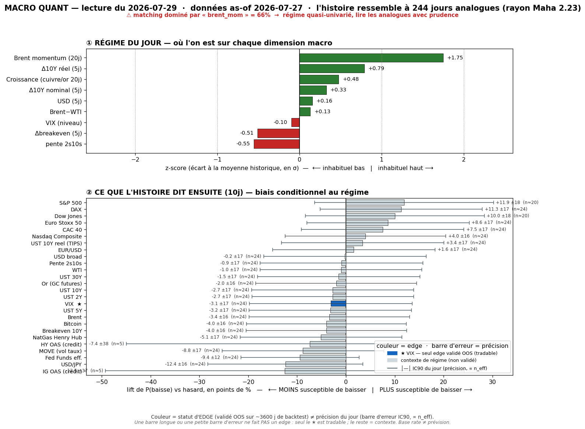

# 📊 Macro Quant Daily — Couche 2
**Run 2026-07-29 · régime as-of 2026-07-27** (dernière donnée FRED complète)

> **Ce que dit cette note** : dans quels régimes historiquement comparables à aujourd'hui se sont trouvés les marchés, et **combien de fois** un asset a monté/baissé ensuite — avec `n_eff`, **lift vs hasard**, IC bootstrap, tag. **Base rate ≠ prévision.** Dimensionne la conviction ; ne remplace pas la Couche 1. Méthodo : [[Wiki/macro/Macro-Quant-Methodo]].

> ⚠️ **FILTRE OOS (dur)** — cf. [[Macro/Quant/research/2026-07-14 - Backtest Validation]] : **seul le VIX** a un IC hors-échantillon significatif (0,170, t=3,22). Pour **tout autre asset** le base rate est affiché **en contexte de régime uniquement** — *pas de skill OOS, direction non exploitable*.

> ✅ **CAVEAT VINTAGE — nettement atténué ce run.** FRED oil s'arrête au **~27/07**, `brent_mom` = **+1,75σ** (oil post-spike, en décrue de +2,11 vendredi). Or le live 29/07 montre l'oil qui **re-escalade** (trêve Hormuz cassée, Brent **+4% >$87**). Pour la première fois depuis le 14/07, la feature dominante `brent_mom` **cohère avec le live** (les deux oil-up) au lieu de l'inverser. Le lag data joue donc **peu** aujourd'hui côté oil — mais garder que `brent_mom` sous-estime légèrement la ré-accélération (+1,75 vintage vs re-spike live). `dbe_5` bascule −0,51 (breakeven qui reflue as-of 27/07).

---

## 1. Régime du jour (z-scores expanding, causaux)

| Feature | z | Lecture |
|---|---:|---|
| `brent_mom` (Brent 20j) | **+1,75** | vintage 27/07, oil-up en décrue — cohère avec re-escalade live (peu de biais ce run) |
| `dreal_5` (Δ10Y réel) | +0,79 | taux réels se tendent encore |
| `growth` (cuivre/or 20j) | +0,48 | proxy croissance au-dessus de sa moyenne |
| `d10_5` (Δ10Y nominal) | +0,33 | 10Y en légère hausse |
| `dusd_5` (USD 5j) | +0,16 | USD ~neutre |
| `brwti` (Brent−WTI) | +0,13 | spread proche moyenne |
| `vix_lvl` | −0,10 | VIX ~neutre |
| `dbe_5` (Δbreakeven) | −0,51 | inflation anticipée qui reflue |
| `slope` (2s10s) | −0,55 | courbe plus plate que la moyenne |

**Signature** = *taux réels ↑ + momentum pétrole positif (décru) + croissance-proxy ↑ + breakeven qui reflue + courbe plate* → analogue **reflation à impulsion inflation qui se tasse**. **Échantillon** : 2007-01 → 2026-07, **244 analogues** (rayon Maha 2,23), PCA : PC1-5 = 23/19/13/13/10 %.

> ⚠️ Rappel : le driver **live** du 29/07 n'est pas dans ces features — c'est un **RISK-OFF double** (chip rout 6ᵉ jour, doute AI-ROI + re-escalade Hormuz), jour **FOMC 20h + Meta/MSFT 22h**. La signature reflationniste décrit le fond macro, pas l'événementiel du jour pivot.

---

## 2. Base rates forward — horizon 10 jours

`meanC` = rendement moyen conditionnel · `lift` = écart au baseline · `%neg` = fréquence de baisse · **OOS** = direction exploitable hors-échantillon (VIX seul) · unités : **% pour prix, bps pour taux, points pour VIX**.

| Asset | meanC | baseline | lift | %neg C | %neg base | IC90 | n_eff | tag | OOS |
|---|---:|---:|---:|---:|---:|---|---:|:--:|:--:|
| **VIX** | **+0,54 pt** | +0,01 | **+0,53** | 50,4 | 53,5 | [+0,17 ; +0,91] | 24 | 🟡 | ✅ **exploitable** |
| MOVE (vol taux) | +2,08 | +0,03 | +2,06 | 43,9 | 52,6 | [+1,38 ; +2,79] | 24 | 🟡 | contexte |
| UST 30Y | +2,25 bps | +0,04 | +2,21 | 47,1 | 48,7 | [+1,16 ; +3,33] | 24 | 🟡 | contexte |
| Breakeven 10Y | +2,00 bps | −0,01 | +2,01 | 42,6 | 46,6 | [+1,23 ; +2,78] | 24 | 🟡 | contexte |
| UST 10Y | +1,50 bps | −0,05 | +1,55 | 45,9 | 48,6 | [+0,34 ; +2,69] | 24 | 🟡 | contexte |
| Fed Funds eff. | +0,81 bps | −0,34 | +1,14 | 15,6 | 24,9 | [+0,14 ; +1,53] | 24 | 🟡 | contexte |
| UST 5Y | +0,73 bps | −0,10 | +0,83 | 46,3 | 49,5 | [−0,73 ; +2,20] | 24 | 🟡 | contexte |
| UST 2Y | +0,74 bps | −0,14 | +0,89 | 44,3 | 47,0 | [−0,87 ; +2,25] | 24 | 🟡 | contexte |
| Pente 2s10s | +0,76 bps | +0,10 | +0,67 | 48,4 | 49,2 | [−0,21 ; +1,73] | 24 | 🟡 | contexte |
| Brent | +1,46% | +0,07 | +1,39 | 42,6 | 46,0 | [+0,73 ; +2,21] | 24 | 🟡 | contexte |
| WTI | +1,43% | +0,07 | +1,36 | 44,7 | 45,7 | [+0,72 ; +2,14] | 24 | 🟡 | contexte |
| Bitcoin | +3,32% | +1,70 | +1,62 | 40,7 | 44,7 | [+1,75 ; +4,90] | 24 | 🟡 | contexte |
| Or (GC) | +0,43% | +0,38 | +0,04 | 42,2 | 44,2 | [+0,15 ; +0,69] | 24 | 🟡 | contexte |
| USD/JPY | +0,24% | +0,06 | +0,18 | 34,8 | 47,3 | [+0,08 ; +0,40] | 24 | 🟡 | contexte |
| USD broad | +0,11% | +0,04 | +0,07 | 49,2 | 49,3 | [+0,01 ; +0,22] | 24 | 🟡 | contexte |
| EUR/USD | −0,12% | −0,03 | −0,10 | 52,0 | 50,4 | [−0,28 ; +0,03] | 24 | 🟡 | contexte |
| Nasdaq Comp. | +0,01% | +0,48 | −0,47 | 41,8 | 37,8 | [−0,37 ; +0,37] | 24 | 🟡 | contexte |
| S&P 500 | −0,10% | +0,50 | −0,60 | 46,3 | 34,4 | [−0,41 ; +0,17] | **20** | 🟡 | contexte |
| Dow Jones | +0,03% | +0,42 | −0,40 | 47,3 | 37,3 | [−0,23 ; +0,29] | **20** | 🟡 | contexte |
| Euro Stoxx 50 | −0,42% | +0,08 | −0,50 | 52,9 | 44,3 | [−0,76 ; −0,07] | 24 | 🟡 | contexte |
| DAX | −0,32% | +0,27 | −0,59 | 53,3 | 41,9 | [−0,67 ; +0,02] | 24 | 🟡 | contexte |
| CAC 40 | −0,21% | +0,08 | −0,29 | 51,6 | 44,1 | [−0,55 ; +0,12] | 24 | 🟡 | contexte |
| UST 10Y réel | −0,50 bps | −0,04 | −0,46 | 53,3 | 49,9 | [−1,88 ; +0,85] | 24 | 🟡 | contexte |
| NatGas | −0,67% | −0,15 | −0,52 | 45,5 | 50,6 | [−2,96 ; +1,53] | 24 | 🟡 | contexte |
| HY OAS (crédit) | +1,73 bps | −1,64 | +3,37 | 50,0 | 57,4 | [−2,75 ; +6,54] | **5** | 🔴 | contexte |
| IG OAS (crédit) | +0,73 bps | −0,62 | +1,35 | 39,6 | 52,1 | [−0,27 ; +1,67] | **5** | 🔴 | contexte |

---

### 2bis. Term-structure — VIX (seul asset OOS-exploitable)

La table §2 fige l'horizon 10 j pour tous (contexte). L'horizon ne change une **décision** que là où l'asset a un skill OOS → le **VIX seul**. Les 3 horizons sont montrés (pas de choix a posteriori = anti horizon-picking) ; l'horizon de référence OOS reste **fixé par le backtest**.

| Horizon | lift | IC90 | n_eff | tag | Lecture |
|---|---:|---|---:|:--:|---|
| **5 j** | **+0,36 pt** | **[+0,06 ; +0,70]** | 49 | 🟡 | **exclut 0 — le read le + robuste (n_eff le + haut)** |
| **10 j** | **+0,53 pt** | **[+0,17 ; +0,91]** | 24 | 🟡 | **exclut 0 aussi — confirme le sens** |
| 20 j | +0,14 pt | [−0,35 ; +0,69] | 12 | 🔴 | englobe 0, n_eff faible → dissipé |

> Term-structure **plus propre que le 28/07** : cette fois **5 j ET 10 j excluent tous deux le zéro** (hier le 5 j touchait 0). Le signal vol-up est donc mieux ancré à court terme, et le 5 j — l'horizon où le VIX est structurellement le plus prévisible (backtest t=3,99) — **confirme**. S'éteint à 20 j (mean-reversion de la vol). **Lecture : vol biaisée à la hausse sur 5-10 j** — cohérent avec le mur d'événements (FOMC + Meta/MSFT ce soir). Contre-exemples : ~50% des analogues voient quand même le VIX baisser à 10 j → biais, pas certitude.

---

## 3. Conclusion statistique (le chiffre, pas l'affirmation)

**Seule lecture forward défendable (filtre OOS) :**
- **VIX ↑ modeste, mieux ancré qu'hier : +0,36 pt @5j (IC [+0,06 ; +0,70], 🟡 n_eff 49) confirmé +0,53 pt @10j (IC [+0,17 ; +0,91]).** Les deux horizons courts excluent le hasard → **vol biaisée à la hausse**, seul signal tradeable. Rappel : dans ~50% des analogues le VIX baisse quand même → biais dimensionnant, pas pari sec.

**Tout le reste = contexte de régime, PAS un pari** (IC OOS ≈ 0) :
- Le régime reflationniste « raconte » : indices US/EU en léger repli (%neg 42-53% vs 34-44% baseline), oil ↑ (Brent/WTI lift +1,4%, **cohérent avec la re-escalade live** mais non exploitable OOS), MOVE ↑ (+2,06, vol taux — à surveiller pour FOMC), BTC/or ↑, crédit qui s'écarte à peine (🔴 n_eff=5).
- **Ne pas trader ces directions** : même quand elles collent au live (oil-up), le backtest dit qu'elles n'ont pas de persistance forward. La cohérence oil live/quant **renforce le récit**, pas un edge statistique.

---

## 4. Confrontation Couche 1 ↔ Couche 2

| Dimension | Couche 1 (daily AMT/niveaux, live 29/07) | Couche 2 (quant, as-of 27/07) | Verdict |
|---|---|---|---|
| Vol | VIX **18,21 <20, −2,46%** = rotation ordonnée, pas panique | **VIX ↑ +0,36 @5j / +0,53 @10j (🟡 ✅ OOS)** | ⚠️ **Couche 2 plus prudente** — le calme live ne doit pas berner : base rate = vol ↑ sur le mur FOMC+earnings |
| Oil | **re-escalade Hormuz, Brent +4% >$87** (trêve cassée) | `brent_mom` +1,75 + Brent lift +1,4% (contexte) | ✅ **convergent** (rare) — le vintage cohère enfin avec le live, oil-up des deux côtés |
| Indices | risk-off chip-led 6ᵉ j, NQ au bord correction, rotation tech→value | NQ/SPX/DAX/SX5E léger repli (contexte only) | ⚖️ même sens, conviction vient de C1 (pas OOS) |
| Taux | jour FOMC (hold 3,75% acquis), oil re-tend → re-hawkish possible | régime dit yields **↑** (UST10 +1,55, breakeven +2,0) | ⚖️ même sens qualitatif (re-hawkish), non exploitable OOS |
| Vol taux | FOMC 20h + Warsh = event risk taux | **MOVE +2,06 (contexte)** — vol taux ↑ dans le régime | ⚠️ flag : MOVE candidat OOS (roadmap) cohère avec FOMC |
| Crédit | CDS Big Tech AI-capex qui se durcit (AI circular financing) | HY/IG OAS s'écartent (🔴 n_eff=5, non fiable) | ⚖️ même sens, C2 trop peu de data |

> **Point clé du run** : pour la 1ʳᵉ fois depuis le 14/07, **oil live et quant convergent** (re-escalade Hormuz ↔ `brent_mom` +1,75) — le caveat vintage s'efface côté oil. Là où les deux couches convergent le plus utilement : **VIX ↑** (seul read OOS) face à un **VIX live à 18 qui semble endormi** → la Couche 2 dit *ne pas se fier au calme* avant FOMC + Meta/MSFT. C'est exactement la valeur ajoutée du base rate : un garde-fou anti-complaisance. Partout ailleurs, priorité Couche 1 live.

---

## 5. À rerunner
- **Post-FOMC 29/07 20h + Meta/MSFT 22h** → recapturer en `/macro-flash` puis Couche 2 : le jour pivot peut basculer le régime (hike-path re-hawkish si oil re-tend, ou apaisement si guidances capg rassurent).
- **Dès que FRED intègre l'oil post-27/07** → `brent_mom` devrait monter (re-escalade) et non baisser — vérifier que le régime reste oil-up.
- Rafraîchir `macro_quant_backtest.py` (trimestriel) : **MOVE** (+2,06 aujourd'hui, cohérent FOMC) est le candidat n°1 pour rejoindre le VIX dans les assets OOS — la vol taux est *a priori* aussi prévisible que la vol actions.
