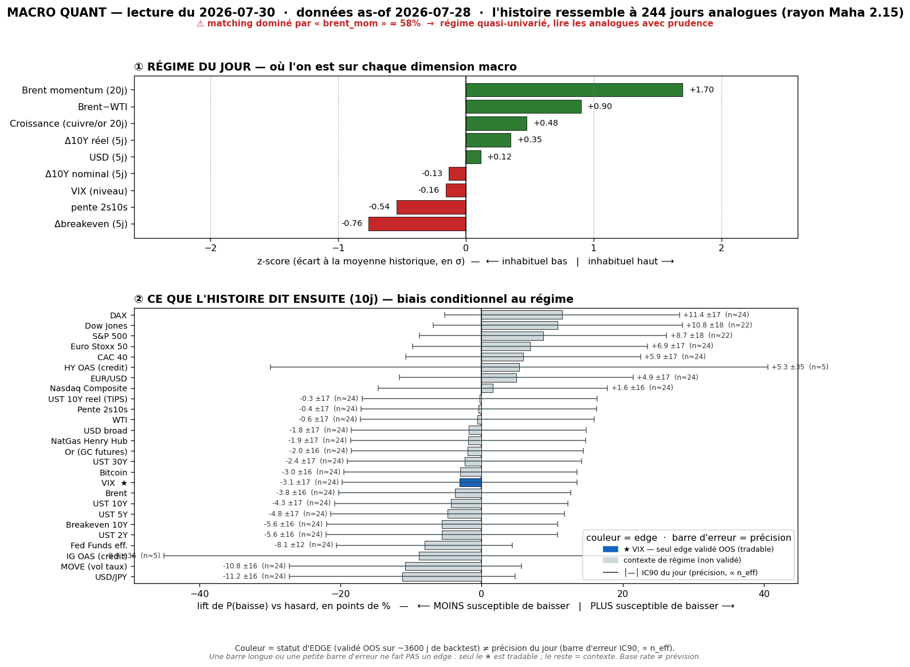

# 📊 Macro Quant Daily — Couche 2
**Run 2026-07-30 · régime as-of 2026-07-28** (dernière donnée FRED complète)

> **Ce que dit cette note** : dans quels régimes historiquement comparables à aujourd'hui se sont trouvés les marchés, et **combien de fois** un asset a monté/baissé ensuite — avec `n_eff`, **lift vs hasard**, IC bootstrap, tag. **Base rate ≠ prévision.** Dimensionne la conviction ; ne remplace pas la Couche 1. Méthodo : [[Wiki/macro/Macro-Quant-Methodo]].

> ⚠️ **FILTRE OOS (dur)** — cf. [[Macro/Quant/research/2026-07-14 - Backtest Validation]] : **seul le VIX** a un IC hors-échantillon significatif (0,170, t=3,22). Pour **tout autre asset** le base rate est en **contexte de régime uniquement** — *pas de skill OOS, direction non exploitable*.

> ✅ **CAVEAT VINTAGE — minimal ce run (oil aligné).** FRED oil prolongé via futures Yahoo → `brent_mom` = **+1,70σ**, et `brwti` **bondit à +0,90σ** (dislocation Brent−WTI = prime de guerre Hormuz sur le Brent). Le live 30/07 confirme : **Brent 92,50 (+1,94%) a reclaim la VAH long** (re-surge géopol). Feature dominante **cohérente avec le live** — 3ᵉ run consécutif sans inversion vintage côté oil. `dbe_5` reflue à −0,76 (breakeven qui se détend).

---

## 1. Régime du jour (z-scores expanding, causaux)

| Feature | z | Lecture |
|---|---:|---|
| `brent_mom` (Brent 20j) | **+1,70** | oil-up (prolongé futures), cohère avec re-surge Brent 92,50 live |
| `brwti` (Brent−WTI) | **+0,90** | **dislocation** — prime de guerre Hormuz sur le Brent, en hausse nette |
| `growth` (cuivre/or 20j) | +0,48 | proxy croissance au-dessus de sa moyenne |
| `dreal_5` (Δ10Y réel) | +0,35 | taux réels légèrement tendus |
| `dusd_5` (USD 5j) | +0,12 | USD ~neutre (avant le hawkish FOMC live) |
| `d10_5` (Δ10Y nominal) | −0,13 | 10Y ~plat as-of 28/07 |
| `vix_lvl` | −0,16 | VIX ~neutre (pré-bascule >20 du 29/07 soir) |
| `slope` (2s10s) | −0,54 | courbe plus plate que la moyenne |
| `dbe_5` (Δbreakeven) | −0,76 | inflation anticipée qui reflue nettement |

**Signature** = *momentum pétrole positif + dislocation Brent−WTI (prime géopol) + croissance-proxy ↑ + breakeven qui reflue + courbe plate*. **Échantillon** : 2007-01 → 2026-07, **244 analogues** (rayon Maha 2,16), PCA : PC1-5 = 23/19/13/13/10 %.

> ⚠️ Rappel : le régime est daté **as-of 28/07, AVANT** la bascule vol du 29/07 soir (VIX casse 20) et le FOMC hawkish. La signature capte l'oil-géopol + reflux breakeven, pas encore le choc hawkish/vol. **Le VIX z −0,16 est déjà périmé** vs le VIX live 20,66.

---

## 2. Base rates forward — horizon 10 jours

`meanC` = rendement moyen conditionnel · `lift` = écart au baseline · `%neg` = fréquence de baisse · **OOS** = direction exploitable hors-échantillon (VIX seul) · unités : **% pour prix, bps pour taux, points pour VIX**.

| Asset | meanC | baseline | lift | %neg C | %neg base | IC90 | n_eff | tag | OOS |
|---|---:|---:|---:|---:|---:|---|---:|:--:|:--:|
| **VIX** | **+0,59 pt** | +0,01 | **+0,58** | 50,4 | 53,6 | [+0,18 ; +1,02] | 24 | 🟡 | ✅ **exploitable** |
| MOVE (vol taux) | +1,74 | +0,03 | +1,72 | 41,8 | 52,6 | [+0,81 ; +2,58] | 24 | 🟡 | contexte |
| UST 30Y | +2,10 bps | +0,04 | +2,06 | 46,3 | 48,7 | [+1,14 ; +3,13] | 24 | 🟡 | contexte |
| Breakeven 10Y | +1,99 bps | −0,01 | +2,00 | 41,0 | 46,6 | [+1,31 ; +2,66] | 24 | 🟡 | contexte |
| UST 10Y | +1,59 bps | −0,04 | +1,63 | 44,3 | 48,6 | [+0,59 ; +2,55] | 24 | 🟡 | contexte |
| UST 2Y | +1,27 bps | −0,14 | +1,42 | 41,4 | 47,0 | [+0,31 ; +2,27] | 24 | 🟡 | contexte |
| UST 5Y | +1,16 bps | −0,10 | +1,25 | 44,7 | 49,5 | [+0,20 ; +2,15] | 24 | 🟡 | contexte |
| Fed Funds eff. | +0,90 bps | −0,34 | +1,23 | 16,8 | 24,9 | [+0,03 ; +1,78] | 24 | 🟡 | contexte |
| Pente 2s10s | +0,31 bps | +0,10 | +0,21 | 48,8 | 49,2 | [−0,57 ; +1,15] | 24 | 🟡 | contexte |
| Brent | +1,41% | +0,07 | +1,34 | 42,2 | 46,0 | [+0,89 ; +1,95] | 24 | 🟡 | contexte |
| WTI | +1,26% | +0,07 | +1,18 | 45,1 | 45,6 | [+0,72 ; +1,78] | 24 | 🟡 | contexte |
| Bitcoin | +3,00% | +1,71 | +1,29 | 41,7 | 44,7 | [+1,77 ; +4,28] | 24 | 🟡 | contexte |
| Or (GC) | +0,50% | +0,38 | +0,11 | 42,2 | 44,2 | [+0,26 ; +0,76] | 24 | 🟡 | contexte |
| USD/JPY | +0,23% | +0,06 | +0,16 | 36,1 | 47,3 | [+0,06 ; +0,38] | 24 | 🟡 | contexte |
| USD broad | +0,08% | +0,04 | +0,04 | 47,5 | 49,4 | [−0,03 ; +0,20] | 24 | 🟡 | contexte |
| EUR/USD | −0,12% | −0,03 | −0,09 | 55,3 | 50,4 | [−0,27 ; +0,03] | 24 | 🟡 | contexte |
| Nasdaq Comp. | +0,06% | +0,48 | −0,43 | 39,3 | 37,8 | [−0,28 ; +0,39] | 24 | 🟡 | contexte |
| S&P 500 | −0,04% | +0,50 | −0,54 | 43,1 | 34,4 | [−0,32 ; +0,26] | **22** | 🟡 | contexte |
| Dow Jones | +0,03% | +0,42 | −0,40 | 48,1 | 37,3 | [−0,23 ; +0,28] | **22** | 🟡 | contexte |
| Euro Stoxx 50 | −0,39% | +0,08 | −0,47 | 51,2 | 44,3 | [−0,72 ; −0,02] | 24 | 🟡 | contexte |
| DAX | −0,32% | +0,27 | −0,59 | 53,3 | 41,9 | [−0,65 ; +0,04] | 24 | 🟡 | contexte |
| CAC 40 | −0,21% | +0,08 | −0,29 | 50,0 | 44,1 | [−0,55 ; +0,14] | 24 | 🟡 | contexte |
| UST 10Y réel | −0,40 bps | −0,04 | −0,37 | 49,6 | 49,9 | [−1,38 ; +0,63] | 24 | 🟡 | contexte |
| NatGas | −1,74% | −0,15 | −1,59 | 48,8 | 50,6 | [−3,77 ; +0,37] | 24 | 🟡 | contexte |
| HY OAS (crédit) | −2,16 bps | −1,65 | −0,51 | 62,7 | 57,4 | [−6,45 ; +2,00] | **5** | 🔴 | contexte |
| IG OAS (crédit) | +0,02 bps | −0,62 | +0,64 | 43,1 | 52,1 | [−0,63 ; +0,69] | **5** | 🔴 | contexte |

---

### 2bis. Term-structure — VIX (seul asset OOS-exploitable)

La table §2 fige l'horizon 10 j pour tous (contexte). L'horizon ne change une **décision** que là où l'asset a un skill OOS → le **VIX seul**. Les 3 horizons sont montrés (pas de choix a posteriori = anti horizon-picking).

| Horizon | lift | IC90 | n_eff | tag | Lecture |
|---|---:|---|---:|:--:|---|
| **5 j** | **+0,38 pt** | **[+0,07 ; +0,71]** | 49 | 🟡 | **exclut 0 — le read le + robuste (n_eff le + haut)** |
| **10 j** | **+0,58 pt** | **[+0,18 ; +1,02]** | 24 | 🟡 | **exclut 0 aussi — confirme le sens** |
| 20 j | +0,26 pt | [−0,11 ; +0,66] | 12 | 🔴 | englobe 0, n_eff faible → dissipé |

> Term-structure **stable sur 3 runs** : 5 j ET 10 j excluent le zéro, s'éteint à 20 j. **Vol biaisée à la hausse sur 5-10 j.** ⚡ **Ce signal vient de se matérialiser** : le VIX live a cassé **20,66 (+13,45%)** le 29/07 soir — le base rate vol-up flaggé depuis le 28/07 était du bon côté. Rappel : ~50% des analogues voient quand même le VIX baisser à 10 j → biais dimensionnant, pas certitude. La question forward n'est plus « la vol monte-t-elle » (fait) mais « reste-t-elle haute » — hors du champ de ce base rate de niveau.

---

## 3. Conclusion statistique (le chiffre, pas l'affirmation)

**Seule lecture forward défendable (filtre OOS) :**
- **VIX ↑ : +0,38 pt @5j (IC [+0,07 ; +0,71]) et +0,58 pt @10j (IC [+0,18 ; +1,02]), 🟡.** Les deux horizons courts excluent le hasard → **vol biaisée à la hausse**, **désormais confirmée par le live** (VIX >20). C'est le 3ᵉ run consécutif où ce signal tient, et il s'est réalisé. Rappel contre-exemples : ~50% des analogues voient le VIX baisser à 10 j.

**Tout le reste = contexte de régime, PAS un pari** (IC OOS ≈ 0) :
- Le régime « raconte » : indices US/EU en léger repli (%neg 39-53% vs 34-44%), **oil ↑** (Brent lift +1,34%, `brwti` +0,90 — **cohérent avec le re-surge géopol live**), **MOVE ↑ +1,72** (vol taux — cohérent post-FOMC hawkish), yields ↑ (UST30 +2,06, breakeven +2,0), BTC ↑, crédit peu lisible (🔴 n_eff=5).
- **Ne pas trader ces directions** malgré leur cohérence avec le live : le backtest dit qu'elles n'ont pas de persistance forward. La cohérence renforce le **récit** (oil-up, vol taux-up, risk-off), pas un edge statistique.

---

## 4. Confrontation Couche 1 ↔ Couche 2

| Dimension | Couche 1 (daily AMT/niveaux, live 30/07) | Couche 2 (quant, as-of 28/07) | Verdict |
|---|---|---|---|
| Vol | **BASCULE : VIX 20,66 (+13,45%) casse 20** — fin complacency | **VIX ↑ +0,38 @5j / +0,58 @10j (🟡 ✅ OOS)** | ✅✅ **convergence FORTE + matérialisée** — le seul signal OOS a prédit le bon sens, le live confirme |
| Oil | **Brent 92,50 (+1,94%) reclaim VAH long**, prime de guerre réinstallée | `brent_mom` +1,70 + `brwti` +0,90 + Brent lift +1,34% | ✅ **convergent** — vintage aligné, dislocation Brent−WTI captée des 2 côtés |
| Vol taux | FOMC **hawkish** (9-3, 3 dissidents hike), Warsh no « pause » | **MOVE +1,72 (contexte)** — vol taux ↑ dans le régime | ⚠️ cohérent : MOVE candidat OOS flagge le stress taux post-FOMC |
| Indices | risk-off confirmé, **NQ casse la VAL court** → air-pocket vers fair value 24 943 | NQ/SPX/DAX léger repli (contexte only) | ⚖️ même sens, conviction vient de C1 (pas OOS) |
| Taux | FOMC hawkish, 3 dissidents pro-hike | régime dit yields **↑** (UST10 +1,63, breakeven +2,0) | ⚖️ même sens qualitatif, non exploitable OOS |
| Crédit/tech | **Meta capex-miss FCF −91% / MSFT beat** — split ROI IA, signal CDS validé | HY/IG OAS peu lisibles (🔴 n_eff=5) | ⚖️ C1 tranche (split), C2 trop peu de data |

> **Le run de la validation** : le signal **VIX ↑** — seul read OOS, flaggé les 28 et 29/07 comme garde-fou anti-complaisance face à un VIX à 18 « endormi » — **s'est réalisé** le 29/07 soir (VIX >20). C'est la démonstration que le filtre OOS isole le bon edge : la Couche 2 a correctement prévenu que le calme était trompeur. Oil et vol taux **convergent** aussi (récit, pas edge). Là où C1 tranche seule = le **split Meta/MSFT** (ROI IA), invisible aux features macro. Priorité C1 sur tout le directionnel non-VIX.

---

## 5. À rerunner
- **Post-PCE + GDP 14h30 (Core PCE fc 3,3%) + Apple/Amazon 22h** → recapturer en `/macro-flash` puis Couche 2 : un Core PCE sticky durcirait le hawkishness ; Apple/Amazon = 2ᵉ manche AI-ROI.
- **Prochain run** : le régime devrait intégrer la bascule vol (VIX >20) et le hawkish FOMC → `vix_lvl` et `d10_5` remonteront, l'analogie changera. Vérifier si le base rate VIX reste vol-up **depuis un niveau déjà élevé** (mean-reversion possible → surveiller un flip).
- Rafraîchir `macro_quant_backtest.py` (trimestriel) : **MOVE** (+1,72, cohérent FOMC hawkish 3 runs de suite) reste le candidat n°1 pour rejoindre le VIX dans les assets OOS.
