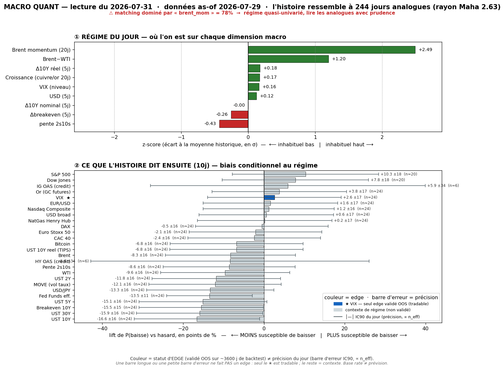

# 📊 Macro Quant Daily — Couche 2
**Run 2026-07-31 · régime as-of 2026-07-29** (dernière donnée FRED complète)

> **Ce que dit cette note** : dans quels régimes historiquement comparables à aujourd'hui se sont trouvés les marchés, et **combien de fois** un asset a monté/baissé ensuite — avec `n_eff`, **lift vs hasard**, IC bootstrap, tag. **Base rate ≠ prévision.** Dimensionne la conviction ; ne remplace pas la Couche 1. Méthodo : [[Wiki/macro/Macro-Quant-Methodo]].

> 🔇 **RUN SANS SIGNAL OOS AUJOURD'HUI.** Le VIX — seul asset à IC hors-échantillon significatif — a un **lift ≈ 0 à tous les horizons** (5j −0,34, 10j +0,00, 20j −0,18 ; **aucun IC n'exclut le zéro**). Le signal vol-up qui portait depuis le 28/07 **s'est épuisé après s'être matérialisé** (VIX a cassé 20 le 29/07). **Aucune conclusion forward directionnelle défendable ce run.** Tout le reste est contexte de régime, non exploitable OOS.

> ⚠️ **CAVEAT VINTAGE.** `brent_mom` = **+2,49σ** (le plus haut de la série) et `brwti` **+1,20σ** : la prime de guerre Hormuz **domine** le matching → les analogues sont pris sur des épisodes d'**oil qui flambe**. Cohérent avec le live du 30/07 (Brent 92,50 reclaim VAH long), mais **pas de daily 31/07 pour confirmer la continuation intraday** → traiter l'oil-up comme *as-of 29/07*, pas live.

---

## 1. Régime du jour (z-scores expanding, causaux)

| Feature | z | Lecture |
|---|---:|---|
| `brent_mom` (Brent 20j) | **+2,49** | ⚠️ **prime de guerre Hormuz — domine le matching** (analogues = oil qui flambe) |
| `brwti` (Brent−WTI) | **+1,20** | **dislocation forte** — le premium géopol se loge sur le Brent |
| `dreal_5` (Δ10Y réel) | +0,18 | taux réels ~neutres |
| `growth` (cuivre/or 20j) | +0,17 | proxy croissance ~moyenne |
| `vix_lvl` | +0,16 | VIX repassé au-dessus de sa moyenne (bascule >20 du 29/07 intégrée) |
| `dusd_5` (USD 5j) | +0,12 | USD ~neutre |
| `d10_5` (Δ10Y nominal) | −0,00 | 10Y plat |
| `dbe_5` (Δbreakeven) | −0,26 | inflation anticipée qui reflue légèrement |
| `slope` (2s10s) | −0,43 | courbe plus plate que la moyenne |

**Signature** = *momentum pétrole extrême + dislocation Brent−WTI (prime géopol) + vol repassée au-dessus de sa moyenne + taux plats*. Régime **oil-choc dominant**. **Échantillon** : 2007-01 → 2026-07, **244 analogues** (rayon Maha **2,63** — le plus élevé de la semaine → analogues plus lâches, matching plus difficile).

> ⚠️ Le rayon Maha 2,63 (vs 2,16 hier) signale que le régime du jour est **plus atypique** — la signature oil-choc a moins de vrais jumeaux historiques. À garder en tête : analogie plus distendue = base rates un cran moins fiables.

---

## 2. Base rates forward — horizon 10 jours

`meanC` = rendement moyen conditionnel · `lift` = écart au baseline · `%neg` = fréquence de baisse · **OOS** = direction exploitable hors-échantillon (VIX seul) · unités : **% pour prix, bps pour taux, points pour VIX**.

| Asset | meanC | baseline | lift | %neg C | %neg base | IC90 | n_eff | tag | OOS |
|---|---:|---:|---:|---:|---:|---|---:|:--:|:--:|
| **VIX** | **+0,01 pt** | +0,01 | **+0,00** | 56,1 | 53,6 | [−0,50 ; +0,47] | 24 | 🟡 | ❌ **pas de signal** |
| MOVE (vol taux) | +2,21 | +0,03 | +2,19 | 40,6 | 52,6 | [+1,24 ; +3,26] | 24 | 🟡 | contexte |
| UST 30Y | +4,87 bps | +0,04 | +4,83 | 32,8 | 48,7 | [+3,44 ; +6,43] | 24 | 🟡 | contexte |
| UST 10Y | +4,54 bps | −0,04 | +4,58 | 32,0 | 48,6 | [+3,02 ; +6,17] | 24 | 🟡 | contexte |
| UST 5Y | +3,95 bps | −0,10 | +4,05 | 34,4 | 49,5 | [+2,41 ; +5,64] | 24 | 🟡 | contexte |
| UST 2Y | +3,80 bps | −0,14 | +3,94 | 35,2 | 47,0 | [+2,27 ; +5,41] | 24 | 🟡 | contexte |
| Breakeven 10Y | +3,37 bps | −0,01 | +3,37 | 31,1 | 46,6 | [+2,62 ; +4,12] | 24 | 🟡 | contexte |
| UST 10Y réel | +1,18 bps | −0,03 | +1,21 | 43,0 | 49,9 | [−0,41 ; +2,86] | 24 | 🟡 | contexte |
| Fed Funds eff. | +1,03 bps | −0,34 | +1,36 | 11,5 | 24,9 | [+0,13 ; +2,12] | 24 | 🟡 | contexte |
| Pente 2s10s | +0,74 bps | +0,10 | +0,64 | 40,6 | 49,2 | [−0,60 ; +2,10] | 24 | 🟡 | contexte |
| Brent | +2,76% | +0,07 | +2,69 | 37,7 | 46,0 | [+1,80 ; +3,77] | 24 | 🟡 | contexte |
| WTI | +2,65% | +0,08 | +2,57 | 36,1 | 45,6 | [+1,71 ; +3,55] | 24 | 🟡 | contexte |
| Bitcoin | +3,15% | +1,71 | +1,44 | 37,9 | 44,7 | [+1,69 ; +4,60] | 24 | 🟡 | contexte |
| USD/JPY | +0,37% | +0,06 | +0,31 | 34,0 | 47,3 | [+0,27 ; +0,48] | 24 | 🟡 | contexte |
| USD broad | +0,02% | +0,04 | −0,02 | 50,0 | 49,4 | [−0,07 ; +0,12] | 24 | 🟡 | contexte |
| EUR/USD | −0,09% | −0,03 | −0,06 | 52,0 | 50,4 | [−0,23 ; +0,06] | 24 | 🟡 | contexte |
| CAC 40 | +0,57% | +0,08 | +0,49 | 41,8 | 44,2 | [+0,17 ; +0,95] | 24 | 🟡 | contexte |
| Euro Stoxx 50 | +0,39% | +0,08 | +0,31 | 42,2 | 44,3 | [+0,02 ; +0,74] | 24 | 🟡 | contexte |
| DAX | +0,38% | +0,27 | +0,11 | 41,4 | 41,9 | [+0,00 ; +0,73] | 24 | 🟡 | contexte |
| Nasdaq Comp. | +0,56% | +0,48 | +0,08 | 38,9 | 37,8 | [+0,19 ; +0,95] | 24 | 🟡 | contexte |
| S&P 500 | +0,28% | +0,50 | −0,22 | 44,6 | 34,3 | [−0,08 ; +0,65] | **20** | 🟡 | contexte |
| Dow Jones | +0,40% | +0,42 | −0,03 | 45,1 | 37,3 | [+0,04 ; +0,79] | **20** | 🟡 | contexte |
| Or (GC) | −0,15% | +0,38 | −0,53 | 48,0 | 44,2 | [−0,53 ; +0,21] | 24 | 🟡 | contexte |
| NatGas | −2,94% | −0,16 | −2,79 | 50,8 | 50,6 | [−5,11 ; −0,80] | 24 | 🟡 | contexte |
| HY OAS (crédit) | −0,81 bps | −1,65 | +0,84 | 49,1 | 57,5 | [−5,70 ; +4,16] | **6** | 🔴 | contexte |
| IG OAS (crédit) | −0,28 bps | −0,61 | +0,33 | 57,9 | 52,0 | [−1,54 ; +0,93] | **6** | 🔴 | contexte |

---

### 2bis. Term-structure — VIX (seul asset OOS-exploitable)

| Horizon | lift | IC90 | n_eff | tag | Lecture |
|---|---:|---|---:|:--:|---|
| 5 j | −0,34 pt | [−0,70 ; +0,04] | 49 | 🟡 | **englobe 0** (touche à peine, légèrement négatif) → pas de signal |
| 10 j | +0,00 pt | [−0,50 ; +0,47] | 24 | 🟡 | **lift nul, IC centré sur 0** → aucun signal |
| 20 j | −0,18 pt | [−0,66 ; +0,34] | 12 | 🔴 | englobe 0 → rien |

> **Le signal vol s'est éteint — proprement.** Après avoir porté 3 runs (28-30/07) et **s'être réalisé** (VIX >20 le 29/07), le base rate ne dit **plus rien** sur la vol forward : lift ≈ 0 partout, tous les IC englobent le zéro. C'est le comportement attendu d'un signal de *niveau* de vol après un spike — depuis un VIX déjà élevé, l'histoire ne penche ni haussière ni baissière. Cross-day : ce lift 10j = **percentile 14%** de tes 7 runs (le plus bas). **Ne rien inférer sur la vol via ce moteur aujourd'hui** — la Couche 1 (structure VIX/contango, GEX) reprend la main.

---

## 3. Conclusion statistique (le chiffre, pas l'affirmation)

**Lecture forward OOS : AUCUNE ce run.** Le VIX, seul asset validé, a un lift nul à tous horizons (IC englobent 0). Le moteur **ne dimensionne aucune conviction directionnelle aujourd'hui** — c'est un résultat honnête, pas un échec : après matérialisation du spike vol, le signal est mécaniquement épuisé.

**Contexte de régime (NON exploitable OOS, à titre descriptif) :**
- Régime **oil-choc + reflation de taux** : yields fortement ↑ dans les analogues (UST10 +4,58 bps, UST30 +4,83, breakeven +3,37), **oil ↑ franc** (Brent +2,69%, WTI +2,57% — la prime de guerre), **MOVE ↑ +2,19** (vol taux), BTC ↑. Indices EU légèrement ↑, US mitigés (SPX lift −0,22).
- **Rayon Maha 2,63 = analogie distendue** → même ce contexte est un cran moins fiable que les runs précédents. Régime atypique (oil-choc extrême), peu de vrais jumeaux.
- Rappel : rien de tout cela n'est un pari (IC OOS ≈ 0). La cohérence oil-up/taux-up avec le récit géopol renforce la **narration**, pas un edge.

---

## 4. Confrontation Couche 1 ↔ Couche 2

> ⚠️ **Pas de `Macro/Daily` daté 31/07 au moment du run** → confrontation avec le dernier live disponible ([[Macro/Daily/2026-07-30 - Macro Daily]]).

| Dimension | Couche 1 (live 30/07, dernier daily) | Couche 2 (quant, as-of 29/07) | Verdict |
|---|---|---|---|
| Vol | VIX **20,66** cassé 20, bascule de régime vol | **VIX lift ≈ 0, aucun signal OOS** | ⚖️ **Couche 2 muette** : après le spike, le base rate n'extrapole pas — la continuation de vol est une question de C1 (contango/GEX), pas de C2 |
| Oil | Brent 92,50 reclaim VAH long, prime de guerre | `brent_mom` +2,49 + `brwti` +1,20 + Brent lift +2,69% | ✅ **convergent** (contexte) — oil-up des 2 côtés, mais non exploitable OOS |
| Taux | FOMC hawkish (9-3, 3 dissidents hike) | régime dit yields **↑ fort** (UST10 +4,58, breakeven +3,37) | ⚖️ même sens qualitatif (reflation/hawkish), non OOS |
| Vol taux | stress taux post-FOMC hawkish | **MOVE +2,19 (contexte)** | ⚠️ cohérent — MOVE candidat OOS, à valider au backtest |
| Indices | risk-off, NQ hors value courte → air-pocket | US mitigés (SPX −0,22, NQ +0,08), EU ↑ légers | ⚖️ signal faible/mixte, non OOS |

> **Le run où le quant se tait — et c'est utile.** Le seul edge (VIX) ayant fait son travail (prévenir la hausse de vol, réalisée), il **revient à neutre** : le moteur ne prétend pas prolonger un mouvement qu'il n'a plus de base pour anticiper. La discipline OOS **empêche d'inventer un signal** là où il n'y en a plus. Pour la suite de la vol (reste-t-elle >20 ?), **priorité totale à la Couche 1 live** (structure VIX/VIX3M, contango, GEX post-FOMC). Oil et taux convergent sur le récit reflation-géopol, mais restent du contexte, pas des paris.

---

## 5. À rerunner
- **Dès qu'un `Macro/Daily` 31/07 existe** → compléter §4 (PCE 30/07 sorti, Apple/Amazon, réaction oil/vol du jour).
- **Surveiller le flip de régime** : le rayon Maha grimpe (2,16 → 2,63), la signature devient oil-choc extrême et atypique → si `brent_mom` continue de monter, l'analogie se distend encore (base rates moins fiables). Guetter un éventuel retour vers un régime plus « standard » une fois la prime de guerre stabilisée.
- **Signal VIX à re-guetter** : nul aujourd'hui ; il redeviendra exploitable quand la signature quittera la zone post-spike. Ne pas forcer une lecture vol entre-temps.
- Rafraîchir `macro_quant_backtest.py` (trimestriel) : **MOVE** (+2,19, cohérent 4 runs de suite avec le stress taux) — candidat n°1 pour élargir la liste OOS au-delà du seul VIX.
