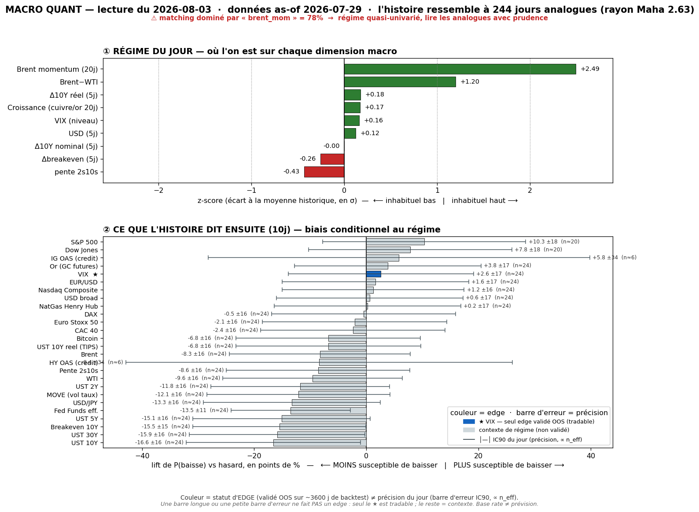

# Macro Quant Daily — 2026-08-03 (données as-of **2026-07-29**)

> **Couche 2 (les ODDS)** : à quelle fréquence un régime historiquement comparable (2007→, 244 analogues) a été suivi de tel move. Ce n'est PAS une prévision — c'est un base rate conditionnel. La direction n'est exploitable que sur les assets à skill OOS (**VIX seul**) ; tout le reste = **contexte de régime**.

> ⚠️ **CAVEAT EN TÊTE — matching périmé + quasi-univarié (double biais, critique aujourd'hui).**
> 1. **Dominance `brent_mom` = 78%** (flag moteur >40% → matching **quasi-univarié**) : les 244 analogues sont sélectionnés à ~78% sur le seul momentum 20j du Brent. Le régime « multi-facteurs » est en réalité « épisodes de forte hausse Brent ».
> 2. **Vintage-lag critique** : la donnée s'arrête au **29/07** (calendrier FRED). Or `brent_mom` valait **+2,49σ** (Brent en forte hausse trailing) — AVANT le **crash Brent −5,64% du 03/08** (désescalade US-Iran, cf. Couche 1). **La feature dominante est donc inversée vs le tape live** → le matching pointe un régime « oil-momentum-up » qui n'existe déjà plus. **Les base rates du cluster « taux↑ / oil↑ » ci-dessous sont mécaniquement contaminés — à lire comme un artefact de latence, pas comme un état courant.** Voir §4.

## §1 — Régime du jour (z-scores causaux, as-of 29/07)
- `brent_mom` **+2,49** · `brwti` **+1,20** · `dreal_5` +0,18 · `growth` +0,17 · `vix_lvl` +0,16 · `dusd_5` +0,12 · `d10_5` −0,00 · `dbe_5` −0,26 · `slope` **−0,43**
- **Lecture** : régime dominé par le **momentum Brent (+2,49σ)** et le spread **Brent−WTI (+1,20σ)** — soit un état « oil fort ». Croissance légèrement positive (`growth` +0,17 → pas stagflation), vol neutre (`vix_lvl` +0,16), pente qui s'aplatit (`slope` −0,43).
- **Persistance** : 8ᵉ jour consécutif dans ce même régime (base cross-day 23/07→03/08, RMS <0,75σ). n_analog = 244, rayon Mahalanobis 2,625, variance PCA expliquée ~78% sur 5 axes.

## §2 — Base rates forward 10j (horizon FIXE pour tous — contexte glanceable)
Rappel : **le chiffre utile = LIFT** (P_cond − baseline). Tags : 🔴 n_eff<20 · 🟡 20-60 · 🟢 >60. **Seul le VIX porte une direction exploitable OOS** ; tout le reste = **contexte de régime, direction NON exploitable** (IC OOS ≈ 0, cf. backtest 14/07). Plafond structurel n_eff @10j ≈ 24 → aucune ligne 🟢 possible à cet horizon (normal).

Asset · lift_mean(10j) · mean_cond · mean_uncond · n_eff · tag · statut

- **VIXCLS (VIX)** · **+0,00** · +0,01 · +0,01 · 24,4 · 🟡 · **OOS EXPLOITABLE → NEUTRE** (aucun lift ; ni vol-up ni vol-down conditionnel)
- DGS30 (UST 30Y) · +4,83 · +4,87 · +0,04 · 24,4 · 🟡 · contexte (pas de skill OOS) — ⚠ contaminé oil-lag
- DGS10 (UST 10Y) · +4,58 · +4,54 · −0,04 · 24,4 · 🟡 · contexte — ⚠ contaminé oil-lag
- DGS5 (UST 5Y) · +4,05 · +3,95 · −0,10 · 24,4 · 🟡 · contexte — ⚠ contaminé oil-lag
- DGS2 (UST 2Y) · +3,94 · +3,80 · −0,14 · 24,4 · 🟡 · contexte — ⚠ contaminé oil-lag
- T10YIE (Breakeven 10Y) · +3,37 · +3,37 · −0,01 · 24,4 · 🟡 · contexte
- DCOILBRENTEU (Brent) · +2,69 · +2,76 · +0,07 · 24,4 · 🟡 · contexte — ⚠ **circulaire** (brent_mom pilote le match) + inversé live
- DCOILWTICO (WTI) · +2,57 · +2,65 · +0,08 · 24,4 · 🟡 · contexte — ⚠ idem
- MOVE (vol taux) · +2,19 · +2,21 · +0,03 · 24,4 · 🟡 · **resp-only — réfuté OOS**, candidat sous observation trimestrielle
- BTCUSD (Bitcoin) · +1,44 · +3,15 · +1,71 · 23,5 · 🟡 · contexte
- DFF (Fed Funds eff.) · +1,36 · +1,03 · −0,34 · 24,4 · 🟡 · contexte
- CAC40 · +0,49 · +0,57 · +0,08 · 24,4 · 🟡 · contexte
- STOXX50 · +0,31 · +0,39 · +0,08 · 24,4 · 🟡 · contexte
- DAX · +0,11 · +0,38 · +0,27 · 24,4 · 🟡 · contexte
- NASDAQCOM (Nasdaq) · +0,08 · +0,56 · +0,48 · 24,4 · 🟡 · contexte (quasi-flat vs baseline)
- DTWEXBGS (USD broad) · −0,02 · +0,02 · +0,04 · 24,4 · 🟡 · contexte (nul)
- DJIA (Dow) · −0,03 · +0,40 · +0,42 · 20,4 · 🟡 · contexte (nul)
- DEXUSEU (EUR/USD) · −0,06 · −0,09 · −0,03 · 24,4 · 🟡 · contexte (nul)
- SP500 · −0,22 · +0,28 · +0,50 · 20,4 · 🟡 · contexte (léger sous-baseline)
- GOLD (Or) · −0,53 · −0,15 · +0,38 · 24,4 · 🟡 · contexte
- DHHNGSP (NatGas) · **−2,79** · −2,94 · −0,16 · 24,4 · 🟡 · contexte
- Crédit HY/IG OAS · +0,85 / +0,34 · — · — · **5,7** · 🔴 · ignoré (n_eff trop faible)

> **Prose (pas un pari)** : le cluster le plus « chaud » (taux longs +4 à +5 pt de lift, oil +2,5) est **entièrement non-OOS** ET **doublement suspect** aujourd'hui (dominance brent_mom 78% + oil crashé depuis l'as-of). Historiquement, un régime « momentum Brent fort » a été suivi de yields en hausse sur 10j — mais (a) sans skill directionnel OOS c'est une corrélation de régime, pas un edge ; (b) le déclencheur même de ce régime (Brent haussier) s'est inversé le 03/08. **Ne rien trader là-dessus.**

## §2bis — Term-structure VIX (5/10/20j) — le SEUL endroit où l'horizon change une décision
Asset OOS-validé (IC OOS +0,170 @10j, t=3,22 ; le backtest le montre + propre à 5j).

Horizon · lift_mean · mean_cond · n_eff · tag · CI90 · signal

- **5j** · **−0,34** · −0,34 · 48,8 · 🟡 · [−0,70 ; **+0,04**] · False → **légère détente vol** mais **CI touche 0** → non significatif
- **10j** · **+0,00** · +0,01 · 24,4 · 🟡 · [−0,50 ; +0,47] · False → **strictement neutre**
- **20j** · −0,18 · −0,15 · 12,2 · 🔴 · [−0,66 ; +0,34] · False → neutre (n_eff sous seuil, ignorer)

> **Lecture VIX** : **aucun signal de vol.** Les 3 horizons ont un CI90 qui inclut 0 et `signal=False`. Le seul biais notable (−0,34 pt @5j, VIX en baisse 65,6% du temps dans les analogues) reste **non significatif** (borne haute +0,04). → **Vol conditionnellement neutre à légèrement molle.** Contre-exemples : même à 5j, le VIX **monte encore 34% du temps** — pas un short-vol de conviction. La bascule vol-up flaggée 28-30/07 est bien **épuisée**.

## §3 — Conclusion statistique
1. **Sur l'unique axe exploitable (VIX) : NEUTRE.** Pas de lift à 10j, détente non significative à 5j. Aucun pari de volatilité justifié par les base rates aujourd'hui.
2. **Tout le reste = contexte non exploitable**, et aujourd'hui **partiellement corrompu** : le régime est piloté à 78% par `brent_mom`, figé au 29/07, avant le crash Brent. Le cluster « taux↑ / oil↑ » est un **fossile de latence**, pas une lecture du marché du 03/08.
3. **n_eff plafonné à 24,4 @10j** (structurel) → aucune ligne 🟢 ; toutes 🟡 au mieux. Rien à sur-interpréter.
4. **MOVE** (+2,19 lift) reste **resp-only** (réfuté OOS) — suivi run-après-run pour le prochain backtest trimestriel, pas tradable.

## §4 — Confrontation Couche 1 ↔ Couche 2 (⚠ DIVERGENCE MAJEURE)
Croisement avec [[Macro/Daily/2026-08-03 - Macro Daily]] (régime live : **RISK-ON / goldilocks — ISM Mfg 55,6 HOT + Brent −5,64% + VIX ~16,8**).

- **DIVERGENCE (le point du jour)** : la Couche 2 matche un régime **« oil-momentum-up »** (brent_mom +2,49σ, as-of 29/07) ; la Couche 1 live montre l'**exact inverse** — **Brent qui s'effondre −5,64%** (désescalade US-Iran). Le moteur, aveugle au choc post-29/07, ancre 78% de son matching sur une feature **périmée et de signe inversé**. → **Priorité absolue à la Couche 1 live.** Les base rates « oil↑ / taux↑ » sont **invalidés par le tape** et ne doivent pas être lus comme un état courant.
- **CONVERGENCE (le seul recoupement propre)** : sur la **vol**, les deux couches disent **calme/neutre** — Couche 2 : VIX lift ≈ 0 sur tous horizons ; Couche 1 : VIX ~16,8, bien sous 20, bascule du 30/07 annulée. **C'est le seul signal où Couche 1 et Couche 2 se renforcent** : pas d'événement de volatilité attendu à court terme (base rate + niveau live concordent).
- **Implication** : la seule chose que la Couche 2 confirme aujourd'hui, c'est l'**absence de signal vol** — cohérent avec le goldilocks live. Tout le reste de la note est neutralisé par la latence oil ; à re-lire dès que FRED intègre le 03/08.

## §5 — À rerunner
- **Dès que FRED met à jour post-03/08** : `brent_mom` va **basculer fortement négatif** (crash −5,64%) → le régime et TOUS les analogues vont changer matériellement. La lecture d'aujourd'hui est **jetable** à la première vintage post-crash. Re-run prioritaire.
- **Surveiller si la vol reste neutre** (VIX lift ≈ 0) une fois le régime oil ré-aligné — c'est le vrai test du seul axe exploitable.
- **Backtest trimestriel** (`macro_quant_backtest.py` → lance `analyze_db.py`) : re-tester l'accession de **MOVE** au filtre OOS (candidat, réfuté au dernier run).
- **Note méthodo** : ce run est un cas d'école du biais **dominance>40% + vintage-lag** se combinant sur un choc de régime → à citer comme exemple vivant de « quand ne PAS lire les base rates ».
