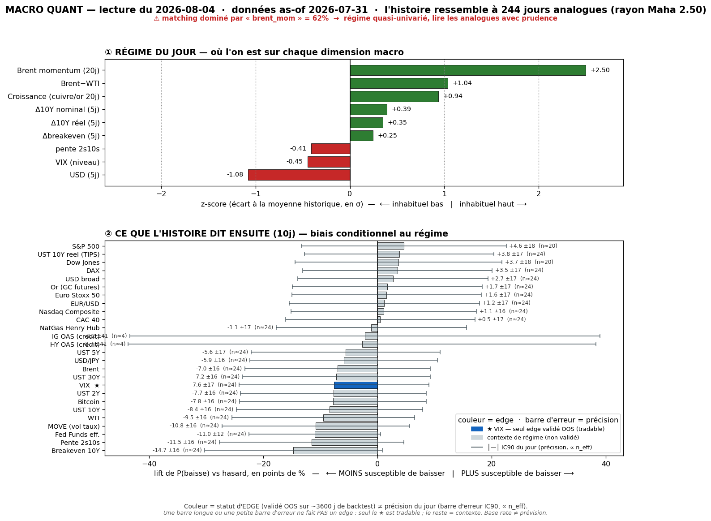

# Macro Quant Daily — 2026-08-04 (données as-of **2026-07-31**)

> **Couche 2 (les ODDS)** : à quelle fréquence un régime comparable (2007→, 244 analogues) a été suivi de tel move. Base rate conditionnel, PAS une prévision. Direction exploitable uniquement sur asset à skill OOS (**VIX seul**) ; le reste = **contexte de régime**.

> ⚠️ **CAVEAT EN TÊTE — matching encore pré-crash oil.**
> As-of = **31/07** (DTWEXBGS a débloqué le calendrier : hier 29/07 → aujourd'hui 31/07). **Toujours AVANT le crash Brent −5,64% du 03/08** (Couche 1). `brent_mom` reste **+2,50σ dominant à 62%** (flag >40% → matching semi-univarié, mais **en baisse** vs 78% hier). ⇒ Le cluster de contexte « oil↑ / taux↑ » ci-dessous est **encore un fossile de latence** ; il basculera quand l'as-of atteindra ~03/08. **En revanche le signal VIX (ci-dessous) est neuf et significatif** — à lire séparément.

## §1 — Régime du jour (z-scores causaux, as-of 31/07)
- `brent_mom` **+2,50** · `brwti` **+1,04** · `growth` **+0,94** · `d10_5` +0,39 · `dreal_5` +0,35 · `dbe_5` +0,25 · `slope` −0,41 · `vix_lvl` **−0,45** · `dusd_5` **−1,08**
- **Δ vs hier (as-of 29/07)** : `dusd_5` plonge (+0,12 → **−1,08** = USD faible sur 5j) · `growth` monte (+0,17 → **+0,94** = reflation renforcée) · `vix_lvl` passe négatif (+0,16 → **−0,45** = VIX bas) · dominance brent_mom **78% → 62%** (matching moins univarié).
- **Lecture** : régime « **oil fort + reflation + USD faible + VIX bas** ». C'est la combinaison low-vol/growth-on qui, historiquement, précède une **remontée de vol** (cf. §2bis). Rayon Mahalanobis 2,501, n_analog 244.

## §2 — Base rates forward 10j (horizon FIXE pour tous — contexte glanceable)
Chiffre utile = **LIFT**. Tags : 🔴 n_eff<20 · 🟡 20-60 · 🟢 >60. **Seul VIX = direction exploitable OOS** ; le reste = **contexte, direction NON exploitable** (IC OOS ≈ 0). Plafond n_eff @10j ≈ 24 → aucune ligne 🟢 (normal).

Asset · lift(10j) · mean_cond · mean_uncond · n_eff · tag · statut

- **VIXCLS (VIX)** · **+0,92** · +0,93 · +0,01 · 24,4 · 🟡 · **OOS EXPLOITABLE → VOL-UP significatif** (voir §2bis pour la term-structure + CI)
- DGS30 (UST 30Y) · +3,24 · +3,28 · +0,05 · 24,4 · 🟡 · contexte — ⚠ oil-lag
- DGS10 (UST 10Y) · +2,97 · +2,93 · −0,04 · 24,4 · 🟡 · contexte — ⚠ oil-lag
- T10YIE (Breakeven 10Y) · +2,90 · +2,88 · −0,01 · 24,4 · 🟡 · contexte
- MOVE (vol taux) · +2,30 · +2,32 · +0,03 · 24,4 · 🟡 · **resp-only — réfuté OOS**, candidat sous observation
- BTCUSD (Bitcoin) · +2,23 · +3,94 · +1,71 · 23,6 · 🟡 · contexte
- DGS5 (UST 5Y) · +2,02 · +1,93 · −0,09 · 24,4 · 🟡 · contexte
- DCOILBRENTEU (Brent) · +1,95 · +2,03 · +0,08 · 24,4 · 🟡 · contexte — ⚠ **circulaire** + inversé live
- DCOILWTICO (WTI) · +1,90 · +1,98 · +0,08 · 24,4 · 🟡 · contexte — ⚠ idem
- DFF (Fed Funds eff.) · +1,69 · +1,36 · −0,34 · 24,4 · 🟡 · contexte
- DGS2 (UST 2Y) · +1,54 · +1,40 · −0,14 · 24,4 · 🟡 · contexte
- T10Y2Y (Pente 2s10s) · +1,43 · +1,54 · +0,10 · 24,4 · 🟡 · contexte
- CAC40 · +0,17 · +0,25 · +0,08 · 24,4 · 🟡 · contexte
- DEXJPUS (USD/JPY) · +0,16 · +0,22 · +0,06 · 24,4 · 🟡 · contexte
- STOXX50 · +0,03 · +0,11 · +0,08 · 24,4 · 🟡 · contexte (nul)
- DTWEXBGS (USD broad) · −0,00 · +0,04 · +0,04 · 24,4 · 🟡 · contexte (nul)
- DEXUSEU (EUR/USD) · −0,03 · −0,06 · −0,03 · 24,4 · 🟡 · contexte (nul)
- DJIA (Dow) · −0,04 · +0,38 · +0,42 · 20,0 · 🟡 · contexte (nul)
- DAX · −0,14 · +0,13 · +0,27 · 24,4 · 🟡 · contexte
- NASDAQCOM (Nasdaq) · −0,18 · +0,30 · +0,48 · 24,4 · 🟡 · contexte (sous baseline)
- GOLD (Or) · −0,20 · +0,19 · +0,38 · 24,4 · 🟡 · contexte
- SP500 · −0,31 · +0,20 · +0,50 · 20,0 · 🟡 · contexte (sous baseline)
- DHHNGSP (NatGas) · **−2,59** · −2,75 · −0,16 · 24,4 · 🟡 · contexte
- Crédit HY/IG OAS · +1,51 / +0,31 · — · — · **4,0** · 🔴 · ignoré (n_eff trop faible)

> **Prose (pas un pari)** : le cluster « taux longs +2 à +3, oil +2 » reste **non-OOS ET pré-crash** → contexte fossile, ne rien trader. La seule ligne actionnable est **VIX** (§2bis).

## §2bis — Term-structure VIX (5/10/20j) — le SEUL endroit où l'horizon change une décision
Asset OOS-validé (IC OOS +0,170 @10j, t=3,22). **Aujourd'hui : signal vol-up significatif, croissant avec l'horizon.**

Horizon · lift_mean · mean_cond · pneg_cond · n_eff · tag · CI90 · signal

- **5j** · **+0,37** · +0,37 · 52,5% · 48,8 · 🟡 · **[+0,12 ; +0,64]** · **True → SIGNIFICATIF** (CI exclut 0)
- **10j** · **+0,92** · +0,93 · 45,9% · 24,4 · 🟡 · **[+0,64 ; +1,24]** · **True → SIGNIFICATIF** (CI exclut 0)
- **20j** · **+1,55** · +1,58 · 45,9% · 12,2 · 🔴 · [+1,12 ; +2,11] · True → significatif mais **n_eff 12 (🔴, prudence)**

> **Lecture VIX** : bascule nette vs hier (as-of 29/07 : lift 0,00, neutre). Le régime low-vol/reflation du 31/07 a **historiquement précédé une remontée de VIX**, significative dès 5j (CI exclut 0) et **croissante 5→10→20j** (+0,37 → +0,92 → +1,55). C'est cohérent avec le profil du modèle : **son edge = le TIMING de la vol**, et il dit « vol basse maintenant → tend à remonter sur 1-4 semaines ».
> **Contre-exemples (obligatoire)** : à 10j, le VIX **baisse quand même 45,9% du temps** → favorable ~54%, défavorable ~46%. **C'est un tilt d'espérance, pas une certitude.** Et rappel dur : le base rate prédit le move *moyen*, il est **aveugle aux sauts de crise** (capture ~2% des spikes) — **jamais** un hedge anti-krach.

## §3 — Conclusion statistique
1. **Axe exploitable (VIX) : premier signal vol-UP significatif de la semaine.** Lift +0,37 @5j / +0,92 @10j (CI excluent 0), monotone jusqu'à +1,55 @20j. Espérance de vol en hausse sur 1-4 semaines depuis un point bas — **tilt, pas garantie** (favorable ~54% à 10j).
2. **⚠ Signal conditionné sur un régime pré-crash oil** (as-of 31/07, brent_mom +2,50 dominant 62%). Le crash Brent du 03/08 (risk-on) n'y est pas encore ; il pourrait **atténuer** le vol-up une fois intégré. → **Traiter comme un WATCH, pas un déclencheur.** Re-check dès que l'as-of passe le 03/08.
3. **Reste = contexte non exploitable et fossilisé** par la latence (taux↑/oil↑) → aucune lecture directionnelle.
4. **MOVE** (+2,30) toujours **resp-only** (réfuté OOS), suivi cross-day pour le backtest trimestriel.

## §4 — Confrontation Couche 1 ↔ Couche 2
Croisement avec [[Macro/Daily/2026-08-03 - Macro Daily]] (dernier Daily dispo — régime live : **RISK-ON / goldilocks, VIX ~16,8 calme, Brent −5,64%**).

- **DIVERGENCE sur la vol (le point du jour)** : Couche 1 live = **vol calme** (VIX ~16,8, sous 20, contango) ; Couche 2 = **base rate tilté vol-UP** sur 5-20j. Ce n'est PAS contradictoire mais **complémentaire dans le temps** : « calme maintenant » (Couche 1, le OÙ) vs « tend à se re-tendre sur 1-4 sem » (Couche 2, les odds). C'est **exactement le créneau où le modèle a un edge OOS** → à noter comme **watch vol-long** (ex. structures longues vega bon marché tant que VIX <17), **pas** comme entrée immédiate.
- **Nuance latence** : le signal vol-up est ancré au 31/07 (avant le crash oil + le snapback tech). Le contexte live (oil qui s'effondre = désinflation, goldilocks) est plutôt **anti-vol** à court terme → **priorité à la Couche 1 pour le tape immédiat** ; la Couche 2 sert d'**alerte d'espérance** à surveiller, à re-valider post-03/08.
- **CONVERGENCE ailleurs** : aucune — le reste de la Couche 2 est fossilisé (oil-lag). Le seul recoupement exploitable est la vol, et il est en **divergence temporelle constructive**.

## §5 — À rerunner
- **Dès que FRED passe le 03/08** (DTWEXBGS + spine) : `brent_mom` va **basculer négatif** (crash) → régime + analogues changent → **le signal vol-up VIX sera re-testé sur un régime post-crash** (c'est le vrai test : tient-il quand l'oil-momentum s'inverse ?).
- **Surveiller le VIX live** : s'il reste <17-18 alors que le base rate dit vol-up, l'asymétrie d'un long-vega bon marché s'améliore — mais respecter le taux de contre-exemples (46% du temps ça ne monte pas).
- **Backtest trimestriel** (`macro_quant_backtest.py` → `analyze_db.py`) : ré-évaluer **MOVE** (candidat réfuté).
