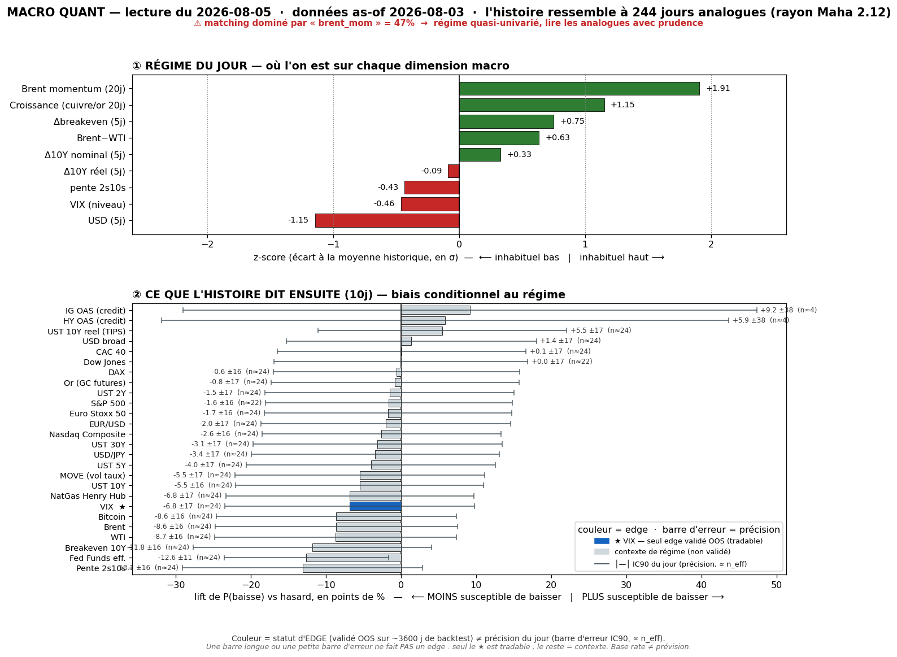

# Macro Quant Daily — 2026-08-05 (données as-of **2026-08-03**)

> **Couche 2 (les ODDS)** : fréquence historique (2007→, 244 analogues) d'un move après un régime comparable. Base rate conditionnel, PAS une prévision. Direction exploitable uniquement sur asset à skill OOS (**VIX seul**) ; le reste = **contexte de régime**.

> ✅ **LE RUN QU'ON ATTENDAIT — crash Brent intégré, matching sain.**
> As-of = **03/08** : le crash Brent −5,64% du 03/08 est **enfin dans FRED**. Effet double, positif : (1) `brent_mom` a **basculé +2,50 → +1,91** (le momentum 20j se dégonfle) ; (2) **dominance brent_mom 62% → 47%** — toujours flaggée (>40%) mais **le régime n'est plus quasi-univarié** : `growth` +1,15, `dusd_5` −1,15, `dbe_5` +0,75 pèsent désormais autant. **Fin du fossile de latence** des 3 derniers runs. Le contexte redevient lisible (mais reste non-OOS → toujours pas tradable hors VIX).

## §1 — Régime du jour (z-scores causaux, as-of 03/08)
- `brent_mom` **+1,91** · `growth` **+1,15** · `dbe_5` +0,75 · `brwti` +0,63 · `d10_5` +0,33 · `dreal_5` −0,09 · `slope` −0,43 · `vix_lvl` **−0,46** · `dusd_5` **−1,15**
- **Δ vs 31/07** : `brent_mom` se dégonfle (+2,50 → +1,91, crash intégré) · dominance **62% → 47%** · `dbe_5` monte (+0,25 → +0,75, breakevens en hausse = anticipations d'inflation ↑) · `growth` se renforce encore (+0,94 → +1,15).
- **Lecture** : régime « **reflation + USD faible + VIX bas** », oil encore en momentum positif mais **en décrue**. Combinaison low-vol/growth-on qui, historiquement, précède une **remontée de vol** (§2bis). Rayon Mahalanobis **2,123** (analogues plus serrés que les runs précédents → matching de meilleure qualité).

## §2 — Base rates forward 10j (horizon FIXE pour tous — contexte glanceable)
Chiffre utile = **LIFT**. Tags : 🔴 n_eff<20 · 🟡 20-60 · 🟢 >60. **Seul VIX = direction exploitable OOS** ; le reste = **contexte, direction NON exploitable** (IC OOS ≈ 0). Plafond n_eff @10j ≈ 24 → aucune ligne 🟢 (normal).

Asset · lift(10j) · mean_cond · mean_uncond · n_eff · tag · statut

- **VIXCLS (VIX)** · **+0,72** · +0,73 · +0,01 · 24,4 · 🟡 · **OOS EXPLOITABLE → VOL-UP significatif** (a survécu au flip oil ; voir §2bis)
- DGS10 (UST 10Y) · +1,98 · +1,94 · −0,04 · 24,4 · 🟡 · contexte (pas de skill OOS)
- T10YIE (Breakeven 10Y) · +1,97 · +1,96 · −0,01 · 24,4 · 🟡 · contexte
- DGS30 (UST 30Y) · +1,87 · +1,92 · +0,05 · 24,4 · 🟡 · contexte
- BTCUSD (Bitcoin) · +1,83 · +3,54 · +1,71 · 24,4 · 🟡 · contexte
- DFF (Fed Funds eff.) · +1,80 · +1,46 · −0,34 · 24,4 · 🟡 · contexte
- DCOILBRENTEU (Brent) · +1,38 · +1,46 · +0,09 · 24,4 · 🟡 · contexte
- T10Y2Y (Pente 2s10s) · +1,30 · +1,41 · +0,10 · 24,4 · 🟡 · contexte
- DGS5 (UST 5Y) · +1,18 · +1,09 · −0,09 · 24,4 · 🟡 · contexte
- DCOILWTICO (WTI) · +1,14 · +1,23 · +0,09 · 24,4 · 🟡 · contexte
- MOVE (vol taux) · +0,88 · +0,91 · +0,03 · 24,4 · 🟡 · **resp-only — réfuté OOS**, candidat sous observation
- DHHNGSP (NatGas) · +0,81 · +0,64 · −0,17 · 24,4 · 🟡 · contexte
- DGS2 (UST 2Y) · +0,67 · +0,53 · −0,14 · 24,4 · 🟡 · contexte
- CAC40 · +0,11 · +0,19 · +0,08 · 24,4 · 🟡 · contexte (nul)
- GOLD (Or) · +0,09 · +0,47 · +0,38 · 24,4 · 🟡 · contexte (nul)
- DEXJPUS (USD/JPY) · +0,08 · +0,14 · +0,06 · 24,4 · 🟡 · contexte (nul)
- DEXUSEU (EUR/USD) · +0,05 · +0,02 · −0,03 · 24,4 · 🟡 · contexte (nul)
- DJIA (Dow) · +0,05 · +0,47 · +0,42 · 22,2 · 🟡 · contexte (nul)
- DFII10 (UST 10Y réel) · +0,00 · −0,03 · −0,03 · 24,4 · 🟡 · contexte (nul)
- DTWEXBGS (USD broad) · −0,02 · +0,02 · +0,04 · 24,4 · 🟡 · contexte (nul)
- NASDAQCOM (Nasdaq) · −0,03 · +0,45 · +0,48 · 24,4 · 🟡 · contexte (nul)
- STOXX50 · −0,04 · +0,04 · +0,08 · 24,4 · 🟡 · contexte (nul)
- SP500 · −0,12 · +0,38 · +0,50 · 22,2 · 🟡 · contexte (léger sous-baseline)
- DAX · −0,14 · +0,13 · +0,27 · 24,4 · 🟡 · contexte
- Crédit IG/HY OAS · −0,26 / −3,08 · — · — · **4,4** · 🔴 · ignoré (n_eff trop faible)

> **Prose (pas un pari)** : le cluster taux (DGS10 +1,98, breakeven +1,97) est **non-OOS** → contexte, pas un pari. À noter : les **actions US ont un lift ~0 à légèrement négatif** (SP500 −0,12, Nasdaq −0,03) — le régime reflation/low-vol n'a **pas** de biais haussier actions conditionnel. Seul VIX porte un signal.

## §2bis — Term-structure VIX (5/10/20j) — le SEUL endroit où l'horizon change une décision
Asset OOS-validé (IC OOS +0,170 @10j, t=3,22). **Test de robustesse passé : le signal survit au changement de régime.**

Horizon · lift_mean · mean_cond · pneg_cond · n_eff · tag · CI90 · signal

- **5j** · **+0,25** · +0,26 · 50,4% · 48,8 · 🟡 · **[+0,01 ; +0,49]** · **True → SIGNIFICATIF** (CI exclut 0, borne basse serrée)
- **10j** · **+0,72** · +0,73 · 46,7% · 24,4 · 🟡 · **[+0,43 ; +1,07]** · **True → SIGNIFICATIF**
- **20j** · **+1,08** · +1,11 · 50,8% · 12,2 · 🔴 · [+0,63 ; +1,61] · True → significatif mais **n_eff 12 (🔴, prudence)**

> **Lecture VIX — le point important du jour** : le signal vol-up **a tenu le flip de régime** (crash oil intégré). Il s'est **affaibli** (10j : +0,92 le 31/07 → **+0,72** aujourd'hui ; 5j : +0,37 → +0,25, borne basse quasi collée à 0) mais **reste significatif** (CI excluent 0 à 5j et 10j). ⇒ Ce n'était **pas** un pur artefact de l'oil-momentum périmé : sur un régime post-crash, low-vol/reflation continue de précéder une remontée de VIX. **C'est un vrai renforcement de la lecture** (le signal a passé son test de résistance).
> **Contre-exemples (obligatoire)** : à 10j le VIX **baisse quand même 46,7% du temps** → favorable ~53%, **tilt d'espérance pas certitude**. Et rappel dur : base rate = move *moyen*, **aveugle aux sauts de crise** (capture ~2%) → **jamais** un hedge anti-krach.

## §3 — Conclusion statistique
1. **VIX = vol-UP significatif, robuste au changement de régime.** +0,25 @5j / +0,72 @10j (CI excluent 0), monotone jusqu'à +1,08 @20j. Le signal a **survécu à l'intégration du crash oil** → gagne en crédibilité (ce n'était pas un fossile de latence). Espérance de vol en hausse sur 1-4 sem depuis un point bas — **tilt (~53% favorable à 10j), pas garantie.**
2. **Matching redevenu sain** : dominance brent_mom 47% (vs 78% il y a 3 jours), rayon Mahalanobis 2,12 (analogues serrés). Le contexte non-OOS (taux ↑) est de nouveau lisible mais **toujours non tradable** (pas de skill OOS).
3. **Actions sans biais conditionnel** (SP500/Nasdaq lift ≈ 0) : le régime ne dit rien de directionnel sur les indices.
4. **MOVE** (+0,88) toujours **resp-only** (réfuté OOS), suivi cross-day.

## §4 — Confrontation Couche 1 ↔ Couche 2 (⇢ CONVERGENCE naissante sur la vol)
Croisement avec [[Macro/Daily/2026-08-04 - Macro Daily]] (régime live 04/08 : **RISK-ON continu, désescalade oil (Hormuz), VIX ~18, DXY <100**).

- **CONVERGENCE naissante (le changement vs hier)** : Couche 2 dit **vol-up sur 5-20j** ; Couche 1 montre le **VIX qui grimpe déjà 16,8 (03/08) → ~18 (04/08)**, toujours <20 mais **en dérive haussière**. Les deux couches pointent désormais **le même sens** : vol basse mais qui se re-tend. Hier c'était une divergence temporelle ; aujourd'hui le live commence à **valider le base rate**. → renforce le **watch vol-long** (structures longues vega encore bon marché à VIX ~18).
- **Cohérence oil** : la Couche 2 n'est plus en contradiction avec le live — `brent_mom` a intégré le crash, le régime colle mieux au tape (désescalade oil, reflation, USD mou).
- **Nuance / priorité** : le contexte live reste **risk-on franc** (Hormuz reopening = désinflation forward, pro-actions). Le base rate VIX est un **tilt d'espérance de vol**, pas un signal de retournement actions. **Priorité Couche 1** pour le tape immédiat ; la Couche 2 = **alerte que le plancher de vol est probablement en train de se former.**

## §5 — À rerunner
- **Signal VIX à monitorer en live** : le VIX a passé 16,8 → 18. S'il continue à dériver alors que le base rate dit vol-up (et que VIX reste <18-19), l'asymétrie d'un long-vega s'améliore — **mais respecter les 47% de contre-exemples.**
- **Prochain run** : suivre la **décrue de `brent_mom`** (le momentum 20j va continuer à baisser à mesure que le crash s'enfonce dans la fenêtre) → dominance devrait repasser <40% (fin du flag) → matching pleinement multi-facteurs.
- **Backtest trimestriel** (`macro_quant_backtest.py` → `analyze_db.py`) : ré-évaluer **MOVE** (candidat réfuté).
- **Note perf** : ce run est le **cas d'école inverse** du 03/08 — quand la latence se résorbe, le signal survivant (VIX) se distingue du contexte fossile (taux/oil). À citer comme exemple de « signal OOS robuste vs contexte de latence ».
