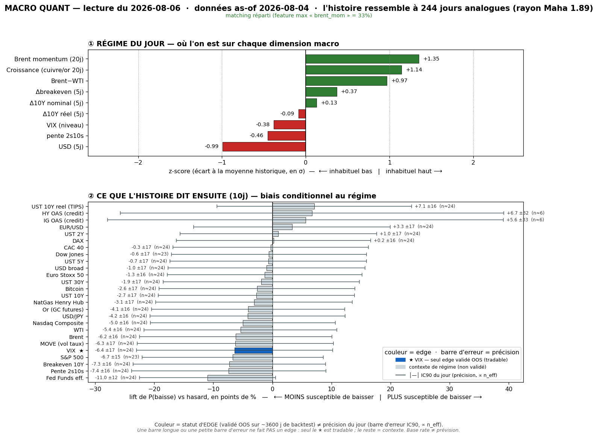

# Macro Quant Daily — 2026-08-06 (données as-of **2026-08-04**)

> **Couche 2 (les ODDS)** : fréquence historique (2007→, 244 analogues) d'un move après un régime comparable. Base rate conditionnel, PAS une prévision. Direction exploitable uniquement sur asset à skill OOS (**VIX seul**) ; le reste = **contexte de régime**.

> ✅ **PREMIER RUN SANS GAP DE LATENCE — as-of 04/08 = date du Daily live 04/08.**
> Pour la première fois depuis le crash oil, la Couche 2 (base rate, as-of 04/08) et la Couche 1 (Daily live, 04/08) sont **sur le MÊME jour calendaire** : plus de fossile de latence, la confrontation §4 est enfin propre (aucun décalage à corriger). Le dégonflage oil se poursuit : `brent_mom` **+1,91 → +1,35**, et surtout **dominance brent_mom 47% → 33%** → **flag levé** (<40%) : le matching n'est **plus** quasi-univarié, le régime est redevenu pleinement multivarié (`growth` +1,14, `dusd_5` −0,99, `brwti` +0,97 pèsent autant). Contexte lisible et sain — mais toujours non-OOS hors VIX.

## §1 — Régime du jour (z-scores causaux, as-of 04/08)
- `brent_mom` **+1,35** · `growth` **+1,14** · `brwti` +0,97 · `dbe_5` +0,37 · `d10_5` +0,13 · `dreal_5` −0,09 · `slope` −0,46 · `vix_lvl` **−0,38** · `dusd_5` **−0,99**
- **Δ vs 03/08** : `brent_mom` continue de se dégonfler (+1,91 → **+1,35**, crash qui se propage dans le momentum 20j) · dominance **47% → 33% (flag levé)** · `dbe_5` reflue (+0,75 → +0,37, les breakevens redescendent) · `growth` stable (+1,15 → +1,14) · `dusd_5` remonte un peu (−1,15 → −0,99, USD moins faible).
- **Lecture** : régime « **reflation modérée + USD faible + VIX bas** », oil en décrue continue. Toujours la combinaison low-vol/growth-on qui, historiquement, précède une **remontée de vol** (§2bis). Rayon Mahalanobis **1,893** (analogues encore plus serrés que le run précédent 2,123 → matching de meilleure qualité run après run). PCA var. expliquée 77,3%.

## §2 — Base rates forward 10j (horizon FIXE pour tous — contexte glanceable)
Chiffre utile = **LIFT**. Tags : 🔴 n_eff<20 · 🟡 20-60 · 🟢 >60. **Seul VIX = direction exploitable OOS** ; le reste = **contexte, direction NON exploitable** (IC OOS ≈ 0). Plafond n_eff @10j ≈ 24 → aucune ligne 🟢 (normal).

Asset · lift(10j) · mean_cond · mean_uncond · n_eff · tag · statut

- DHHNGSP (NatGas) · **+1,84** · +1,68 · −0,17 · 24,4 · 🟡 · contexte
- T10YIE (Breakeven 10Y) · +1,83 · +1,82 · −0,01 · 24,4 · 🟡 · contexte
- DFF (Fed Funds eff.) · +1,62 · +1,29 · −0,34 · 24,4 · 🟡 · contexte
- DCOILBRENTEU (Brent) · +1,11 · +1,21 · +0,09 · 24,4 · 🟡 · contexte — ⚠ circulaire
- T10Y2Y (Pente 2s10s) · +1,09 · +1,20 · +0,10 · 24,4 · 🟡 · contexte
- DGS30 (UST 30Y) · +1,03 · +1,09 · +0,05 · 24,4 · 🟡 · contexte
- DCOILWTICO (WTI) · +1,03 · +1,12 · +0,09 · 24,4 · 🟡 · contexte — ⚠ idem
- DGS10 (UST 10Y) · +0,89 · +0,86 · −0,03 · 24,4 · 🟡 · contexte
- BTCUSD (Bitcoin) · +0,86 · +2,57 · +1,71 · 24,0 · 🟡 · contexte
- MOVE (vol taux) · +0,78 · +0,81 · +0,03 · 24,4 · 🟡 · **resp-only — réfuté OOS**, candidat sous observation
- **VIXCLS (VIX)** · **+0,68** · +0,69 · +0,01 · 24,4 · 🟡 · **OOS EXPLOITABLE → VOL-UP significatif** (voir §2bis pour term-structure + CI)
- GOLD (Or) · +0,43 · +0,81 · +0,38 · 24,4 · 🟡 · contexte
- NASDAQCOM (Nasdaq) · +0,07 · +0,56 · +0,48 · 24,4 · 🟡 · contexte (nul)
- DEXJPUS (USD/JPY) · +0,07 · +0,14 · +0,06 · 24,4 · 🟡 · contexte (nul)
- DGS5 (UST 5Y) · +0,07 · −0,02 · −0,09 · 24,4 · 🟡 · contexte (nul)
- CAC40 · +0,01 · +0,09 · +0,08 · 24,4 · 🟡 · contexte (nul)
- DEXUSEU (EUR/USD) · −0,00 · −0,03 · −0,03 · 24,4 · 🟡 · contexte (nul)
- SP500 · −0,01 · +0,49 · +0,50 · 23,1 · 🟡 · contexte (nul)
- DTWEXBGS (USD broad) · −0,04 · −0,00 · +0,04 · 24,4 · 🟡 · contexte (nul)
- DJIA (Dow) · −0,05 · +0,37 · +0,42 · 23,1 · 🟡 · contexte (nul)
- STOXX50 · −0,10 · −0,03 · +0,08 · 24,4 · 🟡 · contexte
- DGS2 (UST 2Y) · −0,20 · −0,34 · −0,14 · 24,4 · 🟡 · contexte
- DAX · −0,29 · −0,03 · +0,27 · 24,4 · 🟡 · contexte
- DFII10 (UST 10Y réel/TIPS) · **−0,94** · −0,96 · −0,03 · 24,4 · 🟡 · contexte
- Crédit HY/IG OAS · −0,71 / +0,31 · — · — · **5,9** · 🔴 · ignoré (n_eff trop faible)

> **Prose (pas un pari)** : le cluster taux/oil s'est **beaucoup tassé** vs les runs pré-crash (les longs +2/+3 ont disparu, brent lift +1,11). Rien de tout ça n'est OOS → contexte. La seule ligne actionnable reste **VIX** (§2bis). À noter : **MOVE +0,78 > VIX +0,68** @10j ce jour — MOVE reste `resp-only` (réfuté OOS, cf. §3), mais le suivi cross-day (panneau ③) capte l'écart.

## §2bis — Term-structure VIX (5/10/20j) — le SEUL endroit où l'horizon change une décision
Asset OOS-validé (IC OOS +0,170 @10j, t=3,22). **Aujourd'hui : signal vol-up toujours significatif, croissant avec l'horizon — 4e run consécutif où il tient.**

Horizon · lift_mean · mean_cond · pneg_cond · n_eff · tag · CI90 · signal

- **5j** · **+0,34** · +0,34 · 50,0% · 48,8 · 🟡 · **[+0,11 ; +0,57]** · **True → SIGNIFICATIF** (CI exclut 0)
- **10j** · **+0,68** · +0,69 · 47,1% · 24,4 · 🟡 · **[+0,39 ; +0,99]** · **True → SIGNIFICATIF** (CI exclut 0)
- **20j** · **+1,03** · +1,06 · 48,4% · 12,2 · 🔴 · [+0,61 ; +1,54] · True → significatif mais **n_eff 12 (🔴, prudence)**

> **Lecture VIX** : signal **stable et robuste** run après run. Depuis la bascule du 31/07, la term-structure a à peine bougé malgré le flip complet de régime oil : 10j +0,92 (as-of 31/07) → +0,72 (03/08) → **+0,68 (04/08)** — léger tassement, mais **CI excluent toujours 0 aux 3 horizons**. C'est la confirmation forte de la semaine : **le signal vol-up N'ÉTAIT PAS un artefact de latence oil** — il a survécu au dégonflage complet de `brent_mom` (+2,50 → +1,35) ET à la levée du flag de dominance. Edge du modèle = le **TIMING de la vol** : « vol basse maintenant → tend à remonter sur 1-4 semaines ».
> **Contre-exemples (obligatoire)** : à 10j, le VIX **baisse quand même 47,1% du temps** → favorable ~53%, défavorable ~47%. **Tilt d'espérance, pas une certitude.** À 5j c'est encore plus serré (pneg 50,0% = pile favorable/défavorable, l'edge est dans l'amplitude moyenne pas la fréquence). Rappel dur : le base rate prédit le move *moyen*, il est **aveugle aux sauts de crise** (~2% des spikes capturés) — **jamais** un hedge anti-krach.

## §3 — Conclusion statistique
1. **Axe exploitable (VIX) : vol-up significatif, 4e run consécutif, robuste au flip de régime.** Lift +0,34 @5j / +0,68 @10j (CI excluent 0), monotone jusqu'à +1,03 @20j. Espérance de vol en hausse sur 1-4 semaines depuis un point bas — **tilt, pas garantie** (favorable ~53% à 10j).
2. **✅ Signal désormais dé-confondu du bruit oil.** Le régime n'est plus quasi-univarié (dominance 33%, flag levé) ET le crash Brent est pleinement digéré. Le signal vol-up qui tient à travers tout ça = **le plus propre de la semaine**. → Reste un **WATCH vol-long**, pas un trigger : l'edge est un tilt d'espérance, pas une entrée mécanique.
3. **Reste = contexte non exploitable** (taux/oil tassés, tous non-OOS) → aucune lecture directionnelle.
4. **MOVE** (+0,78 @10j, > VIX ce jour) toujours **resp-only** (réfuté OOS, IC OOS 10j −0,007 au dernier backtest) — suivi cross-day (panneau ③ analyze_db) pour le re-test trimestriel. L'écart MOVE>VIX du jour est du contexte, pas un signal.

## §4 — Confrontation Couche 1 ↔ Couche 2
Croisement avec [[Macro/Daily/2026-08-04 - Macro Daily]] (**même date que l'as-of — enfin synchrone**). Régime live : **RISK-ON continu / désescalade oil qui se parachève (Hormuz reopening imminent), VIX ~18 <20 contango, DXY 99,97 <100, US10 4,676%.**

- **SYNCHRO TEMPORELLE ENFIN ACQUISE** : depuis 3 runs la Couche 2 traînait derrière la Couche 1 (latence FRED oil). Aujourd'hui les deux sont sur le **04/08** → la confrontation ne souffre plus d'aucun décalage. C'est la première lecture « propre » de la semaine.
- **DIVERGENCE constructive sur la vol (inchangée)** : Couche 1 live = **vol calme** (VIX ~18, contango, sous 20) ; Couche 2 = **base rate tilté vol-UP** sur 5-20j depuis ce point bas. Pas contradictoire mais **complémentaire dans le temps** : « calme maintenant » (le OÙ) vs « tend à se re-tendre sur 1-4 sem » (les odds). **Créneau exact où le modèle a un edge OOS** → **watch vol-long** (structures longues vega bon marché tant que VIX <18-19), **pas** une entrée immédiate.
- **Note vol live** : le VIX a dérivé 16,8 (03/08) → ~18 (04/08) — début de re-tension **cohérent** avec le sens du base rate, mais encore sous 20 (Hormuz reopening = désinflation = force anti-vol à CT). → **priorité à la Couche 1 pour le tape immédiat** (risk-on domine) ; la Couche 2 reste l'**alerte d'espérance** sur 1-4 semaines.
- **CONVERGENCE ailleurs** : le reste de la Couche 2 s'est tassé au point de ne plus rien dire de directionnel (oil/taux non-OOS + lift faibles). Le seul recoupement exploitable reste la vol, en divergence temporelle constructive.

## §5 — À rerunner
- **Surveiller le VIX live vs le base rate** : s'il continue de dériver >18-19 alors que le tape reste risk-on, c'est le base rate qui « gagne » lentement ; s'il retombe <17 sur un Hormuz-deal confirmé, l'asymétrie long-vega bon marché s'améliore. Respecter le taux de contre-exemples (~47% du temps ça ne monte pas @10j).
- **Suivre le dégonflage `brent_mom`** : encore +1,35, va continuer de baisser dans les prochains runs (le crash sort progressivement de la fenêtre 20j). Vérifier que le signal VIX **reste stable** quand brent_mom passera négatif → dernier test de robustesse du régime.
- **Backtest trimestriel** (`macro_quant_backtest.py` → `analyze_db.py`) : ré-évaluer **MOVE** (candidat réfuté, IC OOS 10j −0,007 ; panneau ③ suit VIX vs MOVE run-après-run).
