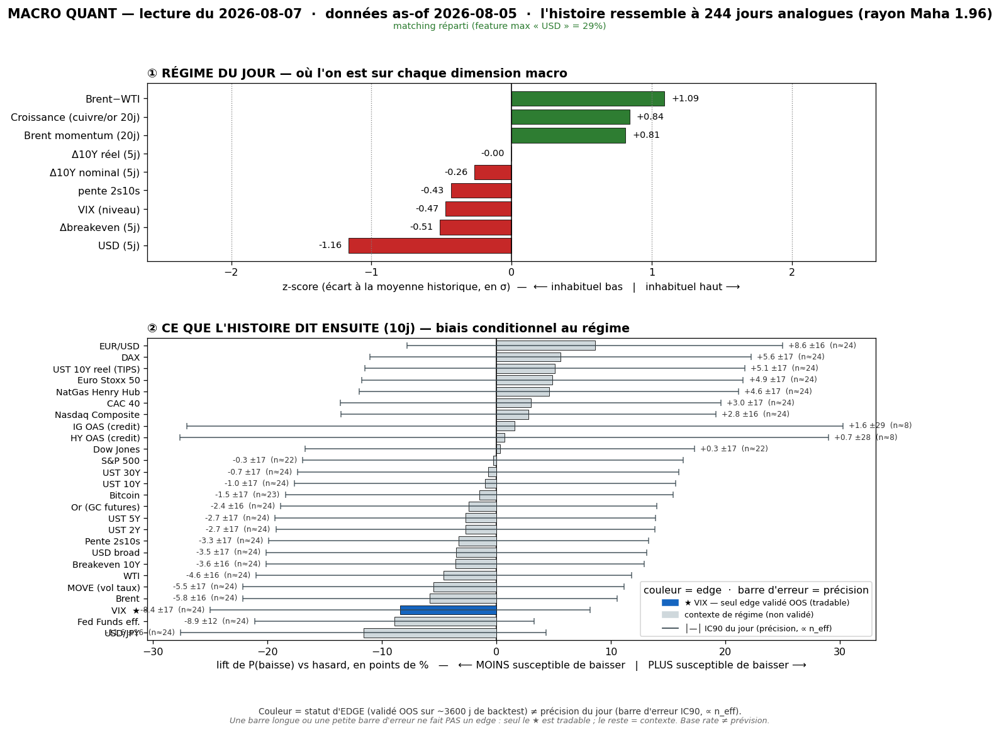

# Macro Quant Daily — 2026-08-07 (données as-of **2026-08-05**)

> **Couche 2 (les ODDS)** : fréquence historique (2007→, 244 analogues) d'un move après un régime comparable. Base rate conditionnel, PAS une prévision. Direction exploitable uniquement sur asset à skill OOS (**VIX seul**) ; le reste = **contexte de régime**.

> ✅ **FIN DE LA SAGA OIL — le régime a rotationné, plus aucun fossile de latence.**
> As-of = **05/08**. `brent_mom` s'est **totalement dégonflé** : +2,50 (31/07) → +1,91 → +1,35 → **+0,81** aujourd'hui. La feature dominante n'est **plus l'oil** mais **`dusd_5` (USD faible) à 29%** (flag <40%, matching multivarié sain). Le régime est désormais « **USD faible + reflation + VIX bas** », l'oil n'est plus qu'un facteur secondaire en décrue. Contexte propre et lisible — toujours non-OOS hors VIX. **Léger décalage résiduel** : as-of 05/08 vs Daily live 07/08 (≈2 j ouvrés de latence FRED oil) → le choc NFP du 07/08 (et le crash VIX à 14,90) n'est PAS encore dans le régime ci-dessous (cf. §4, ça le rend encore plus pertinent).

## §1 — Régime du jour (z-scores causaux, as-of 05/08)
- `dusd_5` **−1,16** · `brwti` **+1,09** · `growth` **+0,84** · `brent_mom` +0,81 · `dbe_5` −0,51 · `vix_lvl` **−0,47** · `slope` −0,43 · `d10_5` −0,26 · `dreal_5` −0,00
- **Δ vs 04/08** : bascule de leadership — `brent_mom` s'effondre (+1,35 → **+0,81**), `dusd_5` prend la tête (dominance **33% oil → 29% USD**) · `dbe_5` passe négatif (+0,37 → **−0,51**, breakevens qui refluent = anticipations d'inflation ↓) · `d10_5` passe négatif (taux longs qui détendent) · `vix_lvl` toujours bas (−0,47).
- **Lecture** : régime « **USD faible + reflation modérée + désinflation forward + VIX bas** ». Toujours la signature low-vol/growth-on qui, historiquement, précède une **remontée de vol** (§2bis) — et le signal s'est **renforcé** ce run. Rayon Mahalanobis 1,959, PCA var. expliquée 77,3%.

## §2 — Base rates forward 10j (horizon FIXE pour tous — contexte glanceable)
Chiffre utile = **LIFT**. Tags : 🔴 n_eff<20 · 🟡 20-60 · 🟢 >60. **Seul VIX = direction exploitable OOS** ; le reste = **contexte, direction NON exploitable** (IC OOS ≈ 0). Plafond n_eff @10j ≈ 24 → aucune ligne 🟢 (normal).

Asset · lift(10j) · mean_cond · mean_uncond · n_eff · tag · statut

- Crédit HY OAS · +2,17 · +0,52 · −1,65 · **8,2** · 🔴 · ignoré (n_eff trop faible)
- DCOILWTICO (WTI) · +1,34 · +1,44 · +0,09 · 24,4 · 🟡 · contexte — ⚠ circulaire
- DCOILBRENTEU (Brent) · +1,34 · +1,43 · +0,10 · 24,4 · 🟡 · contexte — ⚠ idem
- T10YIE (Breakeven 10Y) · +1,23 · +1,22 · −0,01 · 24,4 · 🟡 · contexte
- DGS10 (UST 10Y) · +1,17 · +1,14 · −0,03 · 24,4 · 🟡 · contexte
- DGS30 (UST 30Y) · +1,09 · +1,15 · +0,05 · 24,4 · 🟡 · contexte
- BTCUSD (Bitcoin) · +1,01 · +2,73 · +1,71 · 23,2 · 🟡 · contexte
- DFF (Fed Funds eff.) · +0,97 · +0,63 · −0,34 · 24,4 · 🟡 · contexte
- DGS5 (UST 5Y) · +0,92 · +0,84 · −0,09 · 24,4 · 🟡 · contexte
- MOVE (vol taux) · +0,92 · +0,95 · +0,03 · 24,4 · 🟡 · **resp-only — réfuté OOS**, candidat sous observation
- **VIXCLS (VIX)** · **+0,88** · +0,89 · +0,01 · 24,4 · 🟡 · **OOS EXPLOITABLE → VOL-UP significatif** (voir §2bis pour term-structure + CI)
- DGS2 (UST 2Y) · +0,64 · +0,50 · −0,14 · 24,4 · 🟡 · contexte
- T10Y2Y (Pente 2s10s) · +0,53 · +0,64 · +0,11 · 24,4 · 🟡 · contexte
- IG OAS (credit) · +0,36 · −0,27 · −0,63 · **8,2** · 🔴 · ignoré (n_eff trop faible)
- DEXJPUS (USD/JPY) · +0,31 · +0,37 · +0,06 · 24,4 · 🟡 · contexte
- GOLD (Or) · +0,11 · +0,49 · +0,38 · 24,4 · 🟡 · contexte (nul)
- DTWEXBGS (USD broad) · +0,05 · +0,10 · +0,04 · 24,4 · 🟡 · contexte (nul)
- DFII10 (UST 10Y réel/TIPS) · −0,06 · −0,09 · −0,02 · 24,4 · 🟡 · contexte (nul)
- DJIA (Dow) · −0,08 · +0,34 · +0,42 · 22,0 · 🟡 · contexte (nul)
- DEXUSEU (EUR/USD) · −0,12 · −0,14 · −0,03 · 24,4 · 🟡 · contexte
- CAC40 · −0,19 · −0,11 · +0,08 · 24,4 · 🟡 · contexte
- STOXX50 · −0,23 · −0,15 · +0,08 · 24,4 · 🟡 · contexte
- SP500 · −0,25 · +0,25 · +0,50 · 22,0 · 🟡 · contexte (sous baseline)
- DHHNGSP (NatGas) · −0,38 · −0,54 · −0,17 · 24,4 · 🟡 · contexte
- DAX · −0,40 · −0,12 · +0,27 · 24,4 · 🟡 · contexte
- NASDAQCOM (Nasdaq) · −0,40 · +0,08 · +0,48 · 24,4 · 🟡 · contexte (sous baseline)

> **Prose (pas un pari)** : signature intéressante ce run — **actions en lift négatif** (SP500 −0,25, Nasdaq −0,40, DAX −0,40) ET **vol-up + taux/oil positifs** : le profil « USD-faible/reflation depuis un VIX bas » a historiquement précédé un petit **wobble actions + re-tension vol**. **MAIS actions = non-OOS → contexte, PAS un short.** La seule ligne actionnable reste **VIX** (§2bis). MOVE +0,92 > VIX +0,88 à nouveau — MOVE reste `resp-only` (réfuté OOS).

## §2bis — Term-structure VIX (5/10/20j) — le SEUL endroit où l'horizon change une décision
Asset OOS-validé (IC OOS +0,170 @10j, t=3,22). **Aujourd'hui : signal vol-up qui SE RENFORCE — 5e run consécutif, le plus fort depuis le 31/07.**

Horizon · lift_mean · mean_cond · pneg_cond · n_eff · tag · CI90 · signal

- **5j** · **+0,56** · +0,56 · 47,5% · 48,8 · 🟡 · **[+0,31 ; +0,82]** · **True → SIGNIFICATIF** (CI exclut 0)
- **10j** · **+0,88** · +0,89 · 45,1% · 24,4 · 🟡 · **[+0,59 ; +1,19]** · **True → SIGNIFICATIF** (CI exclut 0)
- **20j** · **+1,40** · +1,43 · 43,9% · 12,2 · 🔴 · [+0,95 ; +1,89] · True → significatif mais **n_eff 12 (🔴, prudence)**

> **Lecture VIX** : le signal **remonte** après 3 runs de léger tassement. 10j : +0,92 (31/07) → +0,72 (03/08) → +0,68 (04/08) → **+0,88 (05/08)**. Et le taux de contre-exemples **s'améliore** : pneg 10j 45,1% → **favorable ~55%** (vs ~53% hier). C'est la 5e lecture d'affilée où la term-structure vol-up tient, malgré la rotation complète du régime (oil → USD). Edge du modèle = le **TIMING de la vol** : « vol basse maintenant → tend à remonter sur 1-4 semaines », et il le dit plus fort ce run.
> **Contre-exemples (obligatoire)** : à 10j, le VIX **baisse quand même 45,1% du temps** → favorable ~55%, défavorable ~45%. **Tilt d'espérance, pas une certitude.** À 5j, pneg 47,5% (favorable ~52%, l'edge est surtout dans l'amplitude moyenne). Rappel dur : le base rate prédit le move *moyen*, il est **aveugle aux sauts de crise** (~2% des spikes capturés) — **jamais** un hedge anti-krach.

## §3 — Conclusion statistique
1. **Axe exploitable (VIX) : vol-up significatif ET en renforcement.** Lift +0,56 @5j / +0,88 @10j (CI excluent 0), monotone jusqu'à +1,40 @20j. 5e run consécutif, le plus fort depuis la bascule du 31/07. Favorable ~55% @10j — **tilt, pas garantie**.
2. **✅ Signal robuste à la rotation complète du régime.** Le vol-up a tenu à travers : le flip oil (crash Brent), le dégonflage total de `brent_mom` (+2,50 → +0,81), la levée du flag de dominance, ET le changement de leadership (oil → USD faible). Ce n'est **pas** un artefact d'un régime particulier → c'est la signature générique « complacency low-vol → mean-reversion vol ». **WATCH vol-long renforcé**, pas un trigger.
3. **Contexte** : actions en lift négatif + taux/oil positifs = profil de petit wobble, mais **tout non-OOS** → aucune lecture directionnelle hors VIX.
4. **MOVE** (+0,92 @10j, > VIX 3e run d'affilée) toujours **resp-only** (réfuté OOS, IC OOS 10j −0,007 au dernier backtest). L'écart MOVE>VIX est du contexte, pas un signal — suivi cross-day (panneau ③ analyze_db) pour le re-test trimestriel.

## §4 — Confrontation Couche 1 ↔ Couche 2
Croisement avec [[Macro/Daily/2026-08-07 - Macro Daily]] (Daily du jour). Régime live : **RISK-ON / CHOC DOVISH EMPLOI — NFP juillet −23k (1ère baisse, hike Sept OFF the table), S&P record close 7 757,64, Nasdaq +1,3%, VIX 14,90 (complacency PROFONDE), semaine la + forte depuis avril.**

- **DIVERGENCE MAXIMALE — et c'est le cœur du signal.** Couche 1 live = **VIX 14,90, complacency profonde, records actions** (le marché fête le NFP dovish comme un pur risk-on). Couche 2 = **base rate vol-UP qui se renforce** (+0,88 @10j depuis un point encore plus bas). Ce n'est PAS contradictoire : **VIX <15 sur euphorie post-données = exactement le régime où le modèle a son edge OOS** (mean-reversion de la vol sur 1-4 sem). Plus le VIX live descend (14,90 !), plus le point de départ est bas → plus l'asymétrie d'un long-vega bon marché s'améliore.
- **Le décalage joue en faveur du signal, pas contre** : le régime Couche 2 (as-of 05/08) ne « voit » pas encore le crash VIX à 14,90 du 07/08. Une fois intégré, le `vix_lvl` sera **encore plus bas** que −0,47 → le base rate vol-up sera *a priori* renforcé au prochain run. À re-vérifier.
- **Nuance CT (priorité Couche 1)** : le tape immédiat est un risk-on record porté par le pivot dovish (hike off) — force **anti-vol** à très court terme. Le VIX peut rester scotché bas plusieurs jours. → **watch vol-long comme structure d'espérance 1-4 sem** (vega long bon marché tant que VIX <15-16), **pas** une entrée mécanique aujourd'hui. Respecter les 45% de contre-exemples.
- **CONVERGENCE ailleurs** : aucune exploitable. Le reste de la Couche 2 (actions en lift négatif) « rime » avec l'idée d'un essoufflement après une semaine +5% Nasdaq, mais c'est non-OOS → à ne PAS trader. Le seul recoupement décisionnel reste la vol, en divergence temporelle constructive (la plus nette de la semaine).

## §5 — À rerunner
- **Prochain run = test clé** : une fois le 07/08 dans FRED, le crash VIX à 14,90 fera plonger `vix_lvl` → vérifier que le base rate vol-up **se renforce encore** (cohérence interne) et que le régime reste « USD-faible/low-vol ».
- **Surveiller le VIX live vs base rate** : à 14,90 c'est un plancher de complacency ; toute re-tension >16-17 valide lentement le base rate. S'il reste <15 sur l'euphorie NFP, l'asymétrie long-vega s'améliore encore — mais 45% du temps ça ne monte pas @10j.
- **Suivre `brent_mom`** : +0,81, va passer négatif au prochain run (le crash sort de la fenêtre 20j) → dernier jalon de la sortie complète du fossile oil. Vérifier que le VIX reste stable quand ça bascule.
- **Backtest trimestriel** (`macro_quant_backtest.py` → `analyze_db.py`) : ré-évaluer **MOVE** (candidat réfuté, IC OOS 10j −0,007 ; panneau ③ suit VIX vs MOVE, MOVE>VIX 3 runs d'affilée en lift *réalisé* à surveiller).
