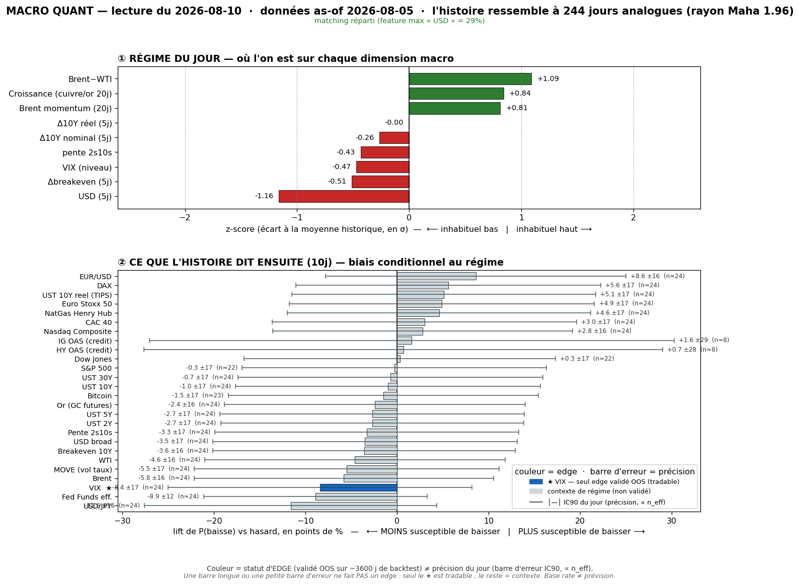
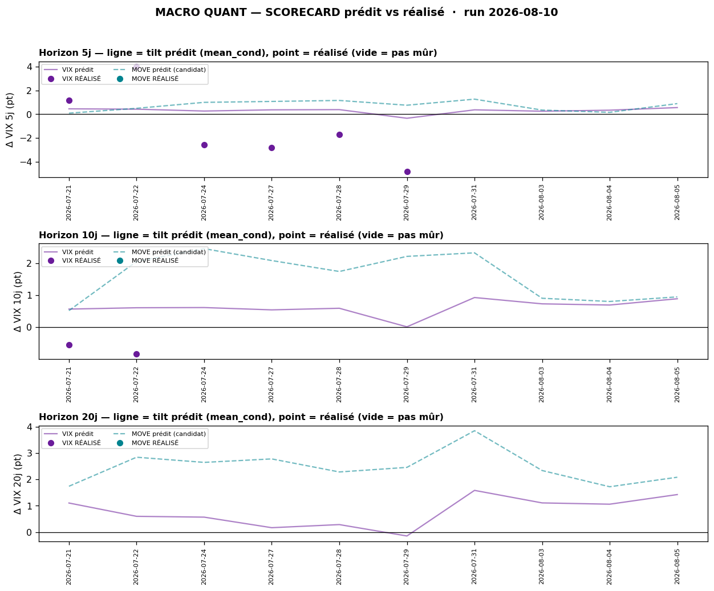

# Macro Quant Daily — 2026-08-10 (données as-of **2026-08-05**)

> **Couche 2 (les ODDS)** : fréquence historique (2007→, 244 analogues) d'un move après un régime comparable. Base rate conditionnel, PAS une prévision. Direction exploitable uniquement sur asset à skill OOS (**VIX seul**) ; le reste = **contexte de régime**.

> ⏸️ **AS-OF GELÉ AU 05/08 — régime inchangé vs vendredi (run 07/08).** FRED n'a pas publié de nouvelle donnée oil sur le week-end → l'as-of reste **05/08**, donc §1/§2/§2bis sont **identiques à la note du 07/08**. **Le neuf de ce run = §2ter (scorecard live)** : premier affichage du track-record prédit vs réalisé du signal VIX. Prochain vrai mouvement de régime attendu quand FRED passe le 06-07/08 (post-NFP).

## §1 — Régime du jour (z-scores causaux, as-of 05/08) — *inchangé vs 07/08*
Feature (tri par |z|) · z · sens

| Feature | z | Sens |
|---|---:|---|
| `dusd_5` — USD broad (5j) | **−1,16** | USD faible |
| `brwti` — Brent−WTI | **+1,09** | spread oil élevé |
| `growth` — cuivre/or | +0,84 | reflation |
| `brent_mom` — Brent 20j | +0,81 | oil en décrue |
| `dbe_5` — breakeven 10Y | −0,51 | inflation attendue ↓ |
| `vix_lvl` — VIX niveau | **−0,47** | VIX bas |
| `slope` — pente 2s10s | −0,43 | s'aplatit |
| `d10_5` — 10Y nominal | −0,26 | taux longs ↓ |
| `dreal_5` — 10Y réel (TIPS) | −0,00 | neutre |

- **Lecture** : régime « **USD faible + reflation modérée + désinflation forward + VIX bas** », oil en décrue (feature dominante = `dusd_5` USD faible à **29%**, flag <40% = matching multivarié sain). Signature low-vol/growth-on qui, historiquement, précède une **remontée de vol** (§2bis). Rayon Mahalanobis 1,959.

## §2 — Base rates forward 10j (horizon FIXE pour tous — contexte glanceable)
Chiffre utile = **LIFT**. Tags : 🔴 n_eff<20 · 🟡 20-60 · 🟢 >60. **Seul VIX = direction exploitable OOS** ; le reste = **contexte, direction NON exploitable** (IC OOS ≈ 0). *(Table inchangée vs 07/08 — as-of gelé.)*

| Asset | lift 10j | cond | uncond | n_eff | tag | statut |
|---|---:|---:|---:|---:|:-:|---|
| Crédit HY OAS | +2,17 | +0,52 | −1,65 | 8,2 | 🔴 | ignoré (n_eff trop faible) |
| DCOILWTICO (WTI) | +1,34 | +1,44 | +0,09 | 24,4 | 🟡 | contexte — ⚠ circulaire |
| DCOILBRENTEU (Brent) | +1,34 | +1,43 | +0,10 | 24,4 | 🟡 | contexte — ⚠ idem |
| T10YIE (Breakeven 10Y) | +1,23 | +1,22 | −0,01 | 24,4 | 🟡 | contexte |
| DGS10 (UST 10Y) | +1,17 | +1,14 | −0,03 | 24,4 | 🟡 | contexte |
| DGS30 (UST 30Y) | +1,09 | +1,15 | +0,05 | 24,4 | 🟡 | contexte |
| BTCUSD (Bitcoin) | +1,01 | +2,73 | +1,71 | 23,2 | 🟡 | contexte |
| DFF (Fed Funds eff.) | +0,97 | +0,63 | −0,34 | 24,4 | 🟡 | contexte |
| DGS5 (UST 5Y) | +0,92 | +0,84 | −0,09 | 24,4 | 🟡 | contexte |
| MOVE (vol taux) | +0,92 | +0,95 | +0,03 | 24,4 | 🟡 | **resp-only — réfuté OOS**, candidat sous obs. |
| **VIXCLS (VIX)** | **+0,88** | +0,89 | +0,01 | 24,4 | 🟡 | **OOS EXPLOITABLE → VOL-UP signif.** (§2bis + §2ter) |
| DGS2 (UST 2Y) | +0,64 | +0,50 | −0,14 | 24,4 | 🟡 | contexte |
| T10Y2Y (Pente 2s10s) | +0,53 | +0,64 | +0,11 | 24,4 | 🟡 | contexte |
| IG OAS (credit) | +0,36 | −0,27 | −0,63 | 8,2 | 🔴 | ignoré (n_eff trop faible) |
| DEXJPUS (USD/JPY) | +0,31 | +0,37 | +0,06 | 24,4 | 🟡 | contexte |
| GOLD (Or) | +0,11 | +0,49 | +0,38 | 24,4 | 🟡 | contexte (nul) |
| DTWEXBGS (USD broad) | +0,05 | +0,10 | +0,04 | 24,4 | 🟡 | contexte (nul) |
| DFII10 (UST 10Y réel/TIPS) | −0,06 | −0,09 | −0,02 | 24,4 | 🟡 | contexte (nul) |
| DJIA (Dow) | −0,08 | +0,34 | +0,42 | 22,0 | 🟡 | contexte (nul) |
| DEXUSEU (EUR/USD) | −0,12 | −0,14 | −0,03 | 24,4 | 🟡 | contexte |
| CAC40 | −0,19 | −0,11 | +0,08 | 24,4 | 🟡 | contexte |
| STOXX50 | −0,23 | −0,15 | +0,08 | 24,4 | 🟡 | contexte |
| SP500 | −0,25 | +0,25 | +0,50 | 22,0 | 🟡 | contexte (sous baseline) |
| DHHNGSP (NatGas) | −0,38 | −0,54 | −0,17 | 24,4 | 🟡 | contexte |
| DAX | −0,40 | −0,12 | +0,27 | 24,4 | 🟡 | contexte |
| NASDAQCOM (Nasdaq) | −0,40 | +0,08 | +0,48 | 24,4 | 🟡 | contexte (sous baseline) |

> **Prose (pas un pari)** : actions en lift négatif + taux/oil positifs = profil de petit wobble, mais **tout non-OOS → contexte**. Seule ligne actionnable = **VIX** (§2bis), à lire désormais **en regard du track-record réalisé** (§2ter).

## §2bis — Term-structure VIX (5/10/20j) — *inchangé vs 07/08*
Asset OOS-validé (IC OOS +0,170 @10j, t=3,22).

Horizon · lift_mean · mean_cond · pneg_cond · n_eff · tag · CI90 · signal

- **5j** · **+0,56** · +0,56 · 47,5% · 48,8 · 🟡 · **[+0,31 ; +0,82]** · **True → SIGNIFICATIF**
- **10j** · **+0,88** · +0,89 · 45,1% · 24,4 · 🟡 · **[+0,59 ; +1,19]** · **True → SIGNIFICATIF**
- **20j** · **+1,40** · +1,43 · 43,9% · 12,2 · 🔴 · [+0,95 ; +1,89] · True → significatif mais **n_eff 12 (🔴)**

> **Lecture VIX** : signal vol-up significatif, favorable ~55% @10j (pneg 45,1%) — **tilt, pas certitude** (défavorable ~45% du temps). Edge du modèle = le TIMING de la vol depuis un point bas. Aveugle aux sauts de crise (~2% des spikes) — **jamais** un hedge anti-krach.

## §2ter — Track-record LIVE du signal (prédit vs RÉALISÉ) — **NOUVEAU**

Confronte le base rate VIX **prédit** (`mean_cond`) au **réalisé** (`VIX[asof+h] − VIX[asof]`, en points), sur les runs live assez vieux pour être mûrs. VIX réalisé jusqu'au **06/08**. 10 as-of distincts émis depuis le 21/07.

Horizon · N mûrs / en attente · prédit moy · réalisé moy · hit directionnel · IC réalisé

- **5j** · 6 mûrs / 4 en attente · prédit **+0,26** pt · réalisé **−1,13** pt · **3/6 = 50%** · IC +0,68
- **10j** · 2 mûrs / 8 en attente · prédit **+0,59** pt · réalisé **−0,69** pt · **0/2 = 0%** · IC n/a
- **20j** · 0 mûr / 10 en attente · — (fenêtre pas écoulée)
- **MOVE** · non notable — série Yahoo `^MOVE` périmée (s'arrête au 17/07), à corriger un jour (contexte-only de toute façon)

> **Lecture honnête (le point de ce run)** : sur les 2 dernières semaines, le tilt vol-up **n'a PAS payé** — le modèle disait « légère hausse », le VIX a **fondu** de 20,7 (spike 29/07) vers ~15. À 5j : prédit +0,26 vs réalisé **−1,13**. Détail éclairant : le SEUL call vol-**down** (as-of 29/07, VIX à 20,7 → modèle −0,34) a **visé juste** (réalisé −4,85) ; ce sont les calls vol-**up émis à VIX élevé (18-20 post-spike)** qui ont mean-reverté vers le bas. D'où l'IC réalisé **+0,68** @5j : le **classement** du modèle n'est pas mauvais, c'est le **niveau** qui était biaisé trop haut.
> **Caveats durs** : (a) échantillon **minuscule et chevauchant** (6 calls @5j ≈ 1-2 obs indépendantes) → statistiquement ça **ne prouve rien encore**, c'est un track-record qui **se remplit dans le temps** ; (b) **ne PAS invalider le signal du jour** sur 2 semaines : les ratés partaient d'un VIX **haut**, le signal actuel part d'un VIX **bas (15, complacency)** = configuration différente. Le scorecard est un **contrepoids de lucidité**, pas un veto.

## §3 — Conclusion statistique
1. **Axe exploitable (VIX)** : vol-up significatif (+0,56 @5j / +0,88 @10j, CI excluent 0 ; +1,40 @20j 🔴). Favorable ~55% @10j — **tilt, pas garantie**.
2. **⚠ Réalité mesurée (§2ter)** : le signal a **ramé les 2 dernières semaines** (prédit +0,26 vs réalisé −1,13 @5j). Sample mince → pas un verdict, mais un **frein à l'emballement** : « watch vol-long » a coûté du theta pendant que le VIX baissait. Le signal actuel repart d'un VIX bas (config différente) → à surveiller sans sur-conviction.
3. **Reste = contexte non exploitable** (taux/oil/actions non-OOS) → aucune lecture directionnelle.
4. **MOVE** toujours **resp-only** (réfuté OOS) ET **non notable** (série périmée) → contexte pur.

## §4 — Confrontation Couche 1 ↔ Couche 2
Croisement avec [[Macro/Daily/2026-08-09 - Macro Daily]] (Daily le + récent — **note week-end**, marchés fermés). Régime live : **risk-on maintenu post-NFP dovish, prix = dernier close vendredi 07/08 (S&P record 7 757,64, VIX 14,90, Gold 4 360, Brent 83,55), prime géopol/oil sticky (Iran durcit, Houthis). CPI 12/08 = le juge.**

- **DIVERGENCE toujours = cœur du signal** : live VIX **14,90** (complacency profonde) vs Couche 2 vol-up tilté. C'est le régime où le modèle a son edge OOS — MAIS le §2ter rappelle que ce même tilt a raté récemment. **Position honnête** : le VIX à 14,90 est un plancher, l'asymétrie long-vega bon marché existe **en théorie**, mais le track-record impose de la **modestie sur le timing** (le VIX peut rester scotché bas ; le CPI 12/08 tranchera le prochain régime).
- **Priorité Couche 1 pour le tape immédiat** : risk-on record + CPI 12/08 pivot. La Couche 2 = alerte d'espérance 1-4 sem, à re-jauger post-CPI.
- **CONVERGENCE ailleurs** : aucune exploitable (reste non-OOS).

## §5 — À rerunner
- **Post-CPI 12/08 + FRED qui passe le 06-07/08** : l'as-of va enfin bouger du 05/08 → nouveau régime + le `vix_lvl` intégrera le plancher 14,90 (base rate vol-up *a priori* renforcé). Test clé.
- **Scorecard (§2ter) — le remplir** : dans quelques jours, les calls du 31/07 → 05/08 (vol-up depuis VIX bas) arriveront à maturité @5j puis @10j → c'est **le vrai test** du signal actuel (contrairement aux calls à VIX haut déjà notés). Surveiller si le réalisé recolle au prédit.
- **Corriger la série `^MOVE`** (périmée au 17/07) si on veut un jour noter MOVE — sinon rester contexte-only.
- **Backtest trimestriel** (`macro_quant_backtest.py` → `analyze_db.py`) : ré-évaluer MOVE (IC OOS 10j −0,007).
