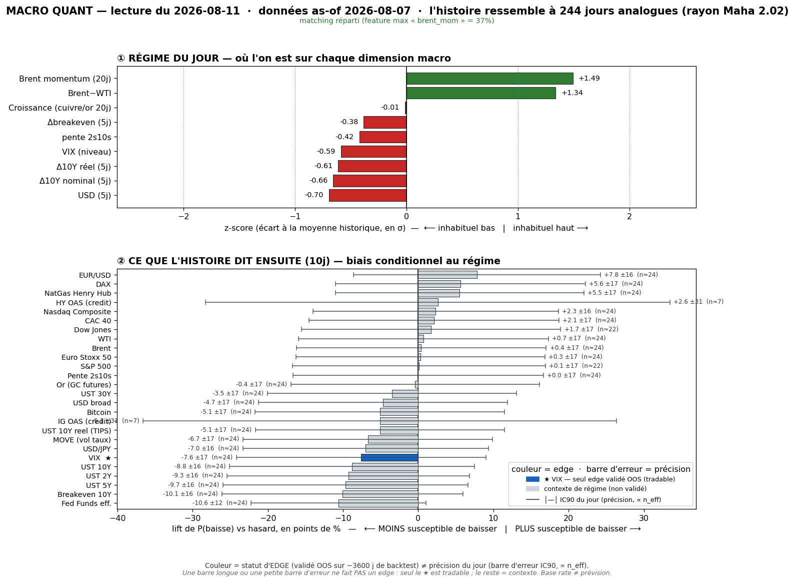
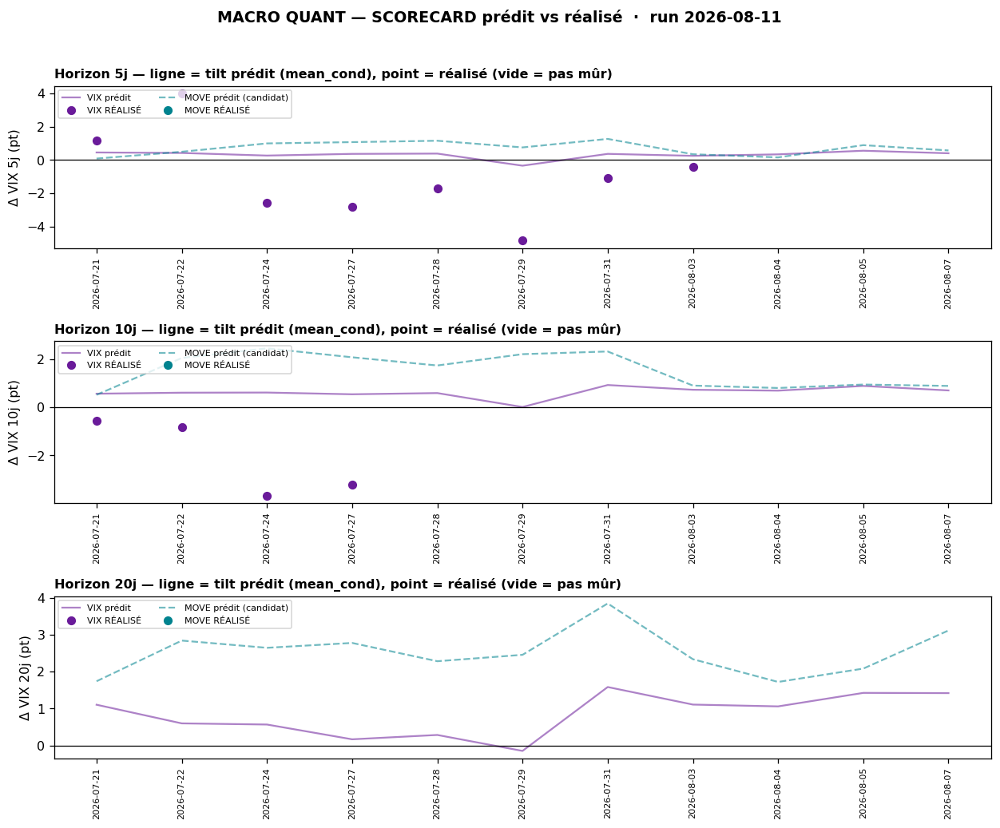

# Macro Quant Daily — 2026-08-11 (as-of 07/08)

> **Couche 2 — les ODDS.** À quelle fréquence un régime historiquement comparable a été suivi de tel move. Ne dit PAS le OÙ (→ Couche 1 `/macro-daily`). Un seul read directionnellement exploitable : **VIX** (seul validé OOS). Tout le reste = **contexte de régime**, direction non exploitable.

> ⚠️ **Latence data (à lire d'abord).** Régime figé **as-of 07/08** (dernière donnée FRED complète). Le live du 11/08 (Daily) = **re-spike oil violent** (Brent ~87,7 +4,95%, US10 4,73%, hike Sept re-price 51%). La feature oil (`brent_mom` +1,49) est donc **vintage-lagée** — MAIS cette fois de **même sens** que le live (oil déjà haussier dans le régime), pas inversée comme le 27/07. Le matching **sous-estime l'intensité** du choc oil live, il ne le contredit pas. Le run décrit le fond ; l'événementiel oil/CPI est côté Couche 1.

## §1 — Régime du jour (z-scores, tri |z|)

Feature | z | Sens
--- | --- | ---
`brent_mom` | **+1,49** | momentum pétrole haussier (résiduel, en repli vs +2,50 fin juillet)
`brwti` | **+1,34** | spread Brent-WTI tendu (prime géopol dans le complexe)
`dusd_5` | −0,70 | USD s'est assoupli sur 5 j
`d10_5` | −0,66 | UST10 a reflué sur 5 j
`dreal_5` | −0,61 | taux réels (TIPS) en repli
`vix_lvl` | −0,59 | **VIX bas = régime de complacency**
`slope` | −0,42 | courbe 2s10s légèrement plus plate
`dbe_5` | −0,38 | breakevens en léger repli
`growth` | −0,01 | cuivre/or neutre

**Signature** = *reflation-oil résiduelle + rates/USD qui s'assouplissent + vol basse*. Analogue = fin de poussée oil sur fond de complacency. Échantillon : **244 analogues** (rayon Maha 2,02).

## §2 — Base rates forward 10 j (horizon fixe pour tous, glanceable)

Unités : vol (VIX/MOVE) = **points** · yields = **bps** · prix = **%**. Statut ✅ = seul read OOS exploitable ; « contexte » = pas de skill OOS, direction non exploitable.

Asset | lift 10j | cond | uncond | n_eff | tag | statut
--- | --- | --- | --- | --- | --- | ---
**VIX** | **+0,69** | +0,70 | +0,02 | 24,4 | 🟡 | ✅ **OOS — vol-up (sig, CI [+0,35 ; +1,04])**
Bitcoin | +3,86 | +5,58 | +1,71 | 23,5 | 🟡 | contexte
MOVE | +0,86 | +0,89 | +0,03 | 24,4 | 🟡 | resp-only (réfuté OOS)
UST 5Y | +1,98 bps | +1,90 | −0,08 | 24,4 | 🟡 | contexte (yields↑)
UST 10Y | +1,97 bps | +1,95 | −0,03 | 24,4 | 🟡 | contexte (yields↑)
UST 30Y | +1,73 bps | +1,79 | +0,06 | 24,4 | 🟡 | contexte
UST 2Y | +1,59 bps | +1,46 | −0,13 | 24,4 | 🟡 | contexte
Breakeven 10Y | +1,33 bps | +1,32 | −0,01 | 24,4 | 🟡 | contexte
NatGas | −1,96% | −2,13 | −0,17 | 24,4 | 🟡 | contexte
WTI | +0,74% | +0,84 | +0,10 | 24,4 | 🟡 | contexte
Brent | +0,51% | +0,62 | +0,11 | 24,4 | 🟡 | contexte
S&P 500 | −0,20% | +0,30 | +0,50 | 21,7 | 🟡 | contexte (equity forward atténué)
Nasdaq | −0,32% | +0,16 | +0,48 | 24,4 | 🟡 | contexte
DAX | −0,34% | −0,08 | +0,27 | 24,4 | 🟡 | contexte
Or (GC) | +0,10% | +0,48 | +0,38 | 24,4 | 🟡 | contexte
USD broad | +0,10% | +0,14 | +0,04 | 24,4 | 🟡 | contexte
HY OAS | −0,60 bps | −2,24 | −1,64 | 6,8 | 🔴 | contexte (n_eff trop bas)

**Lecture contexte (non exploitable) :** le régime reflation-oil mappe des analogues où **les yields montent** (+1,6 à +2,0 bps @10j, tous sig) — ce qui **converge avec le live** (US10 4,73% qui grimpe). Côté equity, le lift est **négatif** (cond bien < uncond) : le régime a historiquement **atténué** le forward actions. Rien de tradable là-dedans (IC OOS ≈ 0), c'est de la couleur de régime.

## §2bis — Term-structure VIX (seul asset à skill OOS)

Horizon | lift | cond | uncond | n_eff | tag | sig | P(baisse) cond
--- | --- | --- | --- | --- | --- | --- | ---
5 j | +0,40 | +0,41 | +0,01 | 48,8 | 🟡 | ✅ | 52% (≈ coin-flip)
10 j | +0,69 | +0,70 | +0,02 | 24,4 | 🟡 | ✅ | 46%
20 j | +1,39 | +1,42 | +0,03 | 12,2 | 🔴 | ✅ | 46%

**Tilt vol-up qui se renforce avec l'horizon**, significatif partout (CI exclut 0). MAIS **base rate ≠ prévision** : à 10 j, le VIX **baisse quand même 46% du temps** dans ce régime. Le pari = espérance légèrement haussière sur la vol, pas une certitude. @20 j 🔴 (n_eff 12,2, plafond structurel — à pondérer).

## §2ter — Track-record LIVE du signal (prédit vs réalisé)

Confrontation du base rate VIX **prédit** au **réalisé** (`VIX[asof+h]−VIX[asof]`, en points), série réalisée jusqu'au 10/08 · 11 as-of distincts.

Horizon | calls mûrs | prédit moy | réalisé moy | hit directionnel | IC réalisé
--- | --- | --- | --- | --- | ---
5 j | 8 / 3 en attente | **+0,28 pt** | **−1,03 pt** | 3/8 = **38%** | **+0,67**
10 j | 4 / 7 en attente | +0,58 pt | −2,07 pt | 0/4 = **0%** | +0,01
20 j | 0 (aucun mûr) | — | — | — | —

**Lecture honnête — le tilt vol-up a ramé.** Sur les 2-3 dernières semaines le VIX a **fondu** (spike 20,7 du 29/07 → ~15), donc le réalisé moyen est nettement **négatif** pendant que le modèle penchait up. MAIS l'**IC +0,67 @5j** montre que le **rank-ordering a tenu** : le seul call vol-DOWN émis (as-of 29/07, prédit −0,34) a **cloué** le plus gros repli (−4,85 pt). Les ratés = des calls vol-up émis depuis un **VIX ÉLEVÉ** (17-20 post-spike) qui ont mean-reverté à la baisse.

> **Caveats obligatoires.** (a) Fenêtres chevauchantes + régime persistant ⇒ calls **fortement corrélés**, le hit-rate n'est PAS parlant tant que l'échantillon indépendant est ce petit — track-record qui **se remplit dans le temps**. (b) VIX = verdict ; MOVE = contexte (0 call mûr, série `^MOVE` Yahoo périmée au 17/07). (c) **Ne pas invalider le signal du jour sur 2 semaines** : les ratés partaient d'un VIX HAUT en mean-reversion ; le signal du jour part d'un **VIX BAS** (14,9 as-of, 15,4 live) avec un **catalyseur up live** (re-spike oil + CPI 12/08) = configuration différente.

## §3 — Conclusion statistique

- **Un seul pari statistiquement défendable : biais vol-up modeste** (VIX, seul OOS). Significatif sur 5/10/20 j (lift +0,40 / +0,69 / +1,39 pt), mais **la vol baisse quand même ~46-52% du temps** dans ce régime → espérance, pas certitude.
- **Le track-record live tempère** : ce même tilt a perdu de l'argent sur 2-3 semaines (VIX en melt-down post-spike). Nuance décisive : les ratés partaient d'un VIX élevé ; **aujourd'hui on part d'un VIX bas + catalyseur up** → le contexte qui a fait rater le signal n'est plus le même.
- **Tout le reste = contexte de régime**, direction non exploitable (IC OOS ≈ 0). Le régime reflation-oil « voudrait » yields↑ + equity atténué + oil↑ — cohérent avec le live, mais **non tradable** en Couche 2.

## §4 — Confrontation Couche 1 ↔ Couche 2

Croisement avec [[Macro/Daily/2026-08-11 - Macro Daily]] (RE-HAWKISH via oil, veille CPI).

Dimension | Couche 1 (live 11/08) | Couche 2 (base rate as-of 07/08) | Verdict
--- | --- | --- | ---
**VIX / vol** | 15,42 **↑** (complacency qui s'écaille, couverture pré-CPI) | **vol-up sig** (+0,69 @10j) | ✅ **CONVERGENCE** — seul read OOS, les deux couches d'accord → **conviction renforcée sur le tilt vol-up**
Taux | US10 4,73% (**monte**, hike Sept re-price) | yields↑ (base rate +2 bps, sig mais non-OOS) | ⚖️ même sens, mais **contexte** (priorité C1)
Oil | re-spike +4,95% (**live**) | oil↑ modéré (vintage-lagé, sous-estime) | ⚖️ même sens, C1 plus frais → **priorité C1**
Actions | S&P cale sous ATH, NQ digère | equity forward **atténué** (lift négatif) | ⚖️ cohérent, non-OOS → contexte
Or | record ~4 396$ (refuge+géopol) | quasi-flat (lift +0,10) | ➖ C2 muette, non pertinent

**La seule convergence actionnable = le VIX** : Couche 1 (VIX qui remonte, CPI = le juge demain) et Couche 2 (tilt vol-up significatif) pointent dans le même sens, et c'est **précisément** le seul asset où la Couche 2 a un skill OOS. Partout ailleurs, priorité totale à la Couche 1 live (la Couche 2 est vintage-lagée et non-OOS).

## §5 — À rerunner

- **Dès que FRED intègre l'oil post-07/08** → `brent_mom` intégrera le re-spike du 11/08 : le régime se **durcira** encore côté reflation-oil (matching plus intense).
- **Post-CPI 12/08** = le pivot : un CPI hot cimente le re-hawkish (yields↑, vol↑) ; un CPI cool casse le narratif oil→inflation. Re-run le 13/08 pour le base rate du **vrai** régime post-CPI.
- Scorecard : 7 calls @10j encore en attente de maturité → il se remplira ; surveiller si le tilt vol-up commence enfin à payer depuis un VIX bas.
