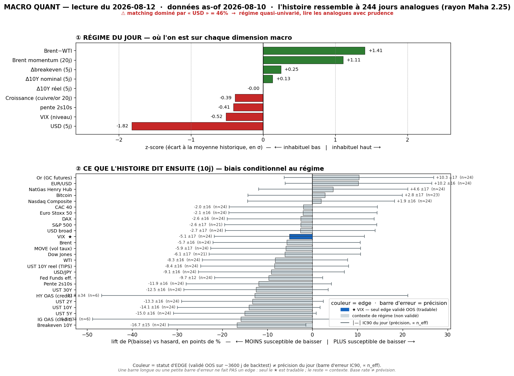
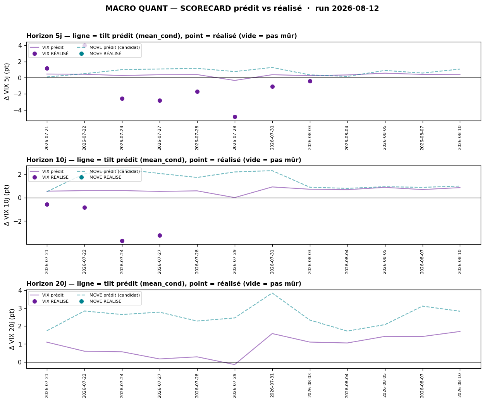
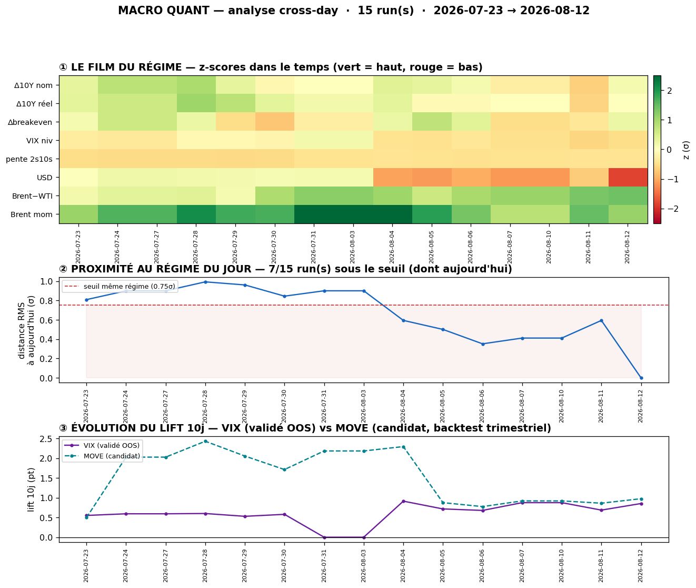

# Macro Quant Daily — 2026-08-12 (données **as-of 2026-08-10**)

> ⚠️ **Décalage vintage de 2 jours ouvrés** : le moteur tourne sur la dernière vintage FRED complète = **10/08**. Le daily Couche 1 du 12/08 décrit un marché **pré-CPI** que ces base rates **ne voient pas**. Toute divergence Couche 1 ↔ Couche 2 se lit d'abord par cette latence.
> ⚠️ **Feature dominante flaggée : `dusd_5` = 46,1% de la distance de matching** (z = **−1,82**, soit une **baisse marquée du USD broad sur 5 j** à la date de vintage). Le matching est donc essentiellement piloté par un choc dollar, avec `brwti` (27,7%, z +1,41) et `brent_mom` (17,0%, z +1,11) en appui. **Les features oil sont vintage-lagées** (FRED s'arrête ~3-4 j avant la date courante) → elles ne portent **pas** le rapport IEA du 12/08 ni le high Brent 90,07 de ce matin.
> n_analog = **244** · rayon Mahalanobis 2,248 · PCA varexp PC1 23,1% / PC2 19,0%.

## §1 — Régime du jour (z-scores, tri par |z|)

| Feature | z | Sens |
|---|---|---|
| `dusd_5` | **−1,82** | **USD broad en forte baisse sur 5 j** — la feature dominante (46% du matching) |
| `brwti` | **+1,41** | spread Brent-WTI **large** = prime seaborne/transit élevée |
| `brent_mom` | **+1,11** | momentum Brent haussier |
| `vix_lvl` | **−0,52** | VIX **sous** sa norme conditionnelle = vol basse |
| `slope` | **−0,41** | pente 2s10s un peu sous la moyenne |
| `growth` | **−0,39** | proxy croissance légèrement mou |
| `dbe_5` | **+0,25** | breakevens en légère hausse |
| `d10_5` | **+0,13** | 10Y quasi inchangé sur 5 j |
| `dreal_5` | **−0,00** | taux réel plat |

**Lecture du régime** : *dollar faible + oil bid (spread transit large) + vol basse + croissance molle*. C'est un régime de **choc d'offre énergétique dans un contexte de dollar qui reflue**, pas un régime de stress.

## §2 — Base rates forward **10 j** (horizon unique pour tous — anti horizon-picking)

> Unités : `yield`/`vol` en **points de base ou points d'indice** · `price` en **%**. Le chiffre utile est le **lift** (cond − uncond), jamais le cond seul.
> Tags : 🔴 n_eff<20 · 🟡 20-60 · 🟢 >60.

| Asset | lift 10j | cond | uncond | n_eff | tag | statut |
|---|---|---|---|---|---|---|
| **UST 10Y** | **+4,20 bp** | +4,18 | −0,03 | 24,4 | 🟡 | SIG — *pas de skill OOS, contexte seul* |
| **UST 30Y** | **+4,00 bp** | +4,06 | +0,06 | 24,4 | 🟡 | SIG — *pas de skill OOS* |
| **UST 5Y** | **+3,49 bp** | +3,41 | −0,08 | 24,4 | 🟡 | SIG — *pas de skill OOS* |
| **HY OAS** | **+3,43 bp** | +1,81 | −1,62 | **5,8** | 🔴 | SIG mais **n_eff dérisoire** — ne rien en tirer |
| **UST 10Y réel (TIPS)** | **+2,31 bp** | +2,29 | −0,02 | 24,4 | 🟡 | SIG — *pas de skill OOS* |
| **Pente 2s10s** | **+2,10 bp** | +2,21 | +0,11 | 24,4 | 🟡 | SIG (repentification) — *pas de skill OOS* |
| **UST 2Y** | **+2,10 bp** | +1,97 | −0,13 | 24,4 | 🟡 | SIG — *pas de skill OOS* |
| **Breakeven 10Y** | **+1,89 bp** | +1,89 | −0,01 | 24,4 | 🟡 | SIG — *pas de skill OOS* |
| **IG OAS** | +1,02 bp | +0,40 | −0,63 | **5,8** | 🔴 | SIG mais n_eff dérisoire |
| **WTI** | **+0,98 %** | +1,09 | +0,11 | 24,4 | 🟡 | SIG — *pas de skill OOS* |
| **MOVE (vol taux)** | **+0,98 pt** | +1,01 | +0,03 | 24,4 | 🟡 | SIG — **resp-only** (réfuté OOS, re-testé chaque trimestre) |
| **VIX** | **+0,86 pt** | +0,87 | +0,02 | 24,4 | 🟡 | ✅ **SIG — seul asset à skill OOS validé → exploitable** |
| **Brent** | **+0,73 %** | +0,84 | +0,11 | 24,4 | 🟡 | SIG — *pas de skill OOS* |
| **USD/JPY** | +0,23 % | +0,29 | +0,06 | 24,4 | 🟡 | SIG — *pas de skill OOS* |
| **USD broad** | +0,12 % | +0,16 | +0,04 | 24,4 | 🟡 | SIG — *pas de skill OOS* |
| **Fed Funds eff.** | +0,13 bp | −0,21 | −0,33 | 24,4 | 🟡 | non-SIG |
| **CAC 40** | +0,17 % | +0,25 | +0,08 | 24,4 | 🟡 | non-SIG |
| **Dow Jones** | +0,19 % | +0,61 | +0,42 | 20,7 | 🟡 | non-SIG |
| **Euro Stoxx 50** | +0,07 % | +0,15 | +0,08 | 24,4 | 🟡 | non-SIG |
| **DAX** | −0,07 % | +0,20 | +0,27 | 24,4 | 🟡 | non-SIG |
| **S&P 500** | −0,16 % | +0,34 | +0,50 | 20,7 | 🟡 | non-SIG |
| **EUR/USD** | **−0,16 %** | −0,18 | −0,03 | 24,4 | 🟡 | SIG — *pas de skill OOS* |
| **Nasdaq Composite** | −0,27 % | +0,21 | +0,48 | 24,4 | 🟡 | non-SIG |
| **Or (GC futures)** | **−0,58 %** | −0,20 | +0,38 | 24,4 | 🟡 | SIG — *pas de skill OOS* |
| **Bitcoin** | −0,58 % | +1,13 | +1,71 | 23,0 | 🟡 | non-SIG |
| **NatGas Henry Hub** | **−5,40 %** | −5,58 | −0,17 | 24,4 | 🟡 | SIG — *pas de skill OOS* |

> **Rappel filtre OOS (dur, cf. [[Macro/Quant/research/2026-07-14 - Backtest Validation]])** : **seul le VIX** a un IC OOS significatif. Toutes les autres lignes ci-dessus sont du **contexte de régime**, direction **non exploitable** — y compris le bloc taux, qui affiche pourtant les lifts les plus gros et les plus consistants (+2 à +4 bp sur toute la courbe). **Ne pas en faire un pari short-duration.**
> Les deux lignes crédit (HY/IG) sont à **n_eff 5,8** : statistiquement du bruit, listées pour complétude uniquement.

## §2bis — Term-structure (assets à skill OOS uniquement → **VIX**)

| Horizon | lift | cond | uncond | n_eff | tag | SIG |
|---|---|---|---|---|---|---|
| **5 j** | **+0,37 pt** | +0,38 | +0,01 | 48,8 | 🟡 | ✅ |
| **10 j** | **+0,86 pt** | +0,87 | +0,02 | 24,4 | 🟡 | ✅ |
| **20 j** | **+1,67 pt** | +1,70 | +0,03 | 12,2 | 🔴 | ✅ |

**Lecture** : le tilt **vol-up est monotone croissant avec l'horizon** — le régime (dollar faible + oil bid + VIX bas) a historiquement été suivi d'une **remontée de vol qui s'amplifie dans le temps**, pas d'un spike immédiat. ⚠️ Le lift @20j est le plus gros **mais** porte un **n_eff 12,2 (🔴)** : plus le lift est grand, moins l'échantillon le soutient. L'horizon **10 j (🟡, n_eff 24,4)** est le meilleur compromis lift/robustesse.
**Contre-exemples** : à 10 j, le VIX baisse quand même dans **48,4%** des cas conditionnels (vs 53,5% inconditionnel). Autrement dit ce tilt vol-up **se trompe pratiquement une fois sur deux** — c'est un biais d'espérance de ~+0,9 pt, pas une prédiction.

## §2ter — Track-record live du signal (prédit vs réalisé)

**VIX** — série réalisée jusqu'au 10/08, **12 as-of émis** :
- **@5 j : 8 calls mûrs** — prédit moy **+0,28 pt** vs réalisé moy **−1,03 pt** · **hit directionnel 3/8 = 38%** · IC réalisé +0,67.
- **@10 j : 4 calls mûrs** — prédit moy **+0,58 pt** vs réalisé moy **−2,07 pt** · **hit directionnel 0/4 = 0%** · IC réalisé +0,01.
- **@20 j : 0 call mûr** (12 en attente).

**MOVE** : **0 call mûr** aux 3 horizons — la série `^MOVE` de la vintage s'arrête au **17/07**, donc rien de mesurable. Contexte uniquement, conformément à son statut resp-only.

> **Honnêteté sur ce track-record** : (a) les runs quotidiens produisent des **fenêtres chevauchantes sur un régime persistant** ⇒ les 8 calls @5j et les 4 calls @10j sont **fortement corrélés** — ce n'est pas 8 et 4 observations indépendantes, le hit-rate n'est **pas parlant** à ce stade ; (b) le biais est néanmoins **franc et dans le même sens partout** : le moteur a tilté **vol-up** pendant tout le snapback du 30/07→10/08, et le VIX a **baissé** (20,7 → 15,5). Le 0/4 @10j n'est pas un hasard statistique, c'est **un régime de compression de vol que le matching n'a pas capté** ; (c) cela **n'invalide pas** le signal du jour — 2-3 semaines ne réfutent pas un IC OOS validé sur backtest — mais impose de **pondérer à la baisse** le tilt vol-up tant que la série de calls ne se retourne pas. Le track-record se remplit dans le temps ; c'est ce qui remplace un `confidence` figé.

## §3 — Conclusion statistique

1. **La seule conclusion forward autorisée** (filtre OOS) : le régime as-of 10/08 porte un **tilt vol-up modéré et monotone** — **+0,86 pt de VIX à 10 j** au-dessus de la baseline, **+1,67 pt à 20 j** (mais n_eff 🔴). **Se trompe ~48% du temps.** Et le **track-record live est actuellement à contre-sens** (0/4 @10j), ce qui doit réduire la taille qu'on accorde à cette information.
2. **Contexte de régime, non exploitable directionnellement** : le **bloc taux est massivement et uniformément haussier en rendement** (+2 bp sur le 2Y jusqu'à +4,2 bp sur le 10Y et +4,0 bp sur le 30Y, avec les breakevens +1,89 bp et le réel +2,31 bp), et la **courbe se repentifie** (+2,10 bp sur 2s10s). C'est cohérent avec un régime de choc d'offre énergétique : *l'inflation anticipée monte, le terme prime, la Fed reste à l'écart*. **Mais IC OOS ≈ 0 sur les taux → aucune position à en tirer.**
3. **Actions : rien.** S&P (−0,16%), Nasdaq (−0,27%), DAX, CAC, Stoxx, BTC — **tous non significatifs** à 10 j. Le régime ne dit rien sur les indices, ce qui est en soi une information : la Couche 2 n'a **aucun** avis sur la réaction actions au CPI.
4. **Or −0,58% (SIG)** : contre-intuitif face au record du 12/08, mais mécanique — dans les analogues, un régime *dollar faible déjà consommé + réel qui remonte* a plutôt vu l'or **consolider** à 10 j. Non exploitable (pas de skill OOS), mais à noter comme **tension** avec la Couche 1.
5. **Crédit inutilisable** : HY/IG à n_eff 5,8. Ignorer.

## §4 — Confrontation Couche 1 ↔ Couche 2

| Sujet | Couche 1 (daily 12/08, live) | Couche 2 (base rates, as-of 10/08) | Verdict |
|---|---|---|---|
| **Vol** | VIX 15,31, VIX3M 18,98, **contango 0,81**, zéro hedge pré-CPI | tilt **vol-up +0,86 pt @10j** (seul signal exploitable) | **DIVERGENCE.** La C1 constate la complaisance, la C2 dit que ce type de régime remonte en vol. ⚠️ Mais le **track-record live donne raison à la C1** depuis 3 semaines (0/4). → **prudence sur le tilt vol-up, ne pas le sur-sizer.** |
| **Taux** | US10 **4,684% strictement inerte**, refuse de bouger avant le CPI | **+4,2 bp @10j sur le 10Y**, +4,0 sur le 30Y, courbe qui repentifie | **CONVERGENCE de direction, divergence de timing.** La C1 dit « rien ne bouge aujourd'hui », la C2 dit « ce régime pousse les rendements sur 10 j ». Pas contradictoire : l'inertie pré-CPI est un fait de séance. **Non exploitable (IC OOS ≈ 0).** |
| **Oil** | Brent **H 90,07**, cap value long travaillé 2ᵉ séance, **IEA élargit le déficit** (−4,3 mb/d, Q3 1,8 mb/d) | Brent **+0,73% @10j**, WTI **+0,98%**, `brwti` z +1,41 et `brent_mom` z +1,11 dans le matching | **CONVERGENCE — mais attention à la circularité.** La C2 « voit » déjà l'oil bid *parce que* c'est une feature d'entrée. Et les séries oil FRED sont **lagées** → l'IEA du 12/08 n'est **pas** dans le modèle. La C2 n'apporte pas d'information neuve ici. |
| **Or** | **record étendu**, GC=F 4 441, spot 4 409 (+1%), > POC 4 351 | **−0,58% @10j (SIG)** | **DIVERGENCE nette.** Latence probable : la vintage 10/08 ne voit pas les 2 séances de bid or. **Priorité à la Couche 1 live** (règle méthodo). |
| **Dollar** | DXY **99,88 plat**, USDJPY 159,41 vers 160 | `dusd_5` z **−1,82** (feature dominante, USD en baisse) → USD broad **+0,12% @10j**, EUR/USD **−0,16%**, USD/JPY **+0,23%** | **CONVERGENCE.** La C2 voit un dollar qui a beaucoup baissé et qui rebondit à la marge ; la C1 voit un DXY qui **ne baisse plus** sous 100. Cohérent. Et **USD/JPY +0,23% @10j** va dans le sens du risque d'intervention BoJ pointé en C1. |
| **Actions** | ES=F > VAH court 7 639, NQ=F > POC 29 370, AI-trade rebidé | **tous non-SIG** | **PAS D'AVIS Couche 2.** La décision actions se prend sur la C1 (niveaux/AMT) et sur le CPI, pas sur les base rates. |

**Synthèse de la confrontation** : la Couche 2 **n'aide pas beaucoup aujourd'hui**. Son seul signal exploitable (vol-up VIX) est (a) contredit par son propre track-record live des 3 dernières semaines et (b) formulé sur une vintage qui ignore le CPI imminent. Sur le sujet du jour — la réaction au CPI — **elle n'a rien à dire** (actions non-SIG). Le bloc taux est le seul endroit où elle est massivement cohérente, et c'est précisément un bloc **non validé OOS**. → **La décision du jour appartient à la Couche 1.**

## §5 — À rerunner

- **Rerun demain 13/08** : la vintage aura intégré le **11/08 et le 12/08**, donc le CPI et la réaction taux/oil. C'est le run qui compte — celui d'aujourd'hui est structurellement aveugle à l'événement de la journée.
- **Surveiller `dusd_5`** : à 46% de dominance, un seul feature pilote presque la moitié du matching. Si le dollar se retourne post-CPI, le jeu d'analogues changera **complètement** — les base rates d'aujourd'hui ne survivront pas à un choc dollar inverse.
- **Backtest trimestriel** (`macro_quant_backtest.py` → `analyze_db.py`) : prochain rafraîchissement des assets validés OOS. **Question ouverte** : le VIX conserve-t-il son IC OOS après cette série de calls ratés (0/4 @10j) ? Le hold-out le dira ; ne pas trancher sur 4 calls corrélés.
- **MOVE** : la série `^MOVE` de la vintage s'arrête au **17/07** → **~4 semaines de retard**, le scorecard MOVE ne peut rien mesurer. **À investiguer côté `yfetch.py`** (ticker périmé / source à changer) — sans ça le suivi « candidat sous observation » du MOVE est purement décoratif.
- **n_eff des lignes crédit (5,8)** : HY/IG sont systématiquement sous le seuil exploitable. Envisager de les **retirer de la table principale** ou de les reléguer en annexe, plutôt que d'afficher chaque jour deux lignes 🔴 non informatives.
