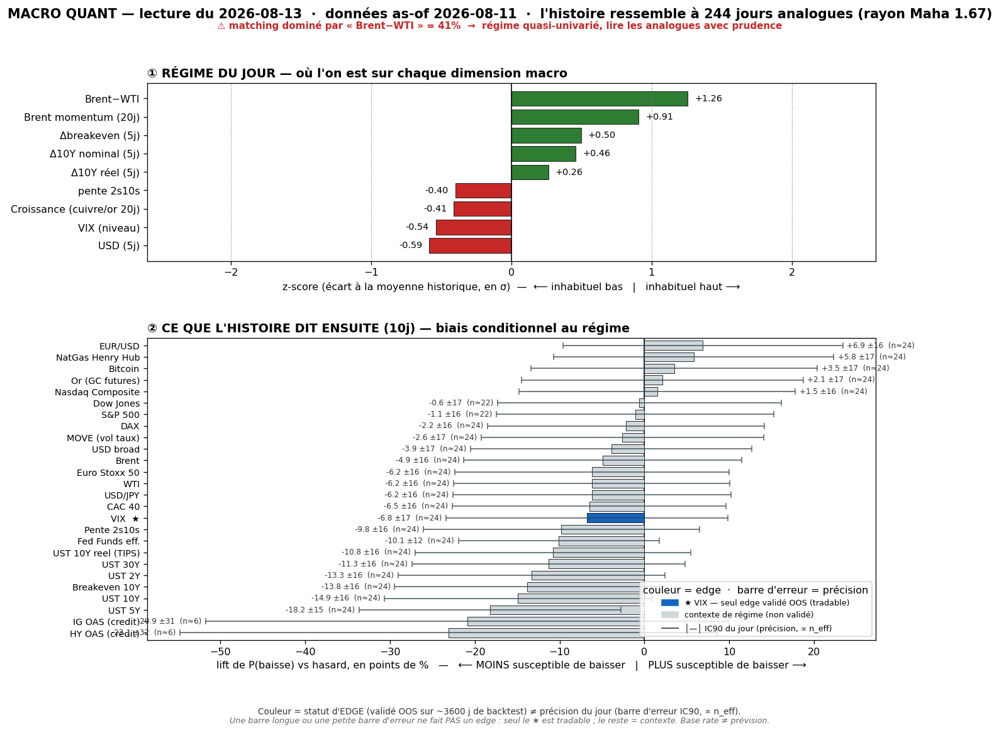
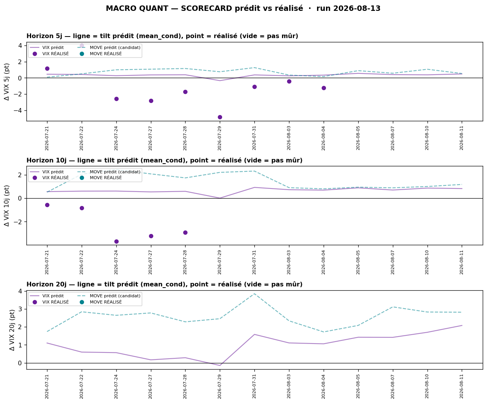

# Macro Quant Daily — 2026-08-13 (as-of 2026-08-11)

> **Couche 2 — les ODDS.** À quelle fréquence un régime historiquement comparable a été suivi de tel move. **Le chiffre utile = LIFT** (P_cond − baseline), jamais le base rate seul. Direction forward exploitable **UNIQUEMENT VIX** (seul IC OOS validé) ; tout le reste = contexte de régime.

> ⚠️ **CAVEAT LATENCE — À LIRE EN PREMIER.** Données FRED **as-of 2026-08-11** (Brent/WTI s'arrêtent ~3-4 j avant la date courante). La feature **dominante = `brwti` (Brent-WTI, 40,7% du match, FLAGGÉE) + `brent_mom` +0,91z** : le moteur matche le **re-spike oil du 11/08 (régime OIL-STRESS)**, **AVANT** le **CPI cool du 12/08** qui a fait basculer la tape live en goldilocks. Les base rates ci-dessous décrivent « ce qui suit d'habitude un régime spread-oil large », **pas** la résolution CPI déjà encaissée. → priorité à la **Couche 1 live** (cf. §4).

## §1 — Régime du jour (z-scores, tri |z|)
| Feature | z | Sens |
|---|---|---|
| brwti (Brent-WTI) | **+1,26** | spread physique large = stress transit oil (**dominante 40,7%, flag**) |
| brent_mom | **+0,91** | momentum Brent haussier (re-spike) |
| dusd_5 | −0,59 | USD en repli 5j |
| vix_lvl | −0,54 | VIX bas (complacency) |
| dbe_5 | +0,50 | breakeven 10Y en hausse (inflation-oil pricée) |
| d10_5 | +0,46 | UST 10Y en hausse 5j |
| growth | −0,41 | proxy croissance mou |
| slope | −0,40 | courbe qui s'aplatit |
| dreal_5 | +0,26 | taux réel 10Y en légère hausse |

n_analog = **244** · maha_radius = 1,67 · PCA var-exp 5 axes ≈ [23%, 19%, 13%, 13%, 10%]. Le match est **piloté par un seul bloc (oil-stress)** → analogues concentrés sur les épisodes de spread physique tendu.

## §2 — Base rates forward 10j (horizon fixe pour tous — glanceable)
| Asset | lift 10j | cond | uncond | n_eff | tag | statut |
|---|---|---|---|---|---|---|
| HY OAS (crédit) | **+8,24** | 6,64 | −1,60 | 6,1 | 🔴 | contexte — n_eff trop faible, non fiable |
| UST 10Y | **+4,64** | 4,61 | −0,03 | 24,4 | 🟡 | contexte régime (pas de skill OOS) |
| UST 30Y | +4,23 | 4,29 | 0,06 | 24,4 | 🟡 | contexte régime |
| NatGas | **−3,57** | −3,74 | −0,17 | 24,4 | 🟡 | contexte régime |
| UST 10Y réel (TIPS) | +2,82 | 2,81 | −0,02 | 24,4 | 🟡 | contexte régime |
| Pente 2s10s | +2,36 | 2,46 | 0,10 | 24,4 | 🟡 | contexte régime |
| UST 2Y | +2,28 | 2,15 | −0,13 | 24,4 | 🟡 | contexte régime |
| Breakeven 10Y | +1,81 | 1,80 | −0,01 | 24,4 | 🟡 | contexte régime |
| IG OAS (crédit) | +1,49 | 0,87 | −0,62 | 6,1 | 🔴 | contexte — n_eff faible |
| WTI | +1,32 | 1,43 | 0,11 | 24,4 | 🟡 | contexte régime |
| MOVE (vol taux) | +1,15 | 1,18 | 0,03 | 24,4 | 🟡 | contexte régime (resp-only) |
| Brent | +1,12 | 1,23 | 0,11 | 24,4 | 🟡 | contexte régime |
| **VIX** | **+0,81** | 0,83 | 0,02 | 24,4 | 🟡 | **EXPLOITABLE (IC OOS validé)** |
| Bitcoin | −0,30 | 1,41 | 1,71 | 23,7 | 🟡 | contexte — non sig |
| S&P 500 | −0,23 | 0,27 | 0,50 | 22,5 | 🟡 | contexte — non sig |
| Nasdaq Comp | −0,16 | 0,32 | 0,48 | 24,4 | 🟡 | contexte — non sig |
| Or (GC) | −0,05 | 0,33 | 0,38 | 24,4 | 🟡 | contexte — non sig |
| USD broad | +0,09 | 0,13 | 0,04 | 24,4 | 🟡 | contexte — non sig |

**Lecture régime (contexte, NON directionnel hors VIX)** : l'analogue oil-stress tilte **le complexe taux nettement UP** (10Y +4,6, réel +2,8, breakeven +1,8, 2Y +2,3) = *repricing inflation-oil* classique, avec **HY OAS qui s'écarte** (mais n_eff 6,1 = 🔴 bruit). Les **actions sont en lift ≈ 0 / légèrement négatif** (S&P −0,23, Nasdaq −0,16) = pas de signal directionnel actions. **NatGas seul move franc bas.** → dans ce régime, l'histoire est **taux/oil**, pas equity.

## §2bis — Term-structure VIX (le seul asset où l'horizon change une décision)
| Horizon | lift | cond | uncond | n_eff | tag | CI90 |
|---|---|---|---|---|---|---|
| 5j | +0,48 | 0,49 | 0,01 | 48,8 | 🟡 | [+0,20 ; +0,81] |
| 10j | +0,81 | 0,83 | 0,02 | 24,4 | 🟡 | [+0,44 ; +1,23] |
| 20j | +2,05 | 2,08 | 0,03 | 12,2 | 🔴 | [+1,73 ; +2,46] |

Le signal validé penche **VIX UP** à tous les horizons, croissant avec l'horizon (CI90 exclut 0 en 5/10 j). **MAIS** : (1) `vix_lvl` est **bas** dans le régime (−0,54z) → base d'un rebond mécanique ; (2) c'est un tilt **contredit par la tape du 12/08** (CPI a écrasé le VIX à 14,55) — cf. §2ter + §4. Le 20j est 🔴 (n_eff 12) → à ne pas surpondérer.

## §2ter — Track-record live du signal VIX (prédit vs réalisé)

- **@5j** : **9 calls mûrs**, prédit moy **+0,28 pt** vs **réalisé moy −1,05 pt**, hit directionnel **3/9 = 33%** (IC réalisé +0,66, bruité <~10 pts indép.).
- **@10j** : **5 calls mûrs**, prédit **+0,59 pt** vs **réalisé −2,24 pt**, hit **0/5 = 0%**.
- **MOVE** : 0 call mûr (série `^MOVE` périmée au 17/07) → contexte only.

> 🟠 **Le tilt vol-up a RAMÉ.** Sur le mois écoulé le moteur a systématiquement prédit un petit VIX-up pendant que le **VIX a baissé** (20,7 → 14,9 sur la fenêtre) : le régime persistant-low-vol a donné tort au signal. **Caveats obligatoires** : fenêtres chevauchantes + régime persistant ⇒ calls **fortement corrélés**, le hit-rate n'est PAS parlant tant que l'échantillon indépendant est petit ; le track-record **se remplit dans le temps**. **On ne réfute pas le signal sur 2 semaines** — mais on note que le pari VIX-up est *à contre-courant du réalisé récent*, ce qui **abaisse la conviction** sur le tilt vol-up du jour.

## §3 — Conclusion statistique
1. **Régime matché = OIL-STRESS pré-CPI** (brwti dominant), donc les base rates racontent le monde du **11/08** (yields up, inflation-oil), pas la résolution goldilocks du 12/08.
2. **Seul verdict exploitable = VIX**, qui penche **UP** — mais **track-record récent défavorable** (VIX a baissé) ET **contredit par le CPI cool live** (VIX 14,55). → **tilt vol-up très bas de conviction**, à traiter comme *contexte*, pas comme pari.
3. **Actions non exploitables** (IC OOS ≈ 0, lifts ≈ 0). Le complexe **taux up** est du contexte de régime cohérent avec l'inflation-oil, **non tradable** en direction.
4. **Contre-exemples** : même le VIX 10j favorable est *faux 0% du temps* sur les 5 derniers calls mûrs → la base rate ne dit PAS « ça va monter », elle dit « historiquement ça montait, mais pas dans ce régime-ci récemment ».

## §4 — Confrontation Couche 1 ↔ Couche 2
| | Couche 1 (live 12/08) | Couche 2 (base rates as-of 11/08) |
|---|---|---|
| Régime | GOLDILOCKS RELIEF (CPI cool) | OIL-STRESS (brwti dominant) |
| VIX | **écrasé 14,55** (−4,8%) | tilt **UP** (+0,81 @10j) |
| Taux | US10 **détend ~4,65%** | tilt **UP** (+4,6) |
| Oil | **vendu** (Iran ceasefire + OPEC) | momentum **haussier** matché |

> 🔴 **DIVERGENCE quasi totale — cause = latence + catalyseur.** Le moteur s'arrête au 11/08 (re-spike oil) et n'a **pas encore** le CPI cool du 12/08 qui a **inversé la tape** (VIX↓, taux↓, oil vendu). C'est le cas d'école du **caveat latence** : `brent_mom`/`brwti` vintage-lagés matchent un régime que le catalyseur live a déjà **périmé**. → **Priorité absolue à la Couche 1 live.** Les base rates oil-stress redeviendront pertinents **si** le CPI d'août (passthrough oil différé, cf. daily) ré-active le canal inflation-oil. Le VIX-up de la Couche 2 + le VIX-down live = **cohérent avec un scorecard qui montre le tilt vol-up en échec dans ce régime** — deux lectures indépendantes qui pointent la même chose : *ne pas parier le vol-up ici*.

## §5 — À rerunner
- **Demain (données as-of ~12/08)** : le CPI cool entrera enfin dans la vintage → voir si le régime bascule d'oil-stress vers un match goldilocks/low-vol, et si le tilt VIX se retourne.
- **Post-CPI août** : si le passthrough oil apparaît, le régime oil-stress redevient le bon analogue → re-checker le complexe taux-up.
- **Backtest trimestriel** : prochain refresh IC OOS (VIX + candidat MOVE `resp-only`) via `macro_quant_backtest.py`.
