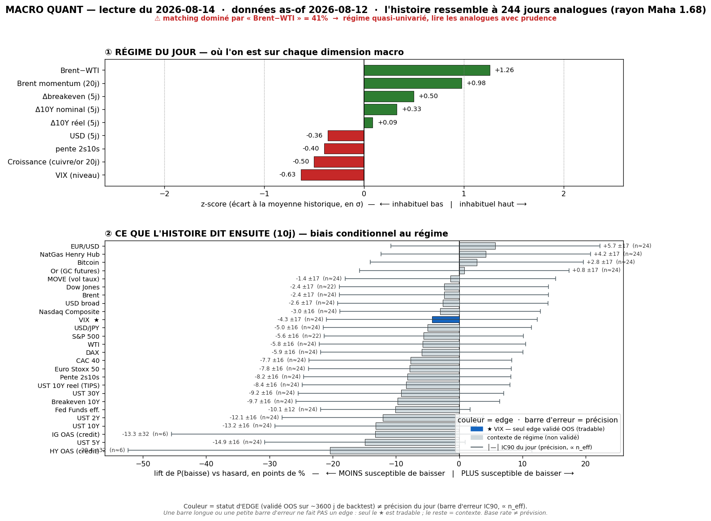
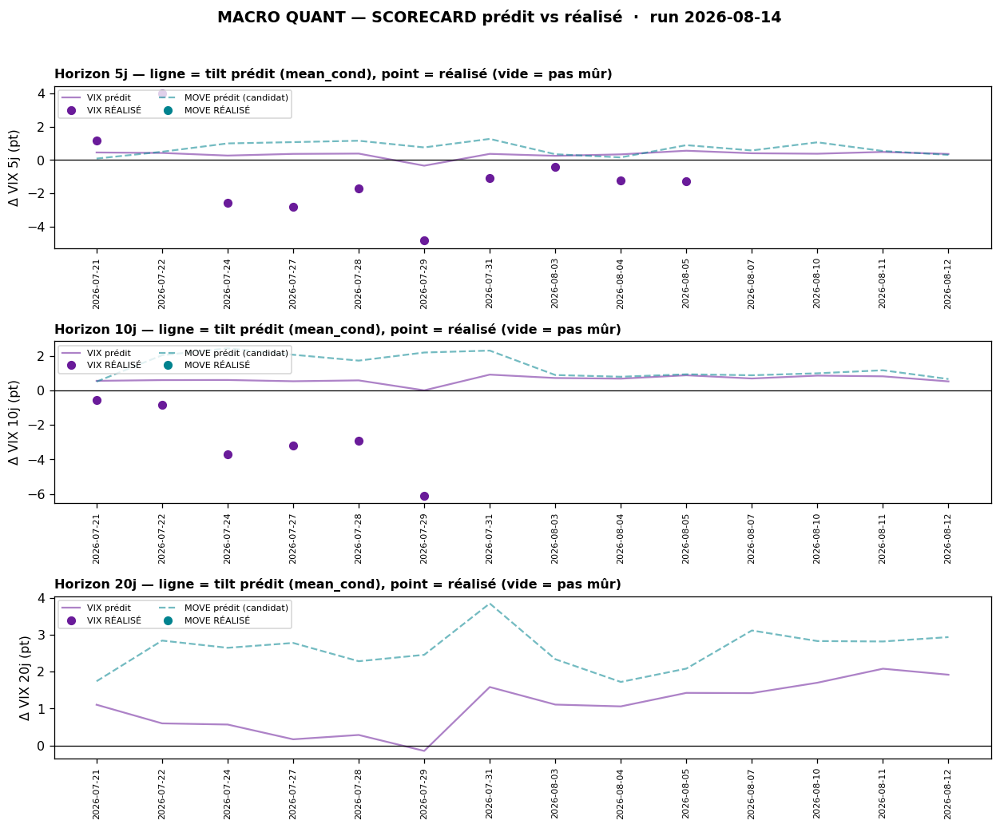

# Macro Quant Daily — 2026-08-14 (as-of 2026-08-12)

> **Couche 2 — les ODDS.** À quelle fréquence un régime comparable a été suivi de tel move. **LIFT = le chiffre utile** (jamais le base rate seul). Direction forward exploitable **UNIQUEMENT VIX** (seul IC OOS validé) ; le reste = contexte de régime.

> ⚠️ **CAVEAT LATENCE — À LIRE EN PREMIER.** Données FRED **as-of 2026-08-12** (le CPI-day est dedans, mais **pas** le PPI cool du 13 ni les records du 13). Feature **dominante = `brwti` (Brent-WTI, 41,2%, FLAGGÉE) + `brent_mom` +0,98z** : le moteur reste **calé sur le régime OIL-STRESS**. Le CPI cool a bien fait baisser `vix_lvl` (−0,63) mais **le spread physique large maintient la classe d'analogue oil-stress** — il ne bascule pas en goldilocks/low-vol. Les base rates décrivent donc encore « ce qui suit un régime de spread-oil tendu », **pas** le risk-on record live. → priorité **Couche 1 live** (cf. §4).

## §1 — Régime du jour (z-scores, tri |z|)
| Feature | z | Sens |
|---|---|---|
| brwti (Brent-WTI) | **+1,26** | spread physique large = stress transit oil (**dominante 41,2%, flag**) |
| brent_mom | **+0,98** | momentum Brent haussier (re-spike encore dans la fenêtre) |
| vix_lvl | **−0,63** | VIX bas — encore plus bas post-CPI (crush du hedge) |
| growth | −0,50 | proxy croissance mou |
| dbe_5 | +0,50 | breakeven 10Y en hausse (inflation-oil pricée) |
| slope | −0,40 | courbe qui s'aplatit |
| dusd_5 | −0,36 | USD en repli 5j |
| d10_5 | +0,33 | UST 10Y en hausse 5j |

n_analog = **244** · maha_radius = 1,68. Vs hier : `vix_lvl` plus bas (−0,54 → −0,63) et `dusd_5` moins négatif, mais **la dominante brwti est intacte** → l'analogue ne change pas de classe malgré le CPI encaissé.

## §2 — Base rates forward 10j (horizon fixe pour tous)
| Asset | lift 10j | cond | uncond | n_eff | tag | statut |
|---|---|---|---|---|---|---|
| HY OAS (crédit) | **+6,36** | 4,79 | −1,57 | 6,2 | 🔴 | contexte — n_eff trop faible, non fiable |
| UST 10Y | **+3,15** | 3,12 | −0,02 | 24,4 | 🟡 | contexte régime (pas de skill OOS) |
| UST 30Y | +2,81 | 2,87 | 0,06 | 24,4 | 🟡 | contexte régime |
| UST 5Y | +2,70 | 2,62 | −0,08 | 24,4 | 🟡 | contexte régime |
| NatGas | **−2,53** | −2,70 | −0,17 | 24,4 | 🟡 | contexte régime |
| UST 10Y réel (TIPS) | +1,76 | 1,75 | −0,01 | 24,4 | 🟡 | contexte régime |
| Pente 2s10s | +1,61 | 1,71 | 0,10 | 24,4 | 🟡 | contexte régime |
| UST 2Y | +1,54 | 1,41 | −0,13 | 24,4 | 🟡 | contexte régime |
| Breakeven 10Y | +1,39 | 1,38 | −0,01 | 24,4 | 🟡 | contexte régime |
| WTI | +0,93 | 1,03 | 0,11 | 24,4 | 🟡 | contexte régime |
| Brent | +0,68 | 0,79 | 0,11 | 24,4 | 🟡 | contexte — non sig |
| MOVE (vol taux) | +0,64 | 0,67 | 0,03 | 24,4 | 🟡 | contexte — resp-only, non sig |
| **VIX** | **+0,52** | 0,54 | 0,02 | 24,4 | 🟡 | **EXPLOITABLE (IC OOS validé)** |
| Bitcoin | +0,40 | 2,11 | 1,71 | 23,8 | 🟡 | contexte — non sig |
| CAC 40 | +0,38 | 0,46 | 0,08 | 24,4 | 🟡 | contexte (sig mais pas OOS) |
| Or (GC) | +0,08 | 0,46 | 0,38 | 24,4 | 🟡 | contexte — non sig |
| Nasdaq Comp | +0,05 | 0,53 | 0,48 | 24,4 | 🟡 | contexte — non sig |
| S&P 500 | −0,03 | 0,47 | 0,49 | 22,5 | 🟡 | contexte — non sig |

**Lecture régime (contexte, NON directionnel hors VIX)** : mêmes signes qu'hier mais **lifts modérés** (10Y +3,1 vs +4,6 hier) — l'analogue oil-stress tilte encore **le complexe taux UP** (inflation-oil) avec **HY OAS élargi** (🔴 bruit, n_eff 6,2). **Actions ≈ 0** (S&P −0,03, Nasdaq +0,05) = aucun signal directionnel. Nasdaq/S&P non exploitables (IC OOS nul). Dans ce régime, l'histoire reste **taux/oil**, pas equity.

## §2bis — Term-structure VIX (seul asset où l'horizon change une décision)
| Horizon | lift | cond | uncond | n_eff | tag | CI90 |
|---|---|---|---|---|---|---|
| 5j | +0,36 | 0,37 | 0,01 | 48,8 | 🟡 | [+0,09 ; +0,66] |
| 10j | +0,52 | 0,54 | 0,02 | 24,4 | 🟡 | [+0,20 ; +0,88] |
| 20j | +1,89 | 1,92 | 0,03 | 12,2 | 🔴 | [+1,43 ; +2,42] |

Le signal validé penche encore **VIX UP** (CI90 exclut 0 en 5/10 j) mais **moins fort qu'hier** (10j +0,52 vs +0,81). Contexte : `vix_lvl` très bas (−0,63) = base d'un rebond mécanique. **MAIS** tilt **contredit par la tape live** (VIX ~14,6, encore en baisse) + scorecard défavorable (§2ter). 20j = 🔴 (n_eff 12) à ne pas surpondérer.

## §2ter — Track-record live du signal VIX (prédit vs réalisé)

- **@5j** : **10 calls mûrs**, prédit moy **+0,31 pt** vs **réalisé moy −1,07 pt**, hit directionnel **3/10 = 30%**.
- **@10j** : **6 calls mûrs**, prédit **+0,49 pt** vs **réalisé −2,89 pt**, hit **0/6 = 0%**. Nouveau call parlant : as-of 29/07 → 12/08 **prédit +0,01 vs réalisé −6,11 pt** (VIX 20,7 → 14,6).
- **MOVE** : 0 call mûr (série `^MOVE` périmée) → contexte only.

> 🟠 **Le tilt vol-up continue de RAMER.** Sur tous les calls mûrs le moteur a prédit un petit VIX-up pendant que **le VIX s'effondrait** (régime risk-on persistant post-CPI/PPI). **Caveats obligatoires** : fenêtres chevauchantes + régime persistant ⇒ calls **fortement corrélés**, hit-rate NON parlant tant que l'échantillon indépendant est petit ; le track-record **se remplit dans le temps**, on ne réfute pas le signal sur 3 semaines. Mais **deux lectures indépendantes** (scorecard 0/6 @10j + VIX live 14,6) pointent la même chose → **conviction TRÈS basse sur le tilt vol-up du jour**.

## §3 — Conclusion statistique
1. **Régime matché = OIL-STRESS** (brwti dominant), inchangé malgré le CPI encaissé → les base rates racontent le monde du spread-oil tendu, pas le risk-on record live.
2. **Seul verdict exploitable = VIX**, penche **UP** mais **moins fort qu'hier** ET **doublement discrédité** (scorecard 0/6 @10j + VIX live crushed). → traiter comme **contexte**, pas comme pari.
3. **Actions non exploitables** (IC OOS ≈ 0, lifts ≈ 0). Complexe **taux UP** = contexte de régime cohérent inflation-oil, non tradable en direction.
4. **Contre-exemples** : le VIX 10j « favorable » est **faux 100% du temps** sur les 6 derniers calls mûrs. La base rate ne dit PAS « ça va monter » — elle dit « historiquement ça montait dans ce régime, mais pas récemment ».

## §4 — Confrontation Couche 1 ↔ Couche 2
| | Couche 1 (live 13-14/08) | Couche 2 (base rates as-of 12/08) |
|---|---|---|
| Régime | RISK-ON HEBDO (records, hold cimenté) | OIL-STRESS (brwti dominant) |
| VIX | **~14,6, écrasé & en baisse** | tilt **UP** (+0,52 @10j) |
| Taux | US10 ~4,65% détendu, 2Y 4,15% | tilt **UP** (+3,1) |
| Actions | S&P/ACWI **records** | lift ≈ 0 (non exploitable) |
| Oil | eased/yo-yo, Brent 87 (drone Hormuz latent) | momentum haussier matché |

> 🔴 **DIVERGENCE persistante — cause = latence + classe d'analogue.** Le moteur (as-of 12/08) capte le CPI cool via `vix_lvl` plus bas, mais **le spread physique oil large maintient la classe oil-stress** → il continue de tilter VIX-up/taux-up alors que la tape live fait l'inverse (VIX crushed, records actions). C'est le **caveat latence + physique** : tant que Brent-WTI reste large, l'analogue « stress » domine, même si le catalyseur macro live (inflation molle) a fait basculer le marché en goldilocks. → **priorité absolue à la Couche 1 live.** **Point de convergence utile** : le complexe **taux-UP** de la Couche 2 est le SEUL scénario qui se ré-activerait **si** le passthrough oil apparaît au **CPI d'août** (caveat backward-looking que les deux couches signalent). L'analogue oil-stress n'est pas « faux », il est **early/deferred**. Le VIX-up, lui, est réfuté à la fois par le live ET par le scorecard.

## §5 — À rerunner
- **Lundi (as-of ~14/08)** : le PPI cool + les records du 13 entreront dans la vintage → voir si l'analogue bascule enfin hors oil-stress (dépend surtout de la compression du spread Brent-WTI, pas du CPI).
- **CPI août** : si le passthrough oil apparaît, le complexe taux-UP de la Couche 2 redevient le bon analogue → re-checker.
- **Backtest trimestriel** : prochain refresh IC OOS (VIX + candidat MOVE `resp-only`) via `macro_quant_backtest.py`.
