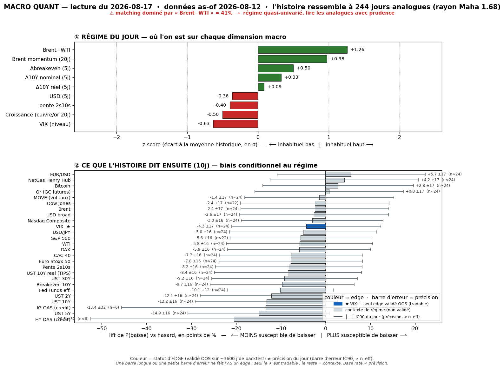
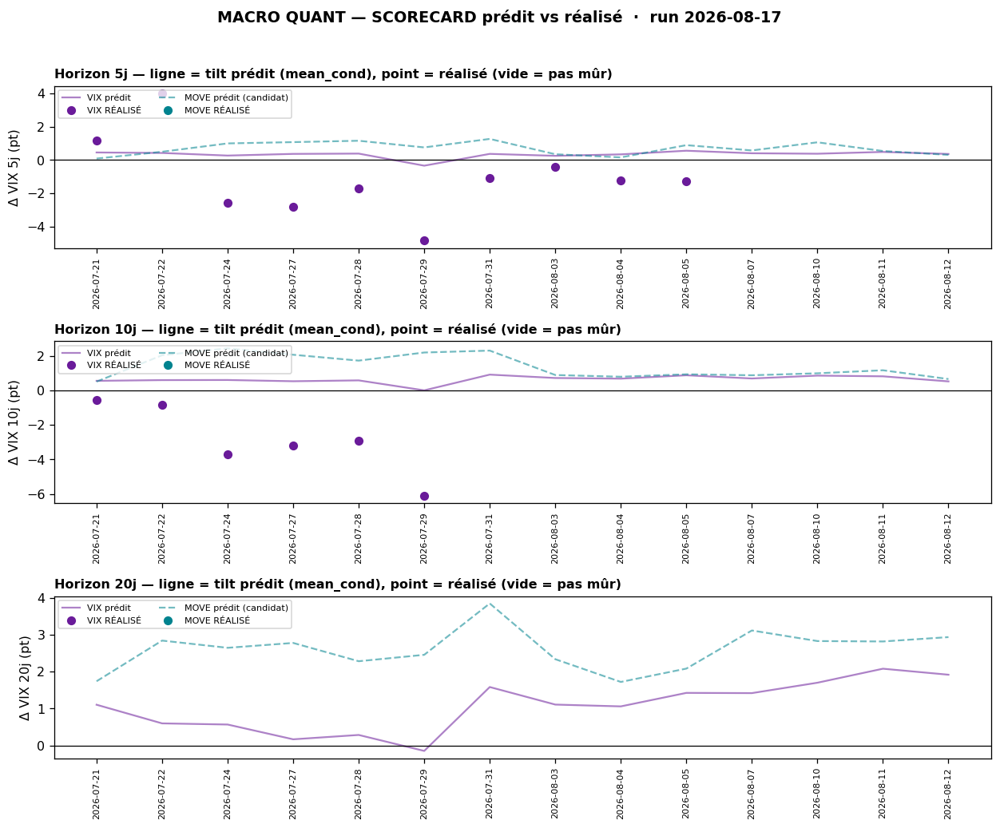
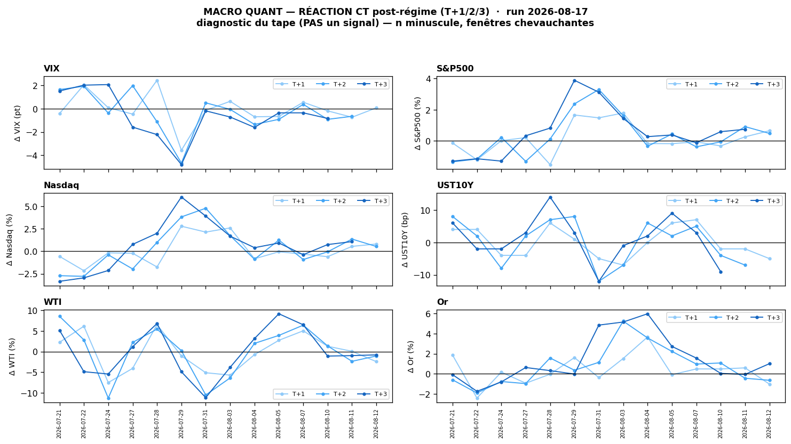

# Macro Quant Daily — 2026-08-17 (as-of 2026-08-12)

> **Couche 2 — les ODDS.** À quelle fréquence un régime comparable a été suivi de tel move. **LIFT = le chiffre utile** (jamais le base rate seul). Direction forward exploitable **UNIQUEMENT VIX** (seul IC OOS validé), et encore : **en RANG, comme contexte-vol** — pas trigger directionnel.

> ⚠️ **CAVEAT LATENCE — À LIRE EN PREMIER, AGGRAVÉ.** La vintage FRED est **as-of 2026-08-12 pour le 3ᵉ jour ouvré consécutif** (run 13, 14 ET 17/08 = même as-of 12/08 : les séries oil FRED n'ont pas avancé sur le week-end). **Conséquence directe : le moteur n'a PAS vu le miss consumer du 14/08** (Retail Sales **−0,6%** / UMich **51**) ni le rate-cut bid / re-spike oil du live. Les z-scores et base rates ci-dessous sont **strictement identiques à la note du 14/08**. Feature **dominante = `brwti` (Brent-WTI, 41,2%, FLAGGÉE) + `brent_mom` +0,98z** → analogue **OIL-STRESS** figé. → priorité **absolue à la Couche 1 live** (§4), le quant est ici un **rappel de régime**, pas une lecture fraîche.

## §1 — Régime du jour (z-scores, tri |z|)
| Feature | z | Sens |
|---|---|---|
| brwti (Brent-WTI) | **+1,26** | spread physique large = stress transit oil (**dominante 41,2%, flag**) |
| brent_mom | **+0,98** | momentum Brent haussier (re-spike encore dans la fenêtre) |
| vix_lvl | **−0,63** | VIX bas (complacency) |
| growth | −0,50 | proxy croissance mou (cuivre/or) |
| dbe_5 | +0,50 | breakeven 10Y en hausse (inflation-oil pricée) |
| slope | −0,40 | courbe qui s'aplatit |
| dusd_5 | −0,36 | USD en repli 5j |
| d10_5 | +0,33 | UST 10Y en hausse 5j |
| dreal_5 | +0,09 | taux réel ~flat |

n_analog = **244** · maha_radius = 1,68 · PCA var (5 axes) 23/19/13/13/10%. **Vs 14/08 : identique** (même vintage). Le moteur reste calé oil-stress ; il ne « bascule » pas parce qu'il n'a **aucune donnée nouvelle** à ingérer.

## §2 — Base rates forward 10j (horizon fixe pour tous)
| Asset | lift 10j | cond | uncond | n_eff | tag | statut |
|---|---|---|---|---|---|---|
| HY OAS (crédit) | **+6,38** | 4,79 | −1,58 | 6,2 | 🔴 | contexte — n_eff trop faible, non fiable |
| UST 10Y | **+3,15** | 3,12 | −0,02 | 24,4 | 🟡 | contexte régime (pas de skill OOS) |
| UST 30Y | +2,81 | 2,87 | 0,06 | 24,4 | 🟡 | contexte régime |
| UST 5Y | +2,69 | 2,62 | −0,08 | 24,4 | 🟡 | contexte régime |
| NatGas | **−2,53** | −2,70 | −0,17 | 24,4 | 🟡 | contexte régime |
| UST 10Y réel (TIPS) | +1,76 | 1,75 | −0,01 | 24,4 | 🟡 | contexte régime |
| Pente 2s10s | +1,60 | 1,71 | 0,10 | 24,4 | 🟡 | contexte régime |
| UST 2Y | +1,54 | 1,41 | −0,13 | 24,4 | 🟡 | contexte régime |
| Breakeven 10Y | +1,39 | 1,38 | −0,01 | 24,4 | 🟡 | contexte régime |
| WTI | +0,93 | 1,03 | 0,11 | 24,4 | 🟡 | contexte régime |
| **VIX** | **+0,52** | 0,54 | 0,02 | 24,4 | 🟡 | **EXPLOITABLE en RANG (contexte-vol)** |
| Bitcoin | +0,40 | 2,11 | 1,71 | 23,8 | 🟡 | contexte — non sig |
| CAC 40 | +0,38 | 0,46 | 0,08 | 24,4 | 🟡 | contexte (sig mais pas OOS) |
| Or (GC) | +0,08 | 0,46 | 0,38 | 24,4 | 🟡 | contexte — non sig |
| Nasdaq Comp | +0,05 | 0,53 | 0,48 | 24,4 | 🟡 | contexte — non sig |
| S&P 500 | −0,03 | 0,47 | 0,49 | 22,5 | 🟡 | contexte — non sig |

**Lecture régime (contexte, NON directionnel hors VIX)** : inchangé — l'analogue oil-stress tilte le **complexe taux UP** (inflation-oil, 10Y +3,1) avec **HY OAS élargi** (🔴 bruit, n_eff 6,2) et **actions ≈ 0** (S&P −0,03, Nasdaq +0,05, IC OOS nul). **⚠️ Ce tilt taux-UP est frontalement contredit par le live** : le 10Y a **détendu** (4,647%) vendredi sur le miss consumer (growth-scare > inflation-oil). L'histoire de l'analogue reste taux/oil ; la tape, elle, price la conso qui craque.

## §2bis — Term-structure VIX (seul asset où l'horizon change une décision)
| Horizon | lift | cond | uncond | n_eff | tag | CI90 |
|---|---|---|---|---|---|---|
| 5j | +0,36 | 0,37 | 0,01 | 48,8 | 🟡 | [+0,09 ; +0,66] |
| 10j | +0,52 | 0,54 | 0,02 | 24,4 | 🟡 | [+0,20 ; +0,88] |
| 20j | +1,89 | 1,92 | 0,03 | 12,2 | 🔴 | [+1,43 ; +2,42] |

Le signal brut penche **VIX UP** (CI90 exclut 0 en 5/10/20j). **MAIS** en **rang** (le seul scope prouvé) le tilt live @10j = **P14 = INHABITUELLEMENT BAS**, et une fois **recalibré** par le track-record (§2ter) il **repasse négatif** (−0,73 pt). 20j = 🔴 (n_eff 12) à ne pas surpondérer.

## §2ter — Track-record live du signal VIX (prédit vs réalisé, recalibré)

- **@5j** : **10 calls mûrs**, biais réalisé−prédit **−1,39 pt** (IC rang +0,61) ; tilt live +0,37 = **P36** ; recalibré (shrink w=0,50) = **−0,33 pt**. Promotion **3/30 indép. → 🔒 verrouillé en contexte**.
- **@10j** : **6 calls mûrs**, biais **−3,38 pt** (IC rang +0,77) ; tilt live +0,54 = **P14** ; recalibré (shrink w=0,38) = **−0,73 pt**. Promotion **1/30 indép. → 🔒 verrouillé en contexte**.
- **@20j** : aucun call mûr.

> 🟠 **Le tilt vol-up brut continue de RAMER, et la recalibration le retourne.** Le moteur a systématiquement prédit un petit VIX-up pendant que le VIX s'effondrait (risk-on persistant) → **la version recalibrée penche désormais VIX-DOWN/flat**. **Caveats obligatoires** : fenêtres chevauchantes + régime persistant ⇒ calls **corrélés** (seulement 1-3 indép.), hit-rate NON parlant tant que l'échantillon indépendant est petit ; **le skill prouvé du VIX est un skill de RANG, pas de niveau** → usage = **cadran contexte-vol / multiplicateur de conviction**, JAMAIS trigger directionnel ni hedge de queue (réfutés net de coûts en C5). Le track-record **se remplit dans le temps**.

## §2quater — Réaction CT diagnostique (bucket VIX0 bas<16, n minuscule)

Le régime part d'un **VIX bas (<16)**. Sur les 7 régimes de ce bucket, le tape **T+3** a fait en moyenne : **S&P +1,0%** (83% même sens), **Nasdaq +1,3%** (83%), **Or +2,2%** (86%), **VIX −0,5 pt** (100%), WTI −0,3%, UST10Y −2 bp. **⚠️ DIAGNOSTIC, pas prédiction** (mur C6 : le move 1-3j est piloté par les catalyseurs qui arrivent APRÈS le label ; fenêtres non indépendantes). **Point notable** : ce diagnostic (grind-up actions + or bid + VIX down) **recoupe le live** (or reclaime le POC, futures verts) **et contredit** le base-rate taux-UP/VIX-up de §2 → cohérent avec « l'analogue oil-stress est early/deferred, pas le tape du jour ».

## §3 — Conclusion statistique
1. **Régime matché = OIL-STRESS** (brwti dominant), **figé sur vintage 12/08 depuis 3 jours** → le moteur n'a pas vu le miss consumer du 14/08. Les base rates racontent le monde du spread-oil tendu, **pas** le growth-scare/rate-cut-bid live.
2. **Seul verdict exploitable = VIX**, penche **UP en brut** mais **recalibré il repasse flat/négatif** (biais −3,38 pt @10j) ET **VIX live crushed (14,5)** → traiter comme **contexte-vol**, pas comme pari. Le rang P14 @10j = complacency, à lire comme cadran de dé-sizing si un choc arrive (Minutes 20/08 / Jackson Hole).
3. **Actions non exploitables** (IC OOS ≈ 0, lifts ≈ 0). Complexe **taux UP** = contexte de régime cohérent inflation-oil, **contredit par le live** (10Y détend sur consumer miss), non tradable en direction.
4. **Contre-exemples** : le base-rate taux-UP et VIX-up sont tous deux **à contre-courant du live** aujourd'hui. La base rate ne dit PAS « ça va monter » — elle dit « historiquement ça montait dans ce régime oil-stress », or le catalyseur live (conso molle) a changé le driver.

## §4 — Confrontation Couche 1 ↔ Couche 2
| | Couche 1 (live 17/08) | Couche 2 (base rates as-of 12/08) |
|---|---|---|
| Régime | RISK-ON QUI S'ESSOUFFLE (consumer craque, rate-cut bid) | OIL-STRESS (brwti dominant, figé) |
| VIX | **~14,5, calme/écrasé** | tilt brut **UP** (+0,52) → **recalibré flat/négatif** |
| Taux | US10 **4,647% détend** (consumer miss) | tilt **UP** (+3,1) — **contredit par le live** |
| Actions | S&P 7 786 (record rejeté), futures verts | lift ≈ 0 (non exploitable) |
| Or | **~4 375 reclaime le POC 4 351** (rate-cut bid) | lift ≈ 0 (mais réaction CT diag. +2,2% recoupe) |
| Oil | Brent ~88 re-spike (Hormuz) | momentum haussier matché ✅ |

> 🔴 **DIVERGENCE persistante et ÉLARGIE — cause = latence (vintage figée) + classe d'analogue.** Le moteur (as-of 12/08) est **aveugle au miss consumer du 14/08** : il continue de tilter taux-UP/VIX-up alors que la tape live fait l'inverse (yields détendent, VIX crushed, or re-bidé sur le rate-cut). **Le SEUL point de convergence live = l'oil** (brent_mom matché, Brent 88 re-spike réel). C'est le **caveat latence + physique** à son maximum : tant que la vintage FRED ne s'actualise pas, l'analogue « stress » domine mécaniquement. → **priorité absolue à la Couche 1 live.** **Point utile conservé** : le complexe **taux-UP** de la Couche 2 se ré-activerait **si** le passthrough oil apparaît au **CPI d'août** (Brent 88 le nourrit) — mais le growth-scare live (conso −0,6%) pousse dans l'autre sens à court terme. L'analogue oil-stress est **early/deferred**, pas « faux ». Le VIX-up, lui, est réfuté par le live ET par le scorecard recalibré.

## §5 — À rerunner
- **Dès que la vintage FRED avance (>12/08)** : le PPI + les records + surtout le **miss consumer du 14/08** entreront → voir si l'analogue bascule enfin hors oil-stress (dépend surtout de la compression du spread Brent-WTI, PAS du consumer — `brwti` est une feature de niveau).
- **FOMC Minutes 20/08 + Jackson Hole 27-29** : catalyseurs vol live — si choc, le cadran contexte-vol (VIX rang bas) sert de multiplicateur de dé-sizing.
- **CPI août** : si le passthrough oil apparaît (Brent 88), le complexe taux-UP de la Couche 2 redevient le bon analogue → re-checker.
- **Backtest trimestriel** : prochain refresh IC OOS (VIX + candidat MOVE `resp-only`) via `macro_quant_backtest.py`.
