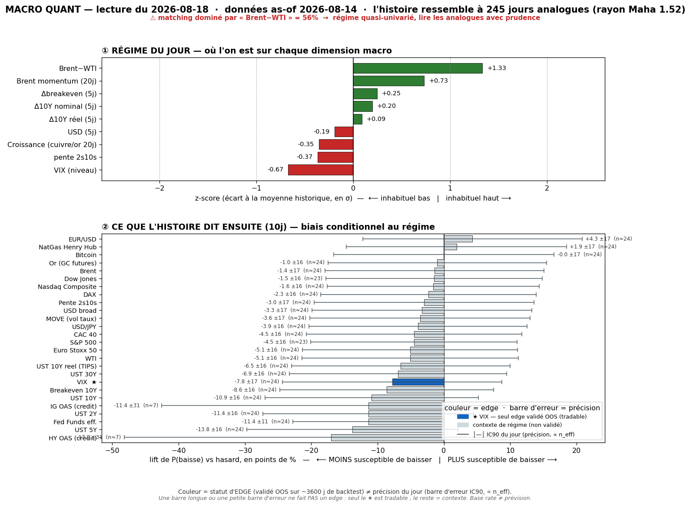
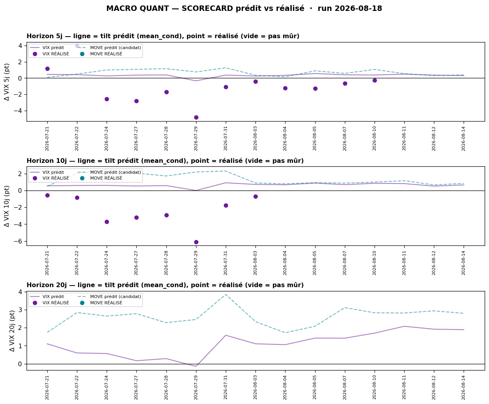

# Macro Quant Daily — 2026-08-18 (as-of 2026-08-14)

> **Couche 2 — les ODDS.** À quelle fréquence un régime comparable a été suivi de tel move. **LIFT = le chiffre utile** (jamais le base rate seul). Direction forward exploitable **UNIQUEMENT VIX** (seul IC OOS validé), et encore : **en RANG, comme contexte-vol** — pas trigger directionnel.

> ⚠️ **CAVEAT LATENCE — À LIRE EN PREMIER.** La vintage FRED a **enfin avancé à as-of 2026-08-14** (après 3 jours ouvrés figés au 12/08). Le moteur voit donc désormais la semaine du miss consumer. **MAIS** : (a) l'oil FRED reste en retard de ~3-4 j sur le live → il **ne voit pas encore** le re-spike Brent ~88 / Hormuz du 17/08 ; (b) la feature **dominante = `brwti` (Brent-WTI, 56,1%, FLAGGÉE, en hausse vs 41,2% hier) + `brent_mom` +0,73z** → l'analogue est **massivement sélectionné sur l'oil élevé**, pas sur le stress consumer. L'appariement est **OIL-STRESS**, à lire comme un régime, pas comme une prédiction fraîche du tape. → priorité **Couche 1 live** (§4).

## §1 — Régime du jour (z-scores, tri |z|)

| Feature | z | Sens |
|---|---|---|
| `brwti` | **+1,33** | 🛢️ WTI/écart Brent-WTI très élevé → **domine le matching à 56,1% (FLAG)** |
| `brent_mom` | +0,73 | momentum Brent haussier (oil-stress) |
| `vix_lvl` | −0,67 | **VIX sous sa moyenne = complacency** (colle au live VIX ~14,5) |
| `slope` | −0,37 | courbe 2s10s plate/basse |
| `growth` | −0,35 | proxy croissance mou (whiff consumer soft) |
| `dbe_5` | +0,25 | breakeven 5j en légère hausse (inflation exp.) |
| `d10_5` | +0,20 | UST10 en légère tension 5j |
| `dusd_5` | −0,19 | USD légèrement mou |
| `dreal_5` | +0,09 | taux réel ~flat |

**Lecture régime** : oil-stress élevé **greffé sur** une vol complaisante (VIX bas) + une croissance molle. C'est un mix inconfortable — le moteur matche 245 analogues sur un radius Mahalanobis 1,52, mais l'ancre du matching est l'oil (56%), pas le fond macro. n_analog=245.

## §2 — Base rates forward 10j (LIFT = P_cond − P_uncond ; tri par |lift|)

⚠️ **Rappel filtre OOS (dur)** : seul le **VIX** a un IC OOS significatif (backtest [[Macro/Quant/research/2026-07-14 - Backtest Validation]]). Tout le reste = **contexte de régime, direction NON exploitable** (IC OOS ≈ 0). Les yields/oil/crédit ci-dessous décrivent « à quoi ressemblait la suite dans des régimes comparables », **pas un pari**.

| Asset | lift 10j | cond | uncond | n_eff | tag | statut OOS |
|---|---|---|---|---|---|---|
| **VIXCLS (VIX)** | **+0,66 pt** | +0,67 | +0,02 | 24 | 🟡 | ✅ **exploitable (RANG, contexte-vol)** |
| BAMLH0A0HYM2 (HY OAS) | +5,98 bps | +4,46 | −1,51 | 7 | 🔴 | contexte — pas de skill OOS |
| MOVE (vol taux) | +0,83 pt | +0,86 | +0,03 | 24 | 🟡 | contexte — resp-only (réfuté OOS) |
| DGS10 (UST 10Y) | +2,22 bps | +2,21 | −0,02 | 24 | 🟡 | contexte — pas de skill OOS |
| DGS5 (UST 5Y) | +2,22 bps | +2,15 | −0,07 | 24 | 🟡 | contexte — pas de skill OOS |
| DGS2 (UST 2Y) | +1,52 bps | +1,39 | −0,12 | 24 | 🟡 | contexte — pas de skill OOS |
| DGS30 (UST 30Y) | +1,60 bps | +1,67 | +0,07 | 24 | 🟡 | contexte — pas de skill OOS |
| DFF (Fed Funds) | +1,19 bps | +0,86 | −0,33 | 24 | 🟡 | contexte — pas de skill OOS |
| DFII10 (réel 10Y) | +1,14 bps | +1,13 | −0,01 | 24 | 🟡 | contexte — pas de skill OOS |
| DCOILWTICO (WTI) | +1,07% | +1,18 | +0,11 | 24 | 🟡 | contexte — pas de skill OOS |
| T10YIE (breakeven) | +1,08 bps | +1,08 | −0,01 | 24 | 🟡 | contexte — pas de skill OOS |
| BAMLC0A0CM (IG OAS) | +0,90 bps | +0,30 | −0,60 | 7 | 🔴 | contexte — pas de skill OOS |
| DCOILBRENTEU (Brent) | +0,79% | +0,91 | +0,12 | 24 | 🟡 | contexte — pas de skill OOS |
| GOLD (or) | +0,33% | +0,72 | +0,38 | 24 | 🟡 | contexte — pas de skill OOS |
| CAC40 | +0,21% | +0,29 | +0,08 | 24 | 🟡 | contexte — pas de skill OOS |
| STOXX50 | +0,14% | +0,22 | +0,08 | 24 | 🟡 | contexte — pas de skill OOS |
| DEXJPUS (USD/JPY) | +0,05% | +0,11 | +0,06 | 24 | 🟡 | **resp-only — rejeté OOS (IC −0,03)** |
| DTWEXBGS (USD broad) | +0,04% | +0,08 | +0,04 | 24 | 🟡 | contexte — pas de skill OOS |
| NASDAQCOM | **−0,13%** | +0,35 | +0,48 | 24 | 🟡 | contexte — pas de skill OOS |
| SP500 | −0,11% | +0,39 | +0,50 | 23 | 🟡 | contexte — pas de skill OOS |

**Ce que ça dit (contexte, pas pari)** : dans les analogues oil-stress, la suite typique était **yields UP** (toute la courbe +1,5 à +2,2 bps @10j, cond>0 systématique), **crédit qui se tend** (HY OAS +6 bps mais 🔴 n_eff=7, à ne pas surinterpréter), **VIX UP** (+0,66 pt), et **actions US à lift LÉGÈREMENT NÉGATIF** (SP500 −0,11%, Nasdaq −0,13% : le régime a en moyenne un peu bridé le beta actions US, cond reste >0 mais < baseline). Rappel : **contre-exemples nombreux** — pour le VIX @10j, favorable ~53% du temps seulement (défavorable ~47%).

## §2bis — Term-structure VIX (le SEUL asset OOS — l'horizon change la décision)

| Horizon | lift | cond | uncond | n_eff | tag | CI90 | rang percentile |
|---|---|---|---|---|---|---|---|
| 5j | +0,30 pt | +0,30 | +0,01 | 49 | 🟡 | [+0,09 ; +0,54] | P27 (médian) |
| 10j | +0,66 pt | +0,67 | +0,02 | 24 | 🟡 | [+0,32 ; +1,06] | P53 (médian) |
| 20j | +1,87 pt | +1,89 | +0,03 | 12 | 🔴 | [+1,50 ; +2,28] | P87 (INHABITUEL) |

**Lecture** : tilt vol-up qui **monte avec l'horizon** — modeste à 5-10j (rang médian, rien d'exceptionnel), mais **marqué à 20j (P87, CI ne touche pas 0)**. Le 20j est 🔴 (n_eff=12, fragile). Traduction opérationnelle **autorisée** (cf. scorecard) : contexte de **dé-sizing / resserrement** si le VIX part de bas (complacency) — **PAS** un trigger d'achat de hedge de queue (réfuté net de contango en C5).

## §2ter — Track-record live du signal VIX (scorecard prédit vs réalisé)

- **@5j** : 12 calls mûrs, **biais réalisé−prédit −1,30 pt** (le signal a sur-prédit la vol-up) ; IC de **rang +0,61** ; tilt recalibré (shrink w=0,55) = **−0,40 pt**. Promotion : 3/30 calls indépendants → **🔒 verrouillé en contexte**.
- **@10j** : 8 calls mûrs, **biais réalisé−prédit −3,04 pt** ; IC de rang **+0,75** ; tilt recalibré (w=0,44) = **−0,68 pt**. 1/30 calls indépendants → **🔒 verrouillé**.
- **@20j** : 0 call mûr (15 en attente), pas encore de calibration.

> **Honnêteté (obligatoire)** : runs quotidiens = fenêtres chevauchantes + régime persistant ⇒ calls **fortement corrélés**. Le hit-rate n'est parlant qu'agrégé sur beaucoup de calls **indépendants** — au démarrage il est maigre et **se remplit dans le temps**. Le biais négatif (réalisé < prédit) dit que **sur cette fenêtre, le tilt vol-up a ramé pendant que le VIX restait bas/baissait** (cohérent avec la complacency persistante). **Le rang tient (IC +0,61/+0,75)** = le signal ordonne correctement même s'il sur-estime le niveau → d'où le shrink. Ne PAS invalider le call du jour sur 2 semaines de données.

## §3 — Conclusion statistique

Un seul verdict exploitable, et il est **prudent** : le régime (oil-stress + VIX bas + growth mou) donne un **tilt vol-up modéré à 10j (+0,66 pt, rang P53)**, **recalibré à la baisse par le live (~−0,68 pt de biais)**, plus net à 20j (P87) mais fragile. Usage = **cadran de contexte-vol / multiplicateur de conviction pour dé-sizer** dans une complacency, **jamais** un trigger directionnel ni un achat de hedge de queue. **Tout le reste (yields up, crédit qui se tend, actions US à lift légèrement négatif) est du CONTEXTE de régime, pas un pari** (IC OOS ≈ 0). **USD/JPY confirmé resp-only** (rejeté OOS le 14/08, IC −0,03) — reste dans la table pour mémoire, direction non exploitable.

## §4 — Confrontation Couche 1 ↔ Couche 2

Daily le plus récent = [[Macro/Daily/2026-08-17 - Macro Daily]] (« RISK-ON QUI S'ESSOUFFLE », VIX ~14,5, or re-bidé, oil re-spike Brent 88).

- **CONVERGENCE forte sur le régime vol** : Couche 1 note « VIX ~14,5, calme <15, **aucune protection** malgré le miss consumer » = exactement le `vix_lvl −0,67` (complacency) du moteur. Les deux couches disent **la même chose** : vol basse, personne n'est hedgé → **le tilt vol-up statistique (+0,66 pt) a un terrain propice** (asymétrie : peu à perdre en bas, beaucoup à gagner si ça casse). C'est le cadran « dé-sizer / resserrer » qui s'allume dans les deux.
- **CONVERGENCE oil** : `brwti +1,33 / brent_mom +0,73` = le re-spike Brent 88 / Hormuz du live. Mais ⚠️ le moteur est **encore en retard de ~3-4 j** sur l'oil (as-of 14/08) → il ne voit pas le pic du 17/08. Le live est plus frais.
- **DIVERGENCE / nuance actions** : Couche 1 = indices qui **tiennent leurs records** (S&P au-dessus de l'ex-ATH = découverte de prix maintenue). Couche 2 = **lift actions US légèrement NÉGATIF** (SP500 −0,11%, Nasdaq −0,13% @10j). Pas une contradiction : le base rate dit « dans des régimes oil-stress comparables, le beta actions US était en moyenne un peu bridé sur 10j » — c'est un **rappel de prudence** derrière les records, cohérent avec le « risk-on qui s'essouffle » du Daily. **Priorité au live** (Couche 1) sur la direction ; la Couche 2 sert de contrepoids statistique.
- **Le vrai juge est devant** (Couche 1) : FOMC Minutes 20/08 + Jackson Hole (Warsh) 27-29/08. Aucun base rate ne capte ces catalyseurs discrets → le quant reste un cadran de régime, pas une prévision d'événement.

## §5 — À rerunner / chantier

- **Demain** : re-run wrapper → guetter (a) si l'oil FRED avance et **desserre la dominance `brwti`** (56% = matching quasi mono-feature, fragilise l'analogue), (b) si le VIX live sort de la complacency post-FOMC Minutes.
- **Scorecard** : le 20j se remplit (15 calls en attente) — première calibration 20j dans ~1 semaine ; c'est l'horizon où le lift est le plus marqué, donc le plus utile à valider live.
- **Univers OOS** : VIX reste **le seul validé**. Rappel des rejets récents — **USD/JPY** (IC OOS −0,03, hold-out −0,05, 14/08), **MOVE** (resp-only). Prochains candidats fetchables à passer au gate trimestriel : **or** + **HY OAS (crédit)** (cf. [[Wiki/macro/Cadre-Hedges-par-Zone]] §5).
- **Hedge par zone** : le débat « VIX ≠ meilleur hedge d'un book non-US » est cadré dans [[Wiki/macro/Cadre-Hedges-par-Zone]] — VSTOXX/Nikkei VI/VKOSPI **non fetchables gratuitement** (404 Yahoo), donc non testables pour l'instant ; le crédit (HY/IG OAS) est le tell gratuit à instruire en priorité.
