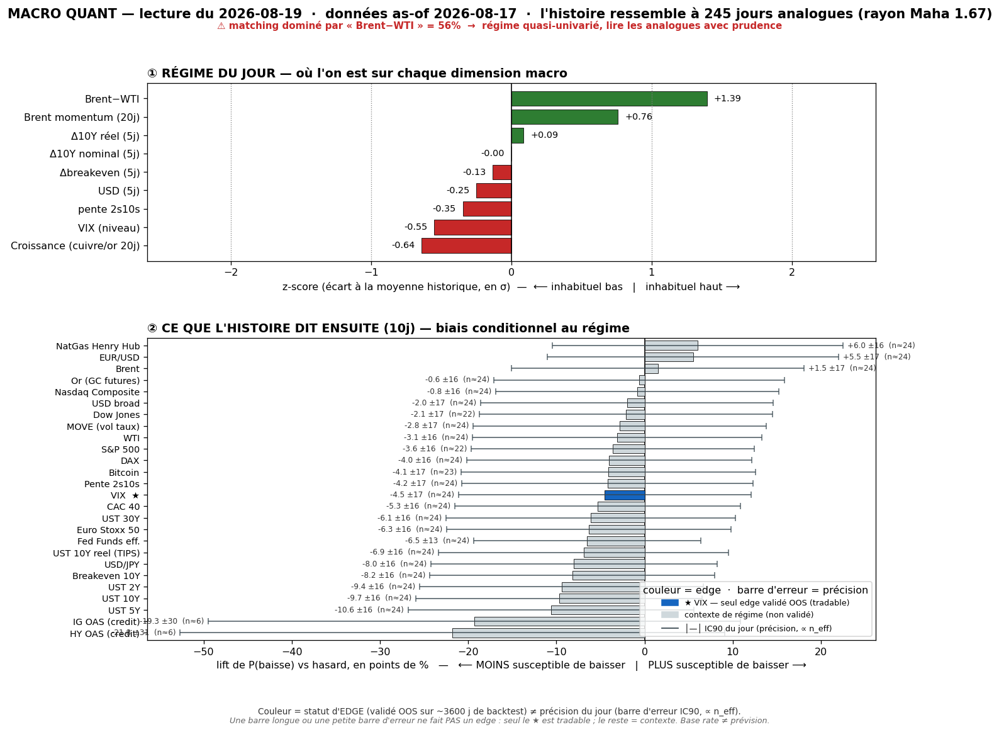
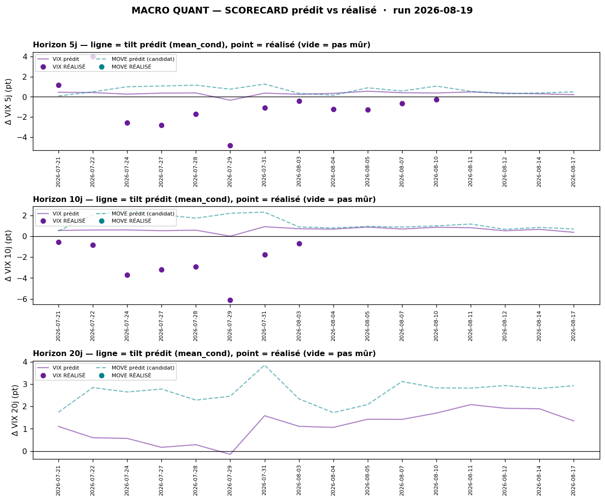

# 🎲 Macro Quant Daily — as-of 2026-08-17

> **Rôle = Couche 2 (les ODDS).** À quelle fréquence un régime historiquement comparable a été suivi de tel move. Le chiffre utile = **LIFT** (P_cond − P_uncond), jamais P_cond seule. **Filtre OOS dur : VIX seul est exploitable en direction** (skill de RANG, pas de niveau) ; tout le reste = **contexte de régime**, direction non exploitable.
> ⚠️ **Latence FRED** : les features oil (`brwti`, `brent_mom`) s'arrêtent au **17/08** → le régime est daté du 17/08, il **ne voit pas** l'escalade Moyen-Orient intraday du 18/08 (Brent >90). La feature dominante étant justement `brwti`, le matching sous-pondère le choc live → **priorité à la Couche 1** sur l'oil.

## §1 — Régime du jour (z-scores causaux, tri par |z|)

| Feature | z | Sens |
|---|---|---|
| **brwti** (spread Brent-WTI) | **+1,39** | **DOMINANT — 56,5% du poids (🚩 FLAG)** : structure oil physique tendue |
| brent_mom (momentum Brent) | +0,76 | re-spike oil confirmé sur la fenêtre |
| growth (nowcast croissance) | −0,64 | croissance molle — se dégrade vs run précédent (−0,35) |
| vix_lvl (niveau VIX) | −0,55 | VIX bas = **complacency** (vol implicite comprimée) |
| slope (pente 2s10s) | −0,35 | courbe légèrement plus plate |
| dusd_5 (Δ USD 5j) | −0,25 | USD mou sur la fenêtre |
| dbe_5 (Δ breakeven 5j) | −0,13 | inflation anticipée ~stable |
| dreal_5 (Δ taux réel 5j) | +0,09 | réels ~plats |
| d10_5 (Δ UST10 5j) | −0,00 | neutre |

> **Lecture** : régime **oil-shock (spread physique) + croissance molle + complacency vol**. Le `brwti` FLAG (56,5%) signifie que le matching est **piloté par la tension oil physique** — c'est un régime « re-spike énergie sur fond de croissance qui fléchit », pas un régime risk-off classique. La feature étant vintage-lagée (17/08), elle capte le mouvement d'août **mais pas** le pic géopol du 18/08.

## §2 — Base rates forward 10 j (horizon fixe pour tous, glanceable)

Rappel : seul le **VIX** franchit le filtre OOS. Les autres lignes sont du **contexte de régime** (IC OOS ≈ 0 → direction non exploitable), affichées pour situer, jamais comme un pari.

| Asset | lift 10j | cond | uncond | n_eff | tag | statut |
|---|---|---|---|---|---|---|
| **VIX** | **+0,37 pt** | +0,39 | +0,02 | 24,5 | 🟡 | ✅ **exploitable (RANG)** — tilt vol-up modéré |
| HY OAS (crédit) | +6,22 bps | +4,72 | −1,50 | 6,5 | 🔴 | contexte — écartement crédit HY (n_eff faible) |
| IG OAS (crédit) | +1,31 bps | +0,71 | −0,60 | 6,5 | 🔴 | contexte — léger stress crédit IG |
| UST 10Y | +2,19 bps | +2,17 | −0,01 | 24,5 | 🟡 | contexte — biais hausse rendement |
| UST 5Y | +1,91 bps | +1,85 | −0,07 | 24,5 | 🟡 | contexte |
| UST 30Y | +1,99 bps | +2,06 | +0,07 | 24,5 | 🟡 | contexte |
| UST 2Y | +1,29 bps | +1,16 | −0,12 | 24,5 | 🟡 | contexte |
| Breakeven 10Y | +1,10 bps | +1,09 | −0,01 | 24,5 | 🟡 | contexte — reflation légère |
| WTI | +0,66% | +0,77 | +0,11 | 24,5 | 🟡 | contexte — cohérent régime oil (pas skill) |
| Brent | +0,42% | +0,53 | +0,12 | 24,5 | 🟡 | contexte — idem |
| Or | +0,21% | +0,59 | +0,38 | 24,5 | 🟡 | contexte — hausse mais lift < uncond |
| CAC 40 | +0,32% | +0,41 | +0,08 | 24,5 | 🟡 | contexte |
| Euro Stoxx 50 | +0,24% | +0,32 | +0,08 | 24,5 | 🟡 | contexte |
| **S&P 500** | **−0,09%** | +0,40 | +0,50 | 22,4 | 🟡 | contexte — **lift négatif** (actions font moins bien que d'ordinaire) |
| **Nasdaq** | **−0,10%** | +0,38 | +0,48 | 24,5 | 🟡 | contexte — idem, tech en retrait |
| Dow Jones | +0,02% | +0,44 | +0,42 | 22,4 | 🟡 | contexte — neutre |
| USD broad | +0,06% | +0,11 | +0,04 | 24,5 | 🟡 | contexte — USD ~plat |
| USD/JPY | +0,17% | +0,23 | +0,06 | 24,5 | 🟡 | **resp-only** (IC OOS −0,03, réfuté) |
| BTC | +2,84% | +4,55 | +1,71 | 23,4 | 🟡 | contexte — n_eff faible, ne rien en tirer |
| NatGas | −3,50% | −3,67 | −0,18 | 24,5 | 🟡 | contexte — saisonnalité, pas skill |

> **Ce qui ressort du contexte** (à ne pas surtrader) : dans les analogues de ce régime oil-shock, les **rendements ont tendance à monter** (+2 bps UST10 sur 10j), le **crédit à s'écarter légèrement** (HY OAS +6 bps mais 🔴 n_eff=6,5), et les **actions US à sous-performer leur baseline** (lift SP500/Nasdaq **négatif** : elles montent moins souvent qu'à l'accoutumée). L'or monte mais **moins que d'habitude** (lift +0,21 < uncond +0,38). **Aucune de ces lignes n'est un signal** — juste la coloration du régime.

## §2bis — Term-structure VIX (le seul asset où l'horizon change une décision)

| Horizon | lift | cond | uncond | n_eff | tag | CI 90% |
|---|---|---|---|---|---|---|
| 5 j | +0,20 pt | +0,21 | +0,01 | 49,0 | 🟡 | [−0,03 ; +0,44] (borne basse < 0) |
| 10 j | +0,37 pt | +0,39 | +0,02 | 24,5 | 🟡 | [+0,03 ; +0,74] (>0) |
| 20 j | +1,32 pt | +1,35 | +0,03 | 12,2 | 🔴 | [+0,94 ; +1,79] (n_eff faible) |

> **Tilt vol-up qui se renforce avec l'horizon** — mais à 5j le CI touche le négatif (pas franc), à 20j le n_eff est trop faible (🔴). En **rang**, le call live vaut **P12** à 5j et 10j (= inhabituellement vol-up pour ce régime), **P56** (médian) à 20j. C'est un contexte-vol modéré, **pas un trigger**.

## §2ter — Track-record live du signal VIX (prédit vs réalisé)

Le VIX a un skill de **RANG, pas de niveau** → on lit le percentile, pas les points. Calibration mesurée run-après-run :

| Horizon | calls mûrs | IC rang | biais réalisé−prédit | tilt recalibré (shrink) |
|---|---|---|---|---|
| 5 j | 12 | +0,61 | −1,30 pt | +0,21 → **−0,50 pt** (w=0,55) |
| 10 j | 8 | +0,75 | −3,04 pt | +0,39 → **−0,96 pt** (w=0,44) |
| 20 j | 0 (16 en attente) | n/a | — | +1,35 (brut, non mûr) |

> **Honnêteté (obligatoire)** : (a) fenêtres chevauchantes + régime persistant ⇒ calls **corrélés** — le hit-rate n'est parlant qu'agrégé sur beaucoup de calls indépendants (ici 3/30 à 5j, 1/30 à 10j → **maigre, se remplit dans le temps**). (b) L'IC rang est **positif et solide** (+0,61 / +0,75) : le modèle **classe** bien les régimes vol, mais **sur-prédit systématiquement le niveau** de vol-up (biais négatif) → la recalibration **shrink** rabote le tilt brut à la baisse. (c) VIX = verdict ; MOVE = contexte (série `^MOVE` souvent périmée). Ne PAS invalider le signal du jour sur 2 semaines de données.

## §3 — Conclusion statistique

- **Régime** : oil-shock (spread physique `brwti` FLAG 56,5%) + croissance molle (−0,64) + complacency vol (VIX bas). Piloté par la tension oil — mais **feature vintage-lagée au 17/08**, aveugle au pic géopol du 18/08.
- **Seul verdict exploitable (VIX)** : **tilt vol-up modéré**, franc seulement à 10j (CI>0), et **rabattu par la recalibration** (le modèle sur-prédit la vol dans ce régime → tilt net ≈ −0,5 à −1,0 pt après shrink). Traduction opérationnelle : **contexte-vol qui justifie de ne pas vendre la vol / de ne pas sur-sizer**, pas un achat de hedge ni un short-vol (tous deux réfutés net de coûts en C5).
- **Contexte (non exploitable, à titre de coloration)** : biais hausse des rendements, léger écartement crédit (🔴 n_eff), **actions US à lift négatif** (sous-performent leur baseline), or qui monte moins que d'habitude. Rappel du taux de contre-exemples : même sur le VIX, le régime est **défavorable ~40% du temps** — un base rate n'est pas une prévision.

## §4 — Confrontation Couche 1 ↔ Couche 2

Croisement avec [[Macro/Daily/2026-08-18 - Macro Daily]] (dernier daily) :

- **CONVERGENCE (conviction renforcée)** — *complacency vol + croissance molle* : le daily 18/08 décrit un tape mou (selloff chipmakers, rendements collés en haut, ZEW Current Conditions −61,1, IP/Pending Home Sales en miss) sous un VIX bas. La Couche 2 confirme : régime `growth −0,64` + `vix_lvl −0,55`, avec un tilt vol-up structurel. Les deux couches disent **« complacency sur fond de macro qui fléchit »** → contexte pour **dé-sizer / ne pas vendre la vol**.
- **CONVERGENCE partielle** — *actions US en retrait* : le lift SP500/Nasdaq **négatif** de la Couche 2 (actions montent moins souvent qu'en baseline dans ce régime) rime avec le selloff tech du daily. Mais c'est du **contexte, pas un short** (IC OOS ≈ 0 sur les indices).
- **DIVERGENCE (priorité Couche 1)** — *l'oil* : la feature dominante `brwti` s'arrête au **17/08** → la Couche 2 **ne voit pas** l'escalade Moyen-Orient du 18/08 (Brent >90, missiles EAU, tanker Al Mocha, feu énergie Sulaymaniyah). Le lift Brent/WTI (+0,4/+0,7%) sous-estime donc le choc live. **Priorité au daily** sur l'oil : le re-spike est plus violent que ce que le régime lagé suggère.

## §5 — À rerunner / chantiers

- **VIX** = seul asset validé OOS (skill de rang, 🔒 verrouillé en contexte tant que la porte de promotion reste fermée : 3/30 calls indépendants à 5j). Continue de se calibrer run-après-run.
- **HY/IG OAS** : lift crédit élevé mais **n_eff=6,5 (🔴)** — candidat à surveiller mais échantillon trop mince pour conclure. Re-tester au backtest trimestriel.
- **MOVE** : resp-only (réfuté OOS), re-testé chaque trimestre — suivi par `analyze_db` (panneau ③ VIX vs MOVE).
- **Backtest trimestriel** : prochain refresh du verdict OOS (IC + DSR/PBO/hold-out) via `macro_quant_backtest.py`.
