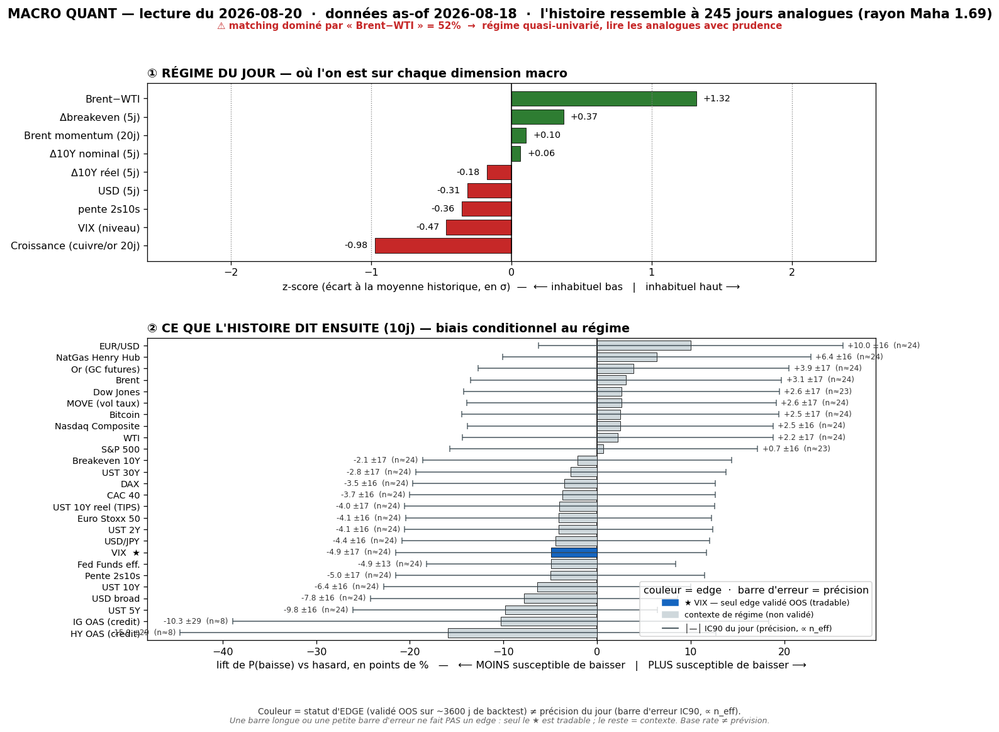
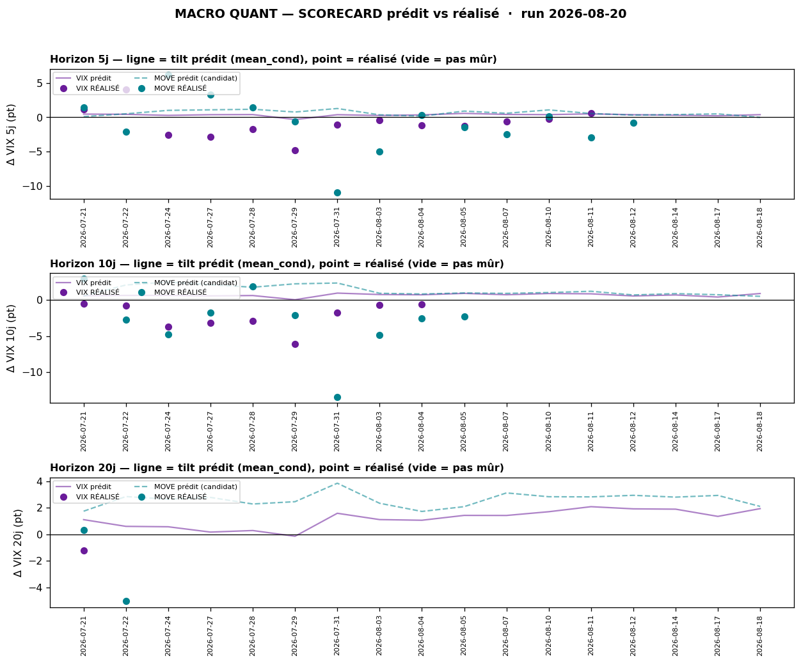

# Macro Quant Daily — 2026-08-20 (as-of 2026-08-18)

> **Couche 2 (les ODDS)** : à quelle fréquence un régime historiquement comparable a été suivi de tel move. Le chiffre utile = **LIFT** (cond − uncond), jamais cond seule. **Filtre OOS dur** : seul le **VIX** a un IC OOS significatif → seul asset dont la direction est exploitable. Tout le reste = **contexte de régime** (direction non exploitable).
> ⚠️ **Caveat latence data (en tête)** : as-of = **2026-08-18** (FRED lag). La feature qui **domine le matching = `brwti` (Brent-WTI, +1,32σ, 52 % de la distance, flaggée)** — et elle est **vintage-lagée ~3-4 j** : le moteur matche sur l'oil du 18/08, **il ne voit PAS le re-spike oil live + Hormuz** du daily 20/08. Le régime identifié est donc **ancré oil-d'il-y-a-2-jours** → priorité à la Couche 1 live pour l'oil.

## §1 — Régime du jour (z-scores, as-of 2026-08-18)
| Feature | z | Sens |
|---|---|---|
| brwti (Brent-WTI) | **+1,32** | spread élevé — dominant matching (52 %, ⚠️ lagé) |
| growth | **−0,98** | momentum croissance **faible** |
| vix_lvl | −0,47 | VIX **bas** (complacency) |
| dbe_5 (Δbreakeven 5j) | +0,37 | inflation anticipée en légère hausse |
| slope (2s10s) | −0,36 | pente qui s'aplatit légèrement |
| dusd_5 (ΔUSD 5j) | −0,31 | USD en repli (cohérent daily : DXY <100) |
| dreal_5 (Δréel 5j) | −0,18 | taux réels ~stables |
| brent_mom | +0,10 | Brent momentum ~neutre (lagé) |
| d10_5 (ΔUS10 5j) | +0,06 | ~neutre |

Analogues : **n=245**, rayon Mahalanobis 1,69, PCA var-exp [23/19/13/13/10 %]. **Signature = spread oil tendu + croissance molle + VIX bas + USD faible.**

## §2 — Base rates forward 10 j (lift vs baseline)
| Asset | lift 10j | cond | uncond | n_eff | tag | statut |
|---|---|---|---|---|---|---|
| **VIX** | **+0,86** | +0,87 | +0,02 | 24,5 | 🟡 | **✅ OOS exploitable** — tilt vol-UP modéré |
| HY OAS | +3,50 | +2,01 | −1,49 | 8,0 | 🔴 | resp-only (n_eff trop faible) |
| UST 10Y (yield) | +0,48 | +0,47 | −0,01 | 24,5 | 🟡 | resp-only — pas de skill OOS |
| UST 10Y réel | +0,79 | +0,79 | −0,01 | 24,5 | 🟡 | resp-only |
| Pente 2s10s | +1,13 | +1,24 | +0,11 | 24,5 | 🟡 | resp-only |
| USD broad | +0,15 | +0,19 | +0,04 | 24,5 | 🟡 | resp-only |
| EUR/USD | −0,17 | −0,19 | −0,03 | 24,5 | 🟡 | resp-only |
| S&P 500 | −0,26 | +0,24 | +0,50 | 22,8 | 🟡 | resp-only — direction non exploitable |
| Nasdaq | −0,13 | +0,35 | +0,48 | 24,5 | 🟡 | resp-only |
| Or | −0,05 | +0,34 | +0,38 | 24,5 | 🟡 | resp-only |
| Brent | −0,51 | −0,39 | +0,12 | 24,5 | 🟡 | resp-only (+ lagé) |
| NatGas | −2,41 | −2,59 | −0,18 | 24,5 | 🟡 | resp-only |
| BTC | +0,10 | +1,81 | +1,71 | 23,5 | 🟡 | resp-only |

> **Lecture** : la SEULE ligne à valeur directionnelle = **VIX +0,86** (dans ce régime, la vol implicite tend à monter de ~0,9 pt sur 10 j au-dessus de sa dérive nulle). Toutes les autres = contexte : ex. actions (SP500/NQ) ont un rendement conditionnel **< baseline** (lift négatif) mais **direction non exploitable** (IC OOS ≈ 0) → à lire « régime historiquement médiocre pour le beta », pas comme un short. **HY OAS lift +3,5 = tendance d'élargissement crédit dans les analogues MAIS n_eff 8 🔴** (échantillon minuscule) → cohérent avec la divergence crédit du daily, **pas un pari**.

## §2bis — Term-structure VIX (seul asset à skill OOS)
| h | lift | cond | uncond | n_eff | tag | CI90 |
|---|---|---|---|---|---|---|
| 5 j | +0,37 | +0,38 | +0,01 | 49,0 | 🟡 | [0,03 ; 0,75] |
| 10 j | +0,86 | +0,87 | +0,02 | 24,5 | 🟡 | [0,46 ; 1,34] |
| 20 j | +1,91 | +1,93 | +0,03 | 12,2 | 🔴 | [1,08 ; 2,80] |

Tilt vol-UP **monotone croissant** avec l'horizon, mais **n_eff décroît** (20 j = 🔴, CI large). Le call live 10 j = **P88 de l'historique VIX (INHABITUEL haut)** → après recalibration (shrink w=0,47 sur le biais mesuré) le tilt réel retombe à **~+0,48 pt**. **Défavorable ~ la moitié du temps** : un lift moyen positif ne dit rien d'une séance donnée.

## §2ter — Track-record live du signal (prédit vs RÉALISÉ)

Confrontation honnête du base rate VIX **prédit** au **réalisé** sur les calls mûrs (série jusqu'au 18/08) :
- **@5 j** : 13 calls mûrs — prédit moy **+0,34 pt** vs réalisé moy **−0,85 pt** ; hit directionnel **4/13 = 31 %** ; IC rang +0,63.
- **@10 j** : 9 calls mûrs — prédit moy **+0,59 pt** vs réalisé moy **−2,26 pt** ; hit directionnel **0/9 = 0 %** ; IC rang +0,75.

> ⚠️ **Le tilt vol-UP a ramé tout l'été** : le signal prédisait la vol en hausse pendant que le VIX **baissait** (dernier call mûr 22/07→19/08 : prédit +2,84, réalisé **−5,05 pt**, 76→71 en rang). Deux lectures cohabitent : (a) **fenêtres chevauchantes + régime persistant ⇒ calls corrélés** → le hit-rate n'est PAS parlant tant que l'échantillon indépendant est petit (4/30 indép. @5j) ; (b) le VIX a un skill de **RANG, pas de niveau** → l'IC rang reste **+0,6/+0,7** (l'ordre est bon même si le niveau moyen est biaisé), d'où la **recalibration par shrink** qui ramène le tilt live à ~+0,5 pt. Statut porte de promotion : **🔒 verrouillé EN CONTEXTE** (usage = cadran de contexte-vol / multiplicateur de conviction, **jamais** trigger directionnel ni hedge de queue — réfutés net de coûts en C5). **Ne pas invalider le signal du jour sur cet échantillon** — juste le mettre en regard.

## §3 — Conclusion statistique
- **Un seul énoncé exploitable** : régime (spread oil tendu + growth faible + VIX bas) → **vol implicite tend à monter, modéré (~+0,5 pt recalibré @10j), P88 = inhabituellement haut, mais CONTEXTE seulement** (dé-sizer / resserrer, pas un long-vol). Défavorable ~50 % du temps.
- **Tout le reste = décor de régime** : actions à rendement conditionnel < baseline (régime médiocre pour le beta), crédit avec tendance d'élargissement (n_eff 🔴), USD faible — **aucune direction exploitable OOS**.
- **Le matching est ancré oil-18/08** (`brwti` 52 %, flaggé, lagé) → **ne reflète pas le re-spike oil live + Hormuz** du daily 20/08. C'est le principal biais du run.

## §4 — Confrontation Couche 1 ↔ Couche 2
- **Convergence** : la Couche 1 (daily 20/08) qualifie le rebond de **« fragile »** (VIX bas, Russell −1,3 %, Daly hawkish « regardless of Treasury action », fix buyback qui s'efface intraday). La Couche 2 **confirme le décor** : VIX bas + growth faible = régime où la vol **tend à remonter** (tilt vol-UP) et où le **beta actions rend moins que sa baseline**. Complacency + tilt vol-up = même message que « le soulagement du 19/08 était fragile ».
- **Divergence / caveat data** : le régime quant est **dominé par `brwti` vintage-lagé (18/08)** → il **ne voit pas** le re-spike oil live + Hormuz que le daily flagge côté fondamental. **Priorité à la Couche 1 live** pour l'oil et l'inflation intraday. Le quant décrit un régime « d'il y a 2 jours » ; le daily décrit le tape d'aujourd'hui.
- **Crédit** : le daily remonte la divergence crédit↔actions ; le base rate HY OAS **va dans le même sens** (lift d'élargissement) mais **n_eff 8 🔴** → confirme la vigilance, ne la chiffre pas.
- **Net** : rien de directionnellement exploitable au-delà du **cadran contexte-vol** (tilt vol-up modéré = raison de **dé-sizer**, cohérent avec la prudence du daily). Jackson Hole/Warsh (27-29) reste le vrai juge — hors de portée d'un base rate.

## §5 — À rerunner
- **Demain** : re-run quotidien (le wrapper force la vintage fraîche) — surveiller si `brwti` reste feature dominante (biais lag) et si l'as-of rattrape le re-spike oil.
- **Trimestriel** : `macro_quant_backtest.py` (verdict IC OOS + DSR/PBO/hold-out) — re-tester si **MOVE** repasse le filtre (resp-only aujourd'hui).
- **Scorecard** : laisser se remplir — 4/30 calls indép. @5j, échantillon encore maigre.
