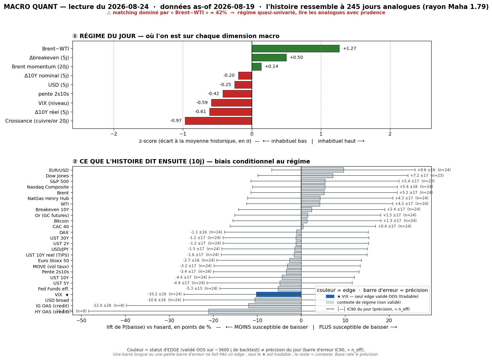
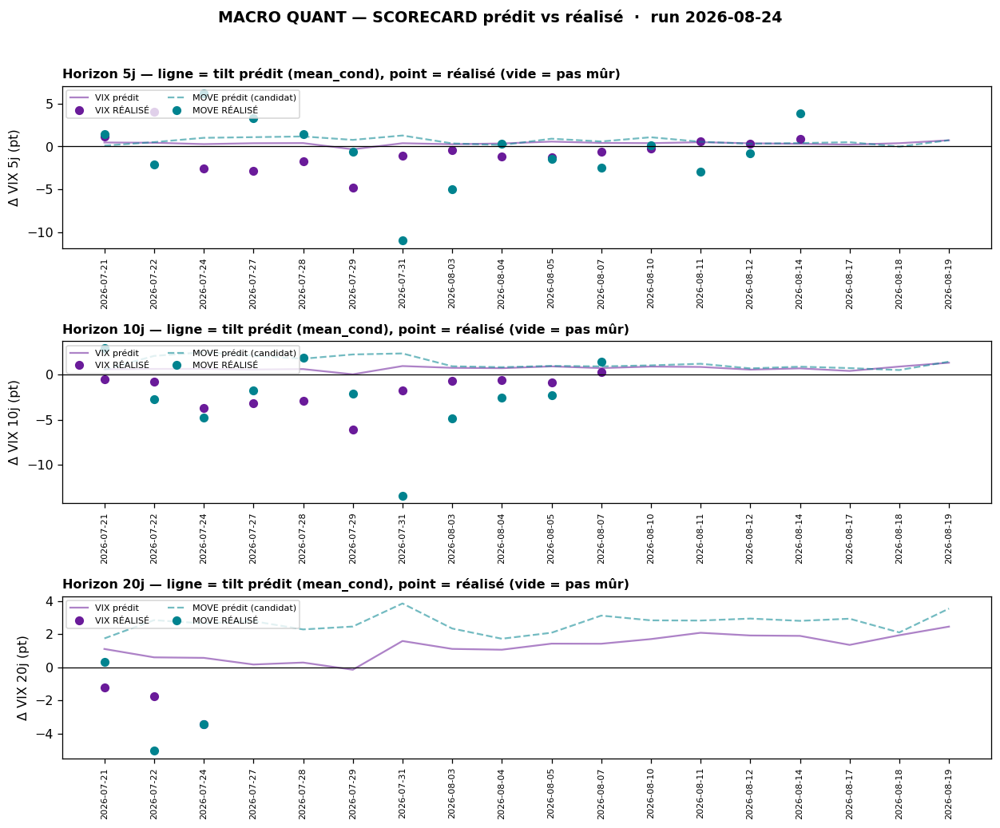

# Macro Quant Daily — run 2026-08-24 · as-of 2026-08-19

> **Couche 2 (les ODDS)** : fréquence historique d'un move après un régime comparable. Chiffre utile = **LIFT** (cond − uncond). **Filtre OOS dur** : seul le **VIX** a un IC OOS significatif → seul asset directionnellement exploitable. Le reste = **contexte de régime**.
> ⚠️ **Caveat latence data — CENTRAL ICI** : le FRED s'arrête à **as-of 2026-08-19 (mercredi)** = **le jour de PIC de stress** (30Y plus-haut 19 ans, S&P perd 7 757, or rend 2%). **Le moteur ne voit NI le buyback de jeudi NI le PMI booming + rebond de vendredi.** La lecture quant est donc **ancrée sur le jour risk-off**, en retard de 2 séances sur le daily du 21/08. Feature dominante `brwti` (Brent-WTI, **42 %**, flaggée) elle aussi lagée. → **priorité à la Couche 1 live.**

## §1 — Régime (z-scores, as-of 2026-08-19)
| Feature | z | Sens |
|---|---|---|
| brwti (Brent-WTI) | **+1,27** | spread oil tendu — dominant matching (42 %, ⚠️ lagé) |
| growth | **−0,97** | momentum croissance faible (jour risk-off) |
| dreal_5 (Δréel 5j) | −0,61 | taux réels **en baisse** sur 5j (flight-to-quality du 19/08) |
| vix_lvl | −0,59 | VIX bas en niveau |
| dbe_5 (Δbreakeven 5j) | +0,50 | inflation anticipée ↑ (oil) |
| slope (2s10s) | −0,42 | aplatissement |
| dusd_5 | −0,25 | USD en repli |
| d10_5 | −0,20 | US10 ~stable/baisse 5j |
| brent_mom | +0,14 | Brent momentum ~neutre (lagé) |

Analogues **n=245**, rayon Mahalanobis 1,79. **Signature = spread oil tendu + croissance molle + fuite vers la qualité (réels ↓) + VIX encore bas.** C'est le portrait du **mercredi de stress**, pas du vendredi de rebond.

## §2 — Base rates forward 10 j (lift vs baseline)
| Asset | lift 10j | cond | uncond | n_eff | tag | statut |
|---|---|---|---|---|---|---|
| **VIX** | **+1,28** | +1,30 | +0,02 | 24,5 | 🟡 | **✅ OOS exploitable** — tilt vol-UP **fort** |
| MOVE | +1,37 | +1,42 | +0,04 | 24,5 | 🟡 | resp-only (réfuté OOS) |
| HY OAS | +6,76 | +5,31 | −1,45 | 8,4 | 🔴 | resp-only (n_eff faible) — élargissement crédit |
| IG OAS | +0,82 | +0,23 | −0,59 | 8,4 | 🔴 | resp-only |
| Pente 2s10s | +1,32 | +1,43 | +0,11 | 24,5 | 🟡 | resp-only |
| UST 2Y (yield) | −1,92 | −2,04 | −0,13 | 24,5 | 🟡 | resp-only — 2Y ↓ (rate-cut bid) |
| UST 10Y (yield) | −0,60 | −0,62 | −0,01 | 24,5 | 🟡 | resp-only |
| USD broad | +0,17 | +0,21 | +0,04 | 24,5 | 🟡 | resp-only |
| S&P 500 | −0,51 | −0,01 | +0,50 | 22,9 | 🟡 | resp-only — direction non exploitable |
| Nasdaq | −0,43 | +0,04 | +0,48 | 24,5 | 🟡 | resp-only |
| Dow | −0,53 | −0,11 | +0,42 | 22,9 | 🟡 | resp-only |
| Or | +0,19 | +0,57 | +0,38 | 24,5 | 🟡 | resp-only |
| Brent | −0,89 | −0,78 | +0,12 | 24,5 | 🟡 | resp-only (+ lagé) |
| BTC | +0,81 | +2,51 | +1,71 | 23,7 | 🟡 | resp-only |

> **Lecture** : seule ligne directionnelle = **VIX +1,28** (tilt vol-UP **plus fort** que le run précédent du 18/08 à +0,86 — logique, l'as-of est le jour de stress). Le reste = contexte : **beta actions à rendement conditionnel < baseline** (SP500 −0,51, NQ −0,43, DJIA −0,53 : régime historiquement médiocre pour le beta, mais **direction non exploitable OOS**) ; **2Y −1,92** = rate-cut bid des analogues risk-off ; **HY OAS +6,76 = fort élargissement crédit dans les analogues, MAIS n_eff 8 🔴** → cohérent avec le stress obligataire de la semaine, **pas chiffrable** en pari.

## §2bis — Term-structure VIX (seul asset à skill OOS)
| h | lift | cond | uncond | n_eff | tag | CI90 |
|---|---|---|---|---|---|---|
| 5 j | +0,71 | +0,71 | +0,01 | 49,0 | 🟡 | [0,35 ; 1,06] |
| 10 j | +1,28 | +1,30 | +0,02 | 24,5 | 🟡 | [0,82 ; 1,80] |
| 20 j | +2,43 | +2,45 | +0,03 | 12,2 | 🔴 | [1,59 ; 3,31] |

Tilt vol-UP monotone croissant, **call live à P100 (INHABITUEL) à TOUS les horizons** — le régime as-of 19/08 est aussi risk-off que l'historique en produit. **MAIS** après recalibration par le biais mesuré (shrink), le tilt s'effondre : **@5j → +0,12 pt · @10j → −0,03 pt · @20j → +1,79 pt**. Autrement dit le signal *brut* crie « vol en forte hausse » ; le signal *honnête* (corrigé du track-record) dit **~flat à 5-10 j**. Voir §2ter.

## §2ter — Track-record live du signal (prédit vs RÉALISÉ)

Série réalisée jusqu'au **21/08** (inclut désormais vendredi), 18 as-of distincts :
- **@5 j** : 15 calls mûrs — prédit moy **+0,34 pt** vs réalisé moy **−0,66 pt** ; hit directionnel **6/15 = 40 %** ; IC rang +0,60.
- **@10 j** : 11 calls mûrs — prédit moy **+0,63 pt** vs réalisé moy **−1,92 pt** ; IC rang +0,74.
- **@20 j** : 3 calls mûrs — prédit moy **+0,76 pt** vs réalisé moy **−2,14 pt**.

> ⚠️ **Le tilt vol-UP a systématiquement sur-prédit tout l'été** : le VIX a **baissé** pendant que le signal annonçait la hausse (@10j prédit +0,63 / réalisé −1,92). C'est exactement pourquoi la recalibration du §2bis ramène le call live P100 à **~0** : le biais historique est massif. Deux garde-fous méthodo : (a) **fenêtres chevauchantes + régime persistant ⇒ calls corrélés** → hit-rate non parlant tant que l'échantillon indépendant est petit (4/30 indép. @5j) ; (b) le VIX a un skill de **RANG, pas de niveau** (IC rang +0,6/+0,7 = l'ordre reste bon). Statut **🔒 verrouillé EN CONTEXTE** : usage = cadran contexte-vol / dé-sizer, **jamais** long-vol ni hedge de queue (réfutés net de coûts en C5). **Ne pas invalider le signal sur cet échantillon** — juste le mettre en regard.

## §3 — Conclusion statistique
- **Un seul énoncé exploitable, et il est ambivalent** : le régime as-of 19/08 (stress oil + croissance molle + réels ↓ + VIX bas) donne un **tilt vol-UP brut fort (P100)** — MAIS le track-record impose de le **recalibrer à ~0 @5-10j**. Net : **contexte-vol tendu mais non actionnable comme pari** (raison de dé-sizer, pas de s'acheter de la vol).
- **Décor cohérent avec un jour risk-off** : beta actions < baseline, rate-cut bid (2Y ↓), élargissement crédit (HY 🔴) — **aucune direction exploitable OOS**.
- **Le biais majeur du run = la latence** : l'as-of 19/08 est **le jour de stress**, pas le rebond de vendredi. La Couche 2 décrit un monde que la Couche 1 a déjà quitté.

## §4 — Confrontation Couche 1 ↔ Couche 2
- **Divergence structurelle (latence FRED)** : le **daily 21/08** dit *US en surchauffe, rebond large, VIX 15,13* ; la **Couche 2 (as-of 19/08)** est figée sur *le jour risk-off* → tilt vol-UP fort + beta faible + crédit qui s'élargit. **Ce n'est pas une contradiction de marché, c'est un décalage de 2 séances.** **Priorité à la Couche 1 live.**
- **Convergence de fond malgré tout** : les deux couches disent **« fragile »**. Le daily 24/08 note VIX ~15 (complacency) **avant** PCE+NVDA+Warsh ; la Couche 2 rappelle que ce type de régime a historiquement un **tilt vol-UP** et un **beta médiocre**. La tension utile = **vol bon marché (VIX 15) face à un régime dont les analogues montent la vol** — mais l'honnêteté du scorecard interdit d'en faire un pari (le tilt a raté tout l'été).
- **Crédit** : les dailies (17-21/08) ont pour fil rouge le stress obligataire ; le base rate HY OAS **+6,76** va dans le même sens (élargissement), **mais n_eff 8 🔴** → confirme la vigilance, ne la chiffre pas. **MOVE non relevé côté Couche 1** (CNBC bloqué) — à rétablir, c'est LE thermomètre de ce régime.
- **Net** : rien de directionnel exploitable au-delà du **cadran contexte-vol** (dé-sizer avant le cluster de catalyseurs W35), cohérent avec la prudence des dailies. **Warsh (ven 28) + PCE/NVDA (mer 26) = hors de portée d'un base rate.**

## §5 — À rerunner
- **Mer 26 / après PCE** : re-run — l'as-of aura avancé et intégrera enfin le rebond/PMI ; surveiller si le régime bascule de « stress » vers « surchauffe ».
- **Trimestriel** : `macro_quant_backtest.py` (IC OOS + DSR/PBO/hold-out) — re-tester **MOVE** (resp-only).
- **Scorecard** : se remplit (4/30 indép. @5j) — le biais de sur-prédiction vol-up est le fait saillant à suivre.
