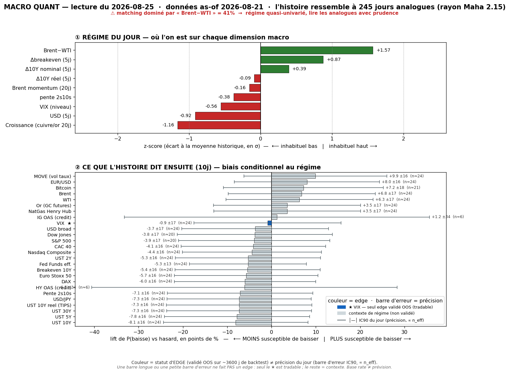
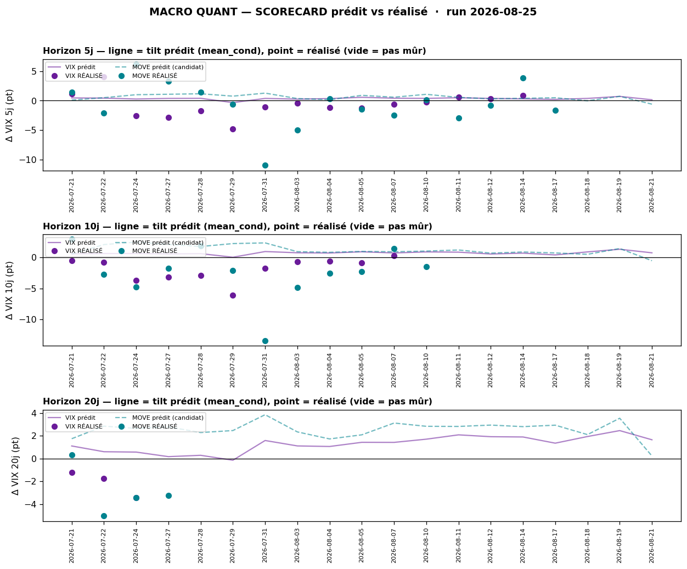

# Macro Quant Daily — run 2026-08-25 · as-of 2026-08-21

> **Couche 2 (les ODDS)** : fréquence historique d'un move après un régime comparable. Chiffre utile = **LIFT** (cond − uncond). **Filtre OOS dur** : seul le **VIX** a un IC OOS significatif → seul asset directionnellement exploitable. Le reste = **contexte de régime**.
> ⚠️ **Latence data — nettement réduite ce run** : le FRED s'arrête à **as-of 2026-08-21 (vendredi)** = **le jour de rebond** (PMI booming, VIX 15,13, growth-scare démoli). Le moteur **voit enfin** le rebond, il n'est plus figé sur le mercredi de stress. Retard résiduel = **2 séances** (il ne voit ni le chip-selloff de lundi 24 ni la détente Iran de mardi 25). Feature dominante `brwti` (Brent-WTI, **40,7 %**, flaggée) **toujours lagée** = reflète le spread oil tendu d'AVANT la détente → le base rate « oil ↓ forward » anticipe précisément son unwind (cf. §4).

## §1 — Régime (z-scores, as-of 2026-08-21)
| Feature | z | Sens |
|---|---|---|
| brwti (Brent-WTI) | **+1,57** | spread oil tendu — dominant matching (40,7 %, ⚠️ lagé) |
| growth | **−1,16** | momentum croissance faible (⚠️ lag hard-data — ne voit pas encore le PMI booming) |
| dusd_5 (ΔUSD 5j) | **−0,92** | USD vendu sur 5j (semaine <100 DXY) |
| dbe_5 (Δbreakeven 5j) | +0,87 | inflation anticipée ↑ (oil) |
| vix_lvl | −0,56 | VIX bas en niveau |
| d10_5 (ΔUS10 5j) | +0,39 | US10 rebondit (vendredi) |
| slope (2s10s) | −0,38 | aplatissement en niveau |
| brent_mom | −0,16 | Brent momentum ~neutre (lagé) |
| dreal_5 (Δréel 5j) | −0,09 | taux réels **~stables** (≠ −0,61 du run précédent : la fuite-qualité s'est arrêtée) |

Analogues **n=245**, rayon Mahalanobis 2,15. **Signature = spread oil tendu + croissance molle (lag) + USD vendu + réels stabilisés + VIX bas.** C'est un portrait **hybride** : le stress oil du milieu de semaine persiste dans le spread, mais la fuite-qualité (réels ↓) a cessé et l'USD a été vendu — le régime **normalise** vs le mercredi de pic.

## §2 — Base rates forward 10 j (lift vs baseline)
| Asset | lift 10j | cond | uncond | n_eff | tag | statut |
|---|---|---|---|---|---|---|
| **VIX** | **+0,71** | +0,73 | +0,01 | 24,5 | 🟡 | **✅ OOS exploitable** — tilt vol-UP **modéré (médian)** |
| MOVE | −0,59 | −0,55 | +0,04 | 24,5 | 🟡 | resp-only (réfuté OOS) — vol taux ↓ |
| HY OAS | −2,10 | −3,56 | −1,47 | 5,7 | 🔴 | resp-only — **resserrement** crédit (flip vs run stress) |
| IG OAS | −1,04 | −1,63 | −0,59 | 5,7 | 🔴 | resp-only — resserrement |
| Pente 2s10s | +1,39 | +1,50 | +0,12 | 24,5 | 🟡 | resp-only — **pentification** |
| UST 10Y (yield) | +1,28 | +1,26 | −0,02 | 24,5 | 🟡 | resp-only — **10Y ↑ (bear-steepener)** |
| UST 30Y (yield) | +1,68 | +1,76 | +0,07 | 24,5 | 🟡 | resp-only — **long-end mène** |
| UST 2Y (yield) | −0,11 | −0,24 | −0,13 | 24,5 | 🟡 | resp-only — front ~stable |
| USD broad | +0,08 | +0,12 | +0,04 | 24,5 | 🟡 | resp-only |
| S&P 500 | −0,08 | +0,42 | +0,50 | 19,7 | 🔴 | resp-only — direction non exploitable |
| Nasdaq | +0,16 | +0,63 | +0,48 | 24,5 | 🟡 | resp-only |
| CAC 40 | +0,20 | +0,28 | +0,09 | 24,5 | 🟡 | resp-only — **EU léger edge vs US** |
| Euro Stoxx 50 | +0,19 | +0,27 | +0,08 | 24,4 | 🟡 | resp-only |
| Or | −0,21 | +0,18 | +0,38 | 24,5 | 🟡 | resp-only |
| **Brent** | **−0,95** | −0,84 | +0,11 | 24,5 | 🟡 | resp-only — **oil ↓ forward (mean-rev du spread)** |
| WTI | −0,85 | −0,76 | +0,10 | 24,5 | 🟡 | resp-only — oil ↓ |
| BTC | −1,42 | +0,29 | +1,70 | 20,8 | 🟡 | resp-only — beta crypto < baseline |

> **Lecture** : seule ligne directionnelle = **VIX +0,71 @10j** — mais **beaucoup plus faible que le run précédent** (+1,28 au 24/08, as-of jour de stress). Le régime s'est normalisé → le tilt vol-UP passe de P100 à médian (voir §2bis/2ter). Contexte : **bear-steepener** (10Y +1,28 / 30Y +1,68 / 2Y −0,11 / pente +1,39 : le long-end vend, la courbe se pentifie — cohérent avec le thème bond-vol structurel) ; **oil ↓ forward** (Brent −0,95, WTI −0,85 : les analogues mean-reversent le spread tendu = l'oil retombe) ; **crédit qui se resserre** (HY OAS −2,10, MAIS n_eff 6 🔴 → non chiffrable, flip de signe vs le run stress) ; **EU léger edge sur US** (CAC/Stoxx +0,2 vs SP500 −0,08) ; **BTC < baseline** (−1,42, beta crypto médiocre dans ces analogues).

## §2bis — Term-structure VIX (seul asset à skill OOS)
| h | lift | cond | uncond | n_eff | tag | CI90 | rang (percentile) |
|---|---|---|---|---|---|---|---|
| 5 j | +0,14 | +0,15 | +0,01 | 49,0 | 🟡 | [−0,21 ; 0,52] | **P11 (INHABITUEL bas)** |
| 10 j | +0,71 | +0,73 | +0,01 | 24,5 | 🟡 | [0,19 ; 1,31] | P63 (médian) |
| 20 j | +1,62 | +1,65 | +0,02 | 12,2 | 🔴 | [0,86 ; 2,48] | P68 (médian) |

Le tilt vol-UP **s'est effondré** vs le run du 24/08 (qui était à P100 à tous horizons) : à **5 j le rang est P11 = quasi vol-neutre**, à 10-20 j il redevient médian. Après recalibration par le biais mesuré (shrink) : **@5j → −0,45 pt · @10j → −0,61 pt · @20j → +0,98 pt**. Autrement dit le signal *honnête* (corrigé du track-record) dit **vol ~flat à en légère BAISSE à 5-10 j** — plus du tout un contexte de dé-sizing comme le run précédent. Voir §2ter.

## §2ter — Track-record live du signal (prédit vs RÉALISÉ)

Dernier call émis **as-of 21/08**. Rappel : le VIX a un skill de **RANG, pas de niveau** → lire le percentile, pas les points. Dernier call mûr : as-of 27/07 → 24/08 **prédit +2,78 pt / réalisé −3,23 pt** (77,2 → 74,0).
- **@5 j** : 15 calls mûrs — **biais réalisé−prédit −1,00 pt** ; IC rang **+0,60** ; recalibré (shrink w=0,60) = **−0,45 pt**.
- **@10 j** : 11 calls mûrs — **biais −2,54 pt** ; IC rang **+0,74** ; recalibré (w=0,52) = **−0,61 pt**.
- **@20 j** : 3 calls mûrs — **biais −2,89 pt** ; IC rang **+0,72** ; recalibré (w=0,23) = **+0,98 pt**.

> ⚠️ **Le tilt vol-UP a sur-prédit tout l'été** (VIX baissait pendant que le signal montait) — c'est ce qui ramène le call live en négatif après recalibration. **Statut 🔒 verrouillé EN CONTEXTE** (4/30 calls indépendants @5j) : usage = cadran contexte-vol / dé-sizer quand le rang est ÉLEVÉ partant d'un VIX bas ; **jamais** long-vol ni hedge de queue (réfutés net de coûts en C5). **Nuance ce run** : le rang n'est PAS élevé (P11@5j, P63@10j) → **pas de signal de dé-sizing statistique aujourd'hui**, contrairement au run du 24/08. La seule raison de prudence est **exogène** (le cluster PCE/NVDA/Warsh, invisible au moteur), pas le base rate.

## §3 — Conclusion statistique
- **Le tilt vol-UP a normalisé** : le régime as-of 21/08 (rebond) donne un tilt VIX **médian (P63 @10j), quasi-neutre @5j (P11)** — recalibré, il vire même **légèrement NÉGATIF @5-10j**. Net : **pas de contexte de dé-sizing statistique ce run** (≠ le run du 24/08 qui criait P100). Le régime s'est dé-stressé dans les données.
- **Contexte cohérent bear-steepener** : long-end qui vend forward (30Y +1,68 / 10Y +1,28 / pente +1,39), crédit qui se resserre (HY 🔴), **oil ↓ forward** (Brent −0,95) — **aucune direction actions exploitable OOS** (SP500 −0,08 🔴).
- **Le signal le plus utile est indirect** : le base rate **oil ↓ forward** (mean-reversion du spread `brwti` tendu) **anticipe l'unwind live de la prime géopol** (détente Iran, Brent ~91). La feature lagée pointe le sens du prochain move.

## §4 — Confrontation Couche 1 ↔ Couche 2
- **Convergence forte sur l'OIL** : le daily 25/08 documente la **détente Iran → Brent ~91 (de ~97), prime qui reflue** ; la Couche 2 a précisément **oil ↓ forward** (Brent −0,95 @10j, −2,87 @20j) par mean-reversion du spread tendu. Le base rate historique et le catalyseur live **pointent le même sens** — rare et notable (la feature lagée n'a pas induit en erreur, elle a cadré l'unwind).
- **Convergence sur le VIX bas** : daily VIX 15,85 (complacency) ; Couche 2 dit que le tilt vol-UP a normalisé (P11-P63), recalibré ~flat/négatif → **cohérent avec un régime dé-stressé**. **MAIS** le moteur est **aveugle au cluster PCE/NVDA/Warsh** : le base rate « vol calme » ne doit PAS servir de réconfort avant les catalyseurs (raison de prudence = exogène, pas statistique).
- **Divergence de timing (latence 2 séances)** : la Couche 2 a un **bear-steepener** (yields ↑ forward) alors que le daily 25/08 montre des **yields en détente live** (US10 4,70 sur l'oil). Ce n'est pas une contradiction : le base rate décrit la tendance historique du régime, le live price la détente oil du jour. Le feature `growth −1,16` reste **laggé** (ne voit pas encore le PMI surchauffe) → à surveiller au prochain re-run.
- **EU léger edge** : CAC/Stoxx +0,2 vs SP500 −0,08 = cohérent avec le daily (IFO allemand 88,8 beat, ré-accélération EU) et le coil US sous 7 757. Contexte, pas pari (resp-only).
- **Net** : rien de directionnel exploitable au-delà du **cadran contexte-vol** — et ce run, **le cadran ne dit PAS dé-sizer** (rang médian). La prudence reste justifiée mais par le **calendrier exogène** (PCE mer · NVDA mer · Warsh ven), pas par les odds. **Priorité à la Couche 1 live.**

## §5 — À rerunner
- **Mer 26 / après PCE** : re-run — l'as-of intégrera lundi/mardi (chip-selloff + détente Iran) ; surveiller si `growth` intègre enfin le PMI surchauffe et si le tilt vol re-monte sur l'event risk.
- **Trimestriel** : `macro_quant_backtest.py` (IC OOS + DSR/PBO/hold-out) — re-tester **MOVE** (resp-only, réfuté).
- **Scorecard** : biais de sur-prédiction vol-up **persiste** (−1,0 à −2,9 pt) — le fait saillant à suivre ; se remplit (4/30 indép. @5j).
