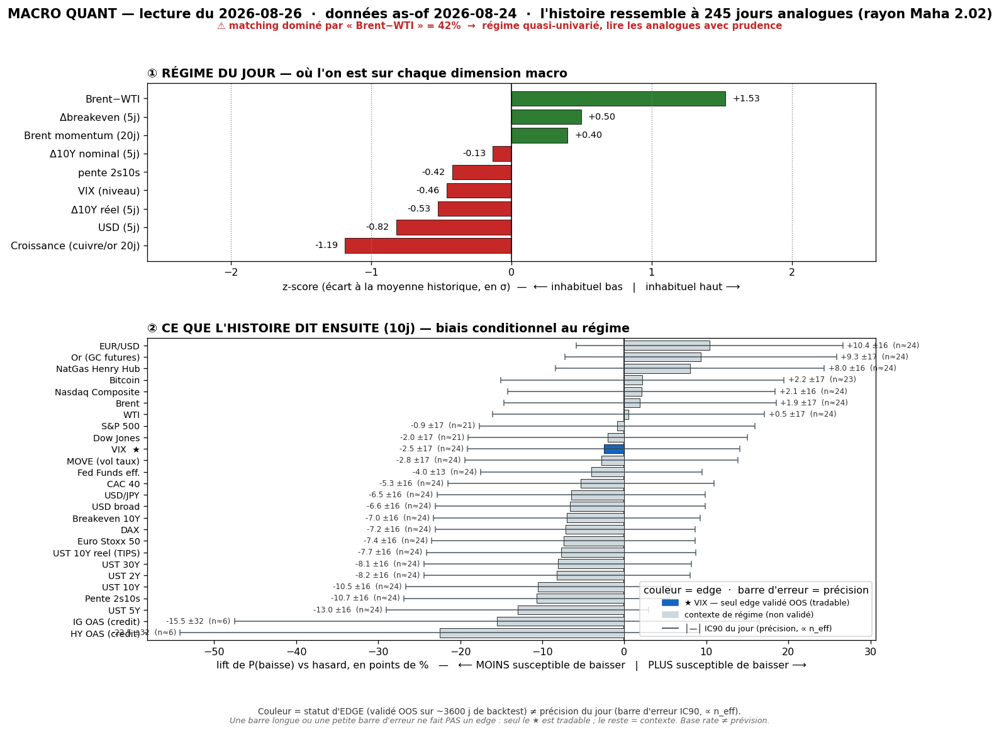
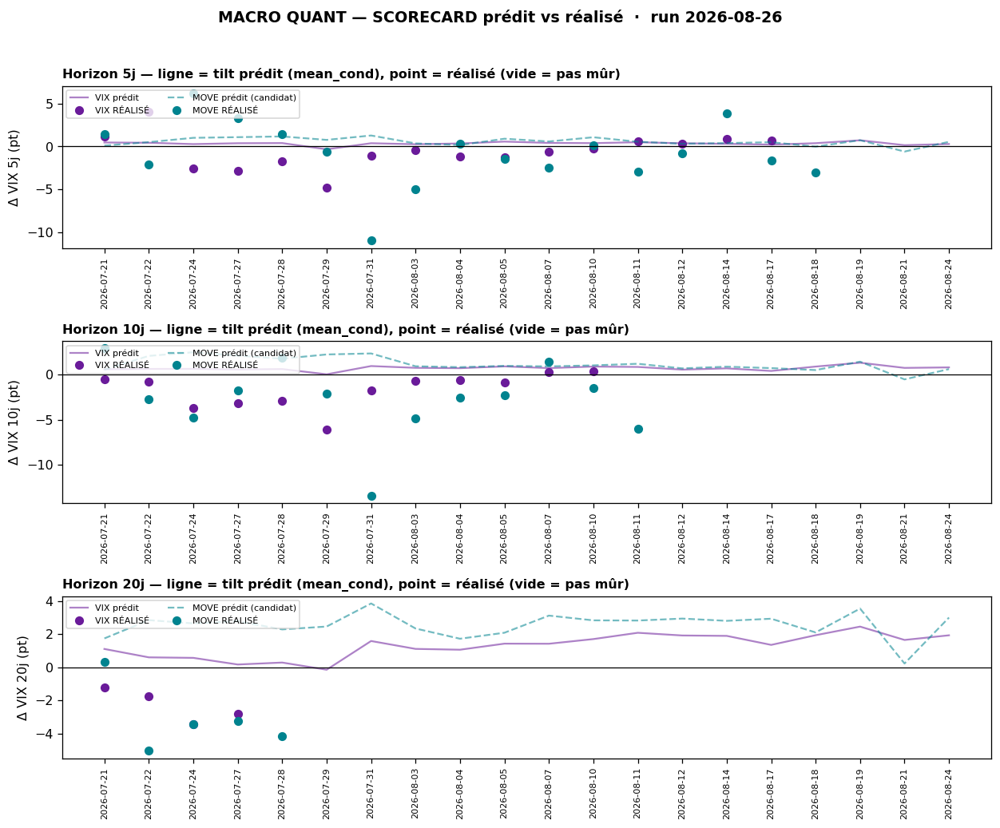

# Macro Quant Daily — 2026-08-26 (données as-of 2026-08-24)

> **Couche 2 — les ODDS.** À quelle fréquence un régime historiquement comparable a été suivi de tel move. Le chiffre utile = **lift** (P_cond − P_uncond), jamais P_cond seule. Base rate ≠ prévision. **Filtre OOS dur** : direction exploitable **VIX seul** ; tout le reste = contexte de régime (IC OOS ≈ 0).

> ⚠️ **CAVEAT LATENCE — feature dominante vintage-lagée.** Le matching est **dominé par `brwti` (spread Brent-WTI) à 42,3 %** du poids Mahalanobis, +growth 25,6 %. Or `brwti`/Brent/WTI (FRED) s'arrêtent au **24/08** → le régime est daté au 24/08 et **ne voit PAS la détente géopol Iran live** (Brent qui bleed ~97→~91 le 25/08, cf. daily). Le `brwti +1,53z` capté par le moteur reflète un spread encore élevé **avant** l'apaisement → **il fausse le matching** vers des analogues « choc oil ». Lecture à pondérer fortement par la Couche 1 live.

## §1 — Régime du jour (z-scores, as-of 2026-08-24)

Analogues retenus : **245** (rayon Mahalanobis 2,02 · k-impulse 5).

| Feature | z | Sens |
|---|---|---|
| brwti | **+1,53** | spread Brent-WTI très étiré ⚠ dominant (42,3 %) + vintage-lag |
| growth | **−1,19** | proxy croissance nettement sous tendance |
| dusd_5 | −0,82 | USD broad en repli (Δ5j) |
| dreal_5 | −0,53 | taux réels (TIPS 10Y) en baisse |
| dbe_5 | +0,50 | breakevens 10Y en hausse (inflation anticipée ↑) |
| vix_lvl | −0,46 | VIX bas |
| slope | −0,42 | pente 2s10s qui s'aplatit sur 5j |
| brent_mom | +0,40 | momentum Brent légèrement positif |
| d10_5 | −0,13 | 10Y quasi neutre |

> Signature : **oil-stress résiduel (brwti) + croissance molle + USD/réels qui se détendent + VIX bas**. C'est un régime « fin de choc oil sur fond de désinflation-taux ». Le biais dominant `brwti` étant périmé, la partie « oil-stress » est la plus suspecte.

## §2 — Base rates forward 10j (horizon fixe, tous assets — contexte glanceable)

Direction exploitable **VIX seul**. Toutes les autres lignes = **contexte de régime, direction non exploitable (pas de skill OOS)**.

| Asset | lift 10j | cond | uncond | n_eff | tag | statut |
|---|---|---|---|---|---|---|
| VIX | **+0,77** | +0,78 | +0,01 | 24 | 🟡 | **exploitable (OOS, SIG)** |
| MOVE (vol taux) | +0,55 | +0,59 | +0,04 | 24 | 🟡 | resp-only (contexte) |
| DFF Fed Funds | −0,11 | −0,45 | −0,33 | 24 | 🟡 | resp-only |
| UST 2Y | −0,04 | −0,17 | −0,13 | 24 | 🟡 | resp-only |
| UST 5Y | +1,77 | +1,69 | −0,07 | 24 | 🟡 | resp-only (SIG) |
| UST 10Y | +2,75 | +2,74 | −0,02 | 24 | 🟡 | resp-only (SIG) |
| UST 30Y | +3,24 | +3,31 | +0,08 | 24 | 🟡 | resp-only (SIG) |
| UST 10Y réel | +2,09 | +2,09 | −0,01 | 24 | 🟡 | resp-only (SIG) |
| Breakeven 10Y | +0,66 | +0,65 | −0,01 | 24 | 🟡 | resp-only |
| Pente 2s10s | +2,79 | +2,91 | +0,12 | 24 | 🟡 | resp-only (SIG) |
| HY OAS | +5,49 | +4,02 | −1,47 | **6** | 🔴 | resp-only (n_eff trop faible) |
| IG OAS | +0,98 | +0,38 | −0,60 | **6** | 🔴 | resp-only (n_eff trop faible) |
| USD broad | +0,09 | +0,13 | +0,04 | 24 | 🟡 | resp-only (SIG) |
| USD/JPY | +0,11 | +0,17 | +0,06 | 24 | 🟡 | resp-only |
| EUR/USD | −0,09 | −0,11 | −0,02 | 24 | 🟡 | resp-only |
| Brent | −0,25 | −0,15 | +0,11 | 24 | 🟡 | resp-only ⚠ feature-lag |
| WTI | −0,10 | +0,00 | +0,10 | 24 | 🟡 | resp-only ⚠ feature-lag |
| NatGas | −5,35 | −5,53 | −0,18 | 24 | 🟡 | resp-only (SIG) |
| Or | −0,41 | −0,03 | +0,39 | 24 | 🟡 | resp-only (SIG) |
| Nasdaq Comp | −0,12 | +0,36 | +0,48 | 24 | 🟡 | resp-only |
| S&P 500 | −0,23 | +0,27 | +0,51 | 21 | 🟡 | resp-only |
| Dow Jones | −0,05 | +0,38 | +0,43 | 21 | 🟡 | resp-only |
| CAC 40 | +0,20 | +0,29 | +0,09 | 24 | 🟡 | resp-only |
| DAX | −0,01 | +0,27 | +0,28 | 24 | 🟡 | resp-only |
| Euro Stoxx 50 | +0,17 | +0,25 | +0,08 | 24 | 🟡 | resp-only |
| Bitcoin | +0,42 | +2,12 | +1,70 | 23 | 🟡 | resp-only |

> **Lecture contexte (non exploitable) :** les analogues « fin de choc oil + désinflation » sont associés, en moyenne, à des **taux qui remontent** (5Y→30Y, réels, pente resteepening — tous SIG mais resp-only), un **or qui rend une partie de la prime** (lift −0,41), des **indices US légèrement sous leur baseline** (lift négatif mais non SIG) et des **actions EU marginalement mieux orientées** (CAC/SX5E lift +). Rien de cela n'est un pari : IC OOS ≈ 0 hors VIX. Crédit (HY/IG) = **n_eff 6 → 🔴, à ignorer**.

## §2bis — Term-structure VIX (seul asset à skill OOS)

| Horizon | lift | cond | uncond | n_eff | tag | SIG | CI90 |
|---|---|---|---|---|---|---|---|
| 5j | +0,27 | +0,28 | +0,01 | 49 | 🟡 | non | [−0,03 ; +0,60] |
| 10j | **+0,77** | +0,78 | +0,01 | 24 | 🟡 | **oui** | [+0,37 ; +1,21] |
| 20j | +1,91 | +1,93 | +0,02 | 12 | 🔴 | oui | [+1,33 ; +2,57] |

> Le tilt **vol-up croît avec l'horizon** : non significatif à 5j, SIG à 10j (CI strictement >0), plus marqué à 20j mais **n_eff 12 → 🔴** (fausse précision). Rappel scope prouvé : le VIX a un **skill de RANG** (percentile), pas de niveau ; @10j le call live = **P70** de l'historique. **Usage autorisé = cadran de contexte-vol / multiplicateur de conviction** (dé-sizer si rang vol-up élevé partant d'un VIX bas = complacency). **Interdit** : trigger directionnel, short-vol, hedge de queue (réfutés net de coûts en C5). Contre-exemple : le tilt est vol-up mais **~51 % du temps le VIX baisse quand même** à 10j (pneg_cond 51,0).

## §2ter — Track-record live (scorecard : prédit vs réalisé)

Dernier call mûr : **as-of 28/07 → 25/08, prédit +2,28 pt vs réalisé −4,17 pt** (VIX 76,1→71,9) — le call vol-up s'est réalisé **vol-down**.

| Horizon | calls mûrs | biais réalisé−prédit | IC rang | tilt recalibré (shrink) | porte promo |
|---|---|---|---|---|---|
| 5j | 16 | **−0,91 pt** | +0,56 | −0,28 pt | 4/30 · 🔒 verrouillé contexte |
| 10j | 12 | **−2,37 pt** | +0,77 | −0,51 pt | 2/30 · 🔒 verrouillé contexte |
| 20j | 4 | −2,92 pt | +0,69 | +1,10 pt | 1/30 · 🔒 verrouillé contexte |

> **Lecture honnête** : sur les horizons mûrs, le base rate brut **sur-prédit la vol** — la calibration réalisée pousse le tilt vers le **plat/vol-down** après shrink (5j −0,28, 10j −0,51). L'IC de **rang** reste positif (+0,56 à +0,77) = le classement percentile tient, mais le **niveau** dérape. **Caveats obligatoires** : (a) fenêtres chevauchantes + régime persistant ⇒ calls corrélés → hit-rate NON parlant tant que l'échantillon indépendant (4-16 calls) est petit, il se remplit dans le temps ; (b) MOVE = contexte seul (série `^MOVE` souvent périmée) ; (c) **ne PAS invalider le signal du jour sur 2 semaines** — juste le mettre en regard : le tilt vol-up a ramé pendant que le VIX baissait. Le signal reste **🔒 verrouillé en contexte** (pas promu en pari).

## §3 — Conclusion statistique

- **Signal directionnel exploitable (VIX) :** tilt **vol-up modéré @10j** (lift +0,77, SIG, P70) — mais **fortement tempéré par le track-record live** qui a sur-prédit la vol (recalibré → ~plat/légèrement vol-up). Net : **contexte de vol légèrement haussier, sans conviction** ; usage = ne pas se sur-exposer, pas un trigger. VIX bas (−0,46z) partant vers un rang vol-up élevé = configuration « complacency » classique de dé-sizing prudent.
- **Contexte de régime (non exploitable, informatif) :** analogues « sortie de choc oil + croissance molle + détente USD/réels » historiquement suivis de **taux qui remontent + or qui rend de la prime + indices US légèrement mous**. À traiter comme toile de fond, **jamais comme paris** (IC OOS ≈ 0).
- **Fiabilité du run :** grevée par la **domination `brwti` (42,3 %) vintage-lagée** — le moteur matche un choc oil déjà en train de se résorber live. Prendre le pan « oil-stress » du régime avec réserve.

## §4 — Confrontation Couche 1 ↔ Couche 2

Daily de réf. : [[Macro/Daily/2026-08-25 - Macro Daily]] (pas de daily du 26 au moment du run).

- **CONVERGENCE — VIX bas + event risk = coil avant résolution.** Couche 1 : « VIX 15,85 tique (+4,76 %) mais pas de réveil, coil sous pivot avant le cluster PCE+NVDA+Warsh ». Couche 2 : tilt vol-up @10j (P70) partant d'un VIX bas. **Les deux pointent un contexte vol-up latent** → conviction renforcée pour **dé-sizer / resserrer avant les catalyseurs de mer-ven**, sans trader la vol en direction.
- **DIVERGENCE — l'oil.** Couche 1 (live) : **détente Iran → Brent bleed ~97→91, prime qui sort**. Couche 2 : régime **dominé par `brwti +1,53` (oil-stress) figé au 24/08** → matche des analogues de choc oil. **Priorité à la Couche 1 live** : la détente est réelle et postérieure aux données FRED. Le biais oil du moteur est un artefact de latence → **ne pas en tirer de lecture oil**.
- **COHÉRENCE taux/USD.** Couche 1 : US10 se détend à ~4,70, USD ~99. Couche 2 : régime `dusd_5 −0,82` + `dreal_5 −0,53` (détente actée), mais base rates forward = **resteepening/taux ↑** en contexte. À surveiller si PCE (mer) réenclenche la jambe taux — cohérent avec le « test des plus-hauts si PCE chaud » de la Couche 1.

## §5 — À rerunner

- **Demain 27/08** : run standard — la vintage FRED devrait intégrer le 25/08 → vérifier si `brwti` **retombe** (validation de l'hypothèse latence) et si la dominance se rééquilibre.
- **Post-PCE (mer 26)** : `/macro-flash` si surprise, puis re-run quant jeudi pour capter le nouveau régime taux/vol.
- **Backtest trimestriel** : prochain `macro_quant_backtest.py` (+ `analyze_db.py`) pour re-tester la promotion MOVE et confirmer VIX comme seul asset OOS validé.
