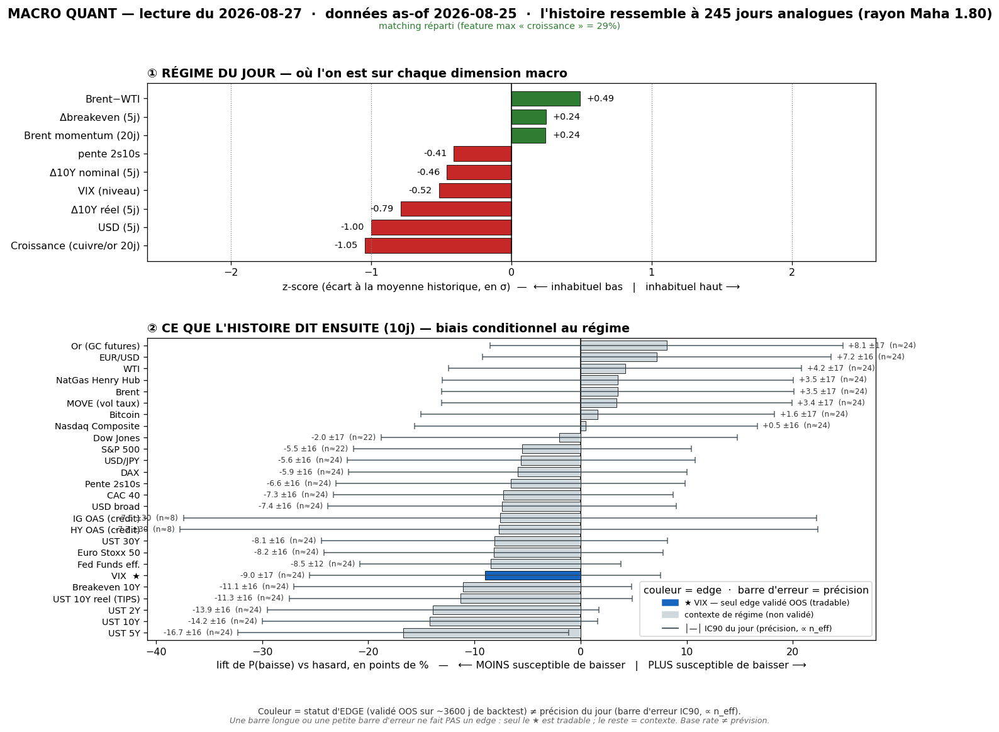
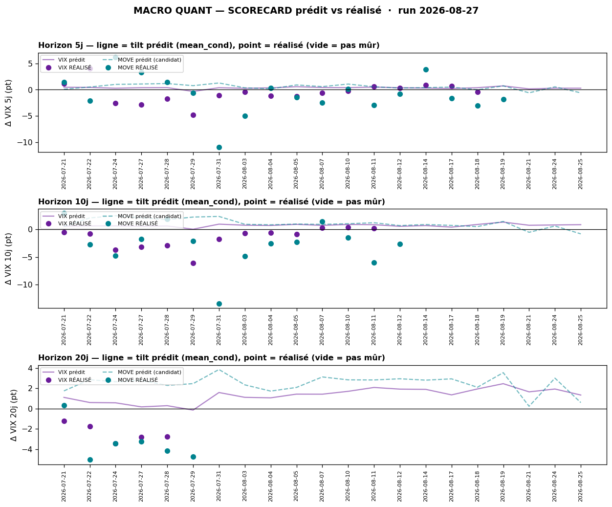

# Macro Quant Daily — 2026-08-27 (données as-of 2026-08-25)

> **Couche 2 — les ODDS.** À quelle fréquence un régime historiquement comparable a été suivi de tel move. Le chiffre utile = **lift** (P_cond − P_uncond), jamais P_cond seule. Base rate ≠ prévision. **Filtre OOS dur** : direction exploitable **VIX seul** ; tout le reste = contexte de régime (IC OOS ≈ 0).

> ✅ **Latence oil résorbée.** La vintage a intégré le 25/08 → la dominance `brwti` d'hier (42,3 %, artefact de choc oil périmé) **s'est effondrée** : plus aucune feature dominante (`growth` mène à 29,3 %, flag False), `brwti` retombe +1,53z→**+0,49z**. Le matching est **plus propre** (rayon Mahalanobis 1,80 vs 2,02 hier). ⚠️ Reste **une latence résiduelle** : la vintage s'arrête au **25/08** → le moteur ne voit **ni le re-bid oil du 26/08** (Putin/Ukraine + Iran/Hormuz) **ni le blowout NVDA** ni le PCE headline chaud → tout ça vit en Couche 1.

## §1 — Régime du jour (z-scores, as-of 2026-08-25)

Analogues retenus : **245** (rayon Mahalanobis 1,80 · k-impulse 5). **Pas de feature dominante** (flag False).

| Feature | z | Sens |
|---|---|---|
| growth | **−1,05** | proxy croissance sous tendance (feature la plus pesante, 29,3 %) |
| dusd_5 | **−1,00** | USD broad en net repli (Δ5j) |
| dreal_5 | −0,79 | taux réels (TIPS 10Y) en baisse |
| vix_lvl | −0,52 | VIX bas |
| brwti | +0,49 | spread Brent-WTI encore positif mais **normalisé** (vs +1,53 hier) |
| d10_5 | −0,46 | 10Y en détente sur 5j |
| slope | −0,41 | pente 2s10s qui s'aplatit |
| dbe_5 | +0,24 | breakevens 10Y légèrement en hausse |
| brent_mom | +0,24 | momentum Brent faiblement positif |

> Signature : **croissance molle + détente USD/réels/10Y + VIX bas**, sans le bruit oil d'hier. C'est un régime « désinflation-taux / risk-on latent » — MAIS conditionné sur des données **antérieures** au tournant hawkish du 26/08 (PCE headline chaud). Le régime capté est celui de la détente, pas du re-durcissement live.

## §2 — Base rates forward 10j (horizon fixe, tous assets — contexte glanceable)

Direction exploitable **VIX seul**. Toutes les autres lignes = **contexte de régime, direction non exploitable (pas de skill OOS)**.

| Asset | lift 10j | cond | uncond | n_eff | tag | statut |
|---|---|---|---|---|---|---|
| VIX | **+0,82** | +0,83 | +0,01 | 24 | 🟡 | **exploitable (OOS, SIG)** |
| MOVE (vol taux) | −0,87 | −0,83 | +0,04 | 24 | 🟡 | resp-only (SIG) |
| DFF Fed Funds | −0,70 | −1,03 | −0,33 | 24 | 🟡 | resp-only |
| UST 2Y | +2,15 | +2,01 | −0,13 | 24 | 🟡 | resp-only (SIG) |
| UST 5Y | +3,78 | +3,71 | −0,07 | 24 | 🟡 | resp-only (SIG) |
| UST 10Y | +3,72 | +3,71 | −0,01 | 24 | 🟡 | resp-only (SIG) |
| UST 30Y | +2,90 | +2,98 | +0,08 | 24 | 🟡 | resp-only (SIG) |
| UST 10Y réel | +2,99 | +2,98 | −0,01 | 24 | 🟡 | resp-only (SIG) |
| Breakeven 10Y | +0,73 | +0,73 | −0,01 | 24 | 🟡 | resp-only (SIG) |
| Pente 2s10s | +1,57 | +1,69 | +0,12 | 24 | 🟡 | resp-only (SIG) |
| HY OAS | +1,43 | −0,05 | −1,48 | **8** | 🔴 | resp-only (n_eff trop faible) |
| IG OAS | +0,17 | −0,43 | −0,60 | **8** | 🔴 | resp-only (n_eff trop faible) |
| USD broad | +0,13 | +0,17 | +0,04 | 24 | 🟡 | resp-only (SIG) |
| USD/JPY | +0,14 | +0,20 | +0,06 | 24 | 🟡 | resp-only |
| EUR/USD | −0,10 | −0,12 | −0,02 | 24 | 🟡 | resp-only |
| Brent | −0,37 | −0,26 | +0,11 | 24 | 🟡 | resp-only ⚠ ne voit pas le re-bid live |
| WTI | −0,62 | −0,52 | +0,10 | 24 | 🟡 | resp-only ⚠ ne voit pas le re-bid live |
| NatGas | −1,84 | −2,03 | −0,18 | 24 | 🟡 | resp-only |
| Or | −0,37 | +0,02 | +0,39 | 24 | 🟡 | resp-only (SIG) |
| Nasdaq Comp | −0,04 | +0,44 | +0,48 | 24 | 🟡 | resp-only |
| S&P 500 | −0,10 | +0,41 | +0,51 | 22 | 🟡 | resp-only |
| Dow Jones | +0,04 | +0,47 | +0,43 | 22 | 🟡 | resp-only |
| CAC 40 | +0,35 | +0,44 | +0,09 | 24 | 🟡 | resp-only (SIG) |
| DAX | +0,19 | +0,47 | +0,28 | 24 | 🟡 | resp-only |
| Euro Stoxx 50 | +0,32 | +0,41 | +0,08 | 24 | 🟡 | resp-only (SIG) |
| Bitcoin | +0,60 | +2,30 | +1,70 | 24 | 🟡 | resp-only |

> **Lecture contexte (non exploitable) :** les analogues « détente USD/réels + croissance molle » sont associés, en moyenne, à un **rebond des taux** (2Y→30Y, réels, pente — tous SIG, resp-only), un **USD qui reprend un peu** (+0,13 SIG), une **vol taux qui baisse** (MOVE −0,87 SIG), un **or qui rend une partie de sa prime** (−0,37 SIG) et des **actions EU marginalement mieux orientées** (CAC/SX5E lift + SIG) que les indices US (lift ≈ 0/négatif, non SIG). Rien de tradeable : IC OOS ≈ 0 hors VIX. Crédit HY/IG = **n_eff 8 → 🔴, à ignorer**.

## §2bis — Term-structure VIX (seul asset à skill OOS)

| Horizon | lift | cond | uncond | n_eff | tag | SIG | CI90 |
|---|---|---|---|---|---|---|---|
| 5j | +0,27 | +0,28 | +0,01 | 49 | 🟡 | non | [−0,04 ; +0,61] |
| 10j | **+0,82** | +0,83 | +0,01 | 24 | 🟡 | **oui** | [+0,44 ; +1,26] |
| 20j | +1,31 | +1,34 | +0,02 | 12 | 🔴 | oui | [+0,88 ; +1,84] |

> Tilt **vol-up croissant avec l'horizon** : non-SIG à 5j, SIG à 10j (CI >0), plus marqué à 20j mais **n_eff 12 → 🔴**. @10j le call live = **P76** du rang VIX. Rappel scope : skill de **RANG** (percentile), pas de niveau. **Usage autorisé** = cadran de contexte-vol / multiplicateur de conviction (dé-sizer si rang vol-up élevé partant d'un VIX bas = complacency — **configuration du jour** : VIX −0,52z bas + tilt vol-up P76). **Interdit** : trigger directionnel, short-vol, hedge de queue. Contre-exemple : ~**45 %** du temps le VIX baisse quand même à 10j (pneg_cond 44,5).

## §2ter — Track-record live (scorecard : prédit vs réalisé)

Trois calls @10j récemment mûrs, **tous vol-up prédits, tous vol-down réalisés** :

| as-of → échéance | prédit | réalisé | dir. |
|---|---|---|---|
| 27/07 → 24/08 | +2,78 | **−3,23** (77,2→74,0) | ❌ |
| 28/07 → 25/08 | +2,28 | **−4,17** (76,1→71,9) | ❌ |
| 29/07 → 26/08 | +2,46 | **−4,74** (74,2→69,4) | ❌ |

| Horizon | calls mûrs | biais réalisé−prédit | IC rang | tilt recalibré (shrink) | porte promo |
|---|---|---|---|---|---|
| 5j | 17 | **−0,90 pt** | +0,56 | −0,29 pt | 5/30 · 🔒 verrouillé contexte |
| 10j | 13 | **−2,24 pt** | +0,78 | −0,43 pt | 2/30 · 🔒 verrouillé contexte |
| 20j | 5 | −2,94 pt | +0,71 | +0,35 pt | 1/30 · 🔒 verrouillé contexte |

> **Lecture honnête** : le base rate brut **sur-prédit systématiquement la vol** — les 3 derniers calls @10j mûrs ont tous raté la direction (le VIX a **baissé** pendant tout le drift désinflation de la semaine). Après recalibration (shrink), le tilt @10j **s'inverse à −0,43 pt** = quasi-plat/légèrement vol-down. L'**IC de rang reste solide** (+0,56 à +0,78) → le classement percentile tient, c'est le **niveau** qui dérape. **Caveats obligatoires** : (a) fenêtres chevauchantes + régime persistant ⇒ 3 calls corrélés, ce n'est PAS un 0/3 indépendant — le sous-échantillon indépendant reste 5/2/1 sur 30 → **hit-rate non parlant, se remplit dans le temps** ; (b) MOVE = contexte seul (resp-only) ; (c) **ne PAS invalider le signal du jour sur 2-4 semaines** — juste le mettre en regard : le tilt vol-up a ramé pendant que le VIX baissait. Signal **🔒 verrouillé en contexte** (non promu).

## §3 — Conclusion statistique

- **Signal directionnel exploitable (VIX) :** base rate brut = **vol-up modéré @10j** (lift +0,82, SIG, P76) partant d'un VIX bas → **configuration complacency** classique de dé-sizing prudent. **MAIS** le track-record live **contredit ce niveau** (3 derniers calls @10j = vol-down réalisé) → tilt **recalibré ~plat/légèrement vol-down**. Net : **pas de conviction vol-up nette** ; le seul usage défendable = ne pas se sur-exposer avant Warsh, sans en faire un pari directionnel.
- **Contexte de régime (non exploitable) :** analogues « détente USD/réels + croissance molle » historiquement suivis d'un **rebond taux + USD + baisse vol taux + or qui rend de la prime**. Fait notable : **ce contexte forward CONVERGE avec le tournant hawkish live** (PCE chaud → bonds vendus, US10 ferme, USD bid). À traiter comme toile de fond confortante, **jamais comme paris** (IC OOS ≈ 0).
- **Fiabilité du run :** **améliorée vs hier** (dominance oil résorbée, match plus serré). Latence résiduelle : ne voit pas le re-bid oil du 26/08 ni le choc NVDA/PCE → ces trois vivent en Couche 1.

## §4 — Confrontation Couche 1 ↔ Couche 2

Daily de réf. : [[Macro/Daily/2026-08-27 - Macro Daily]].

- **CONVERGENCE — taux/USD.** Couche 1 (live) : PCE headline chaud (3,7 %) → narratif « Fed hike this year » → **bonds vendus, US10 ferme ~4,65 %, USD bid**. Couche 2 (contexte) : base rates forward = **rebond taux 2Y→30Y (SIG) + USD +0,13 (SIG) + MOVE −0,87**. **Les deux pointent la même jambe taux/USD haussière** → conviction de contexte renforcée (mais Couche 2 resp-only → pas un trigger).
- **DIVERGENCE #1 — la vol.** Couche 1 : **VIX ~15 (−5,5 %), le beat NVDA a calmé la vol** (complaisance maintenue). Couche 2 brut : tilt vol-up P76. **Le track-record recalibré tranche en faveur de la Couche 1** (le niveau sur-prédit, recalibré → vol-down) → **priorité au live** : pas de réveil vol tant que Warsh (28/08) ne surprend pas.
- **DIVERGENCE #2 — l'oil.** Couche 1 : **oil RE-BID live** (Putin/Ukraine + Iran blackliste les assureurs à Hormuz). Couche 2 : régime `brwti` normalisé (+0,49) + base rate Brent/WTI **négatif** (−0,37/−0,62), figé au 25/08 → **ne voit pas le re-bid**. **Priorité à la Couche 1 live** : la latence data manque le tournant géopol.
- **Le juge = Warsh (28/08 16h00).** Couche 1 et Couche 2 convergent sur un **contexte taux/USD hawkish** ; le risque vol est latent mais non confirmé. Un Warsh hawkish alignerait les deux couches (taux ↑ + réveil vol) ; un Warsh dovish casserait la jambe taux du contexte.

## §5 — À rerunner

- **Demain 28/08 (post-Warsh)** : `/macro-flash` si surprise, puis re-run quant — la vintage devrait intégrer le 26/08 (PCE + re-bid oil) → vérifier si le régime bascule hawkish/oil et si le tilt VIX se recalibre.
- **Surveiller** : convergence Couche 1↔2 sur taux/USD post-Warsh (renforcement) vs cassure de la jambe taux si dovish.
- **Backtest trimestriel** : prochain `macro_quant_backtest.py` (+ `analyze_db.py`) pour re-tester MOVE et confirmer VIX comme seul asset OOS validé.
