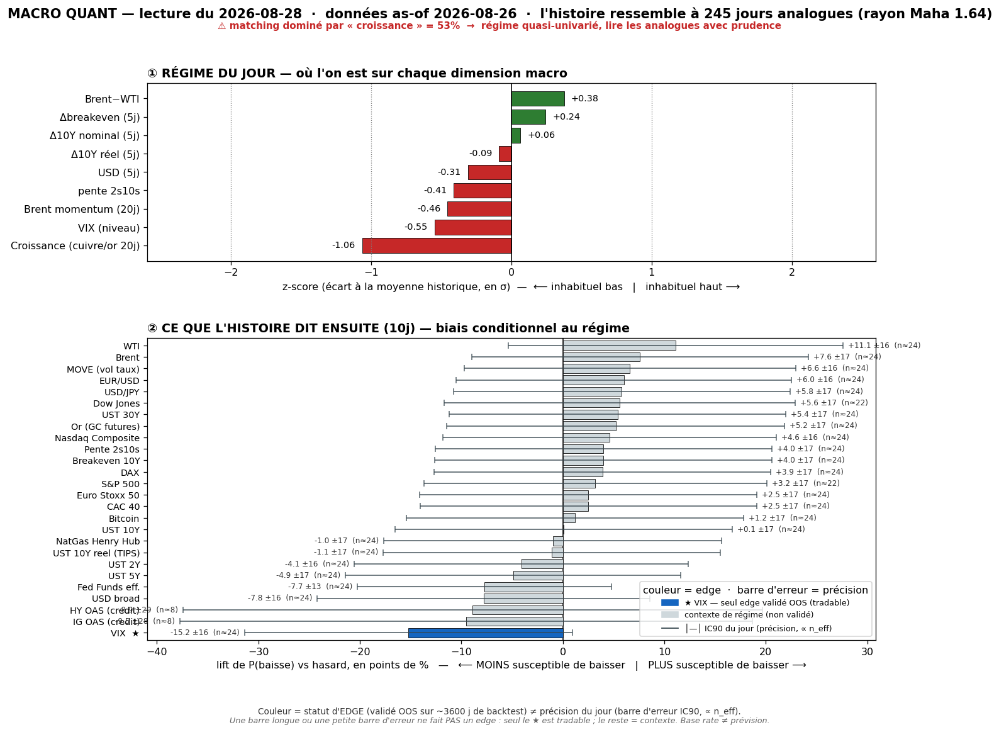
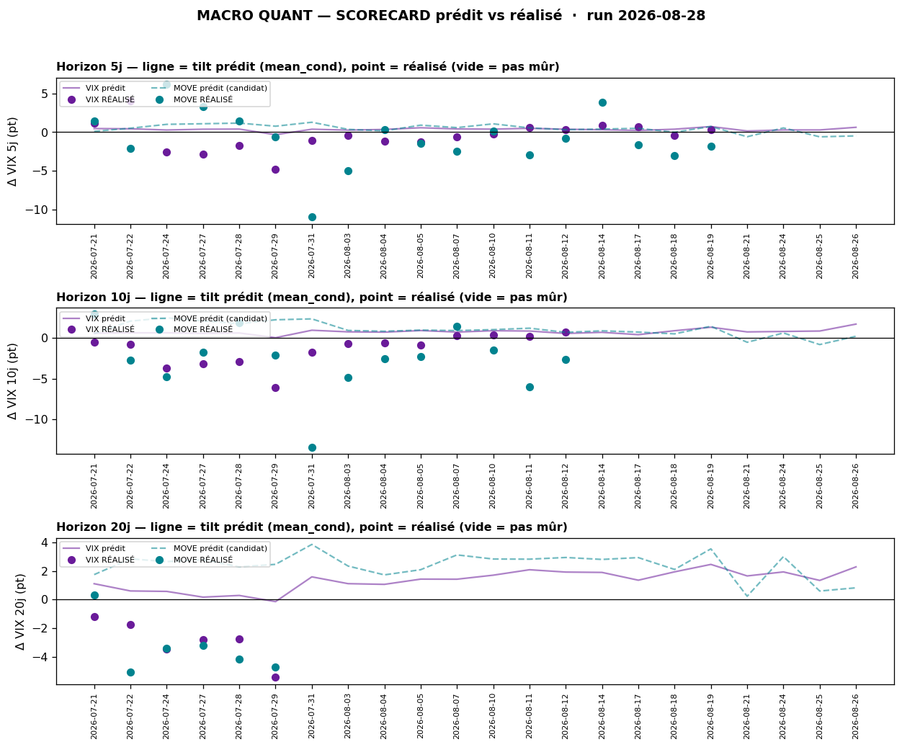

# Macro Quant Daily — 2026-08-28 (données as-of 2026-08-26)

> **Couche 2 — les ODDS.** À quelle fréquence un régime historiquement comparable a été suivi de tel move. Le chiffre utile = **lift** (P_cond − P_uncond), jamais P_cond seule. Base rate ≠ prévision. **Filtre OOS dur** : direction exploitable **VIX seul** ; tout le reste = contexte de régime (IC OOS ≈ 0).

> ⚠️ **Match mono-feature — `growth` domine à 53,4 % (flag True).** Le régime capté est essentiellement « **croissance nettement sous tendance** » (growth −1,06z). Le matching Mahalanobis est le plus serré de la semaine (rayon 1,64) MAIS **dominé par une seule feature** → l'ensemble d'analogues est un **template risk-off / growth-scare**, à prendre comme tel. La vintage s'arrête au **26/08** (intègre enfin PCE chaud + re-bid oil) → elle **ne voit pas** le melt-up NVDA du 27/08 ni le contenu de Warsh (aujourd'hui 16h00) → ça vit en Couche 1.

## §1 — Régime du jour (z-scores, as-of 2026-08-26)

Analogues retenus : **245** (rayon Mahalanobis 1,64 · k-impulse 5). **Feature dominante `growth` (53,4 %, flag True)**.

| Feature | z | Sens |
|---|---|---|
| growth | **−1,06** | proxy croissance nettement sous tendance ⚠ **domine le match (53,4 %)** |
| vix_lvl | −0,55 | VIX bas (au moment des données) |
| brent_mom | −0,46 | momentum Brent qui se retourne à la baisse |
| slope | −0,41 | pente 2s10s qui s'aplatit |
| brwti | +0,38 | spread Brent-WTI encore légèrement positif |
| dusd_5 | −0,31 | USD broad en léger repli (Δ5j) |
| dbe_5 | +0,24 | breakevens 10Y légèrement en hausse |
| dreal_5 | −0,09 | taux réels quasi neutres |
| d10_5 | +0,06 | 10Y quasi neutre |

> Signature : **growth-scare** (croissance −1,06z, oil momentum qui casse, VIX bas). C'est un régime « ralentissement / risk-off latent », d'où un ensemble d'analogues où **la vol monte et le risque baisse** en moyenne. À pondérer par la domination mono-feature.

## §2 — Base rates forward 10j (horizon fixe, tous assets — contexte glanceable)

Direction exploitable **VIX seul**. Toutes les autres lignes = **contexte de régime, direction non exploitable (pas de skill OOS)**.

| Asset | lift 10j | cond | uncond | n_eff | tag | statut |
|---|---|---|---|---|---|---|
| VIX | **+1,67** | +1,68 | +0,01 | 24 | 🟡 | **exploitable (OOS, SIG)** |
| MOVE (vol taux) | +0,16 | +0,19 | +0,04 | 24 | 🟡 | resp-only |
| DFF Fed Funds | −1,41 | −1,74 | −0,33 | 24 | 🟡 | resp-only (SIG) |
| UST 2Y | −0,59 | −0,73 | −0,13 | 24 | 🟡 | resp-only |
| UST 5Y | −0,75 | −0,82 | −0,07 | 24 | 🟡 | resp-only |
| UST 10Y | −1,28 | −1,29 | −0,01 | 24 | 🟡 | resp-only |
| UST 30Y | −1,60 | −1,52 | +0,08 | 24 | 🟡 | resp-only (SIG) |
| UST 10Y réel | +0,30 | +0,29 | −0,01 | 24 | 🟡 | resp-only |
| Breakeven 10Y | −1,58 | −1,59 | −0,01 | 24 | 🟡 | resp-only (SIG) |
| Pente 2s10s | −0,69 | −0,57 | +0,12 | 24 | 🟡 | resp-only |
| HY OAS | +3,34 | +1,83 | −1,50 | **8** | 🔴 | resp-only (n_eff trop faible) |
| IG OAS | +0,59 | −0,01 | −0,60 | **8** | 🔴 | resp-only (n_eff trop faible) |
| USD broad | +0,14 | +0,18 | +0,04 | 24 | 🟡 | resp-only (SIG) |
| USD/JPY | −0,20 | −0,14 | +0,06 | 24 | 🟡 | resp-only (SIG) — yen bid (risk-off) |
| EUR/USD | −0,14 | −0,16 | −0,02 | 24 | 🟡 | resp-only (SIG) |
| Brent | −1,01 | −0,90 | +0,11 | 24 | 🟡 | resp-only (SIG) |
| WTI | −1,25 | −1,16 | +0,10 | 24 | 🟡 | resp-only (SIG) |
| NatGas | +0,45 | +0,27 | −0,18 | 24 | 🟡 | resp-only |
| Or | −0,25 | +0,14 | +0,39 | 24 | 🟡 | resp-only |
| Nasdaq Comp | −0,40 | +0,08 | +0,48 | 24 | 🟡 | resp-only (SIG) |
| S&P 500 | −0,51 | −0,00 | +0,51 | 22 | 🟡 | resp-only (SIG) |
| Dow Jones | −0,50 | −0,07 | +0,43 | 22 | 🟡 | resp-only (SIG) |
| CAC 40 | −0,46 | −0,38 | +0,09 | 24 | 🟡 | resp-only (SIG) |
| DAX | −0,59 | −0,31 | +0,28 | 24 | 🟡 | resp-only (SIG) |
| Euro Stoxx 50 | −0,46 | −0,37 | +0,09 | 24 | 🟡 | resp-only (SIG) |
| Bitcoin | +0,84 | +2,54 | +1,70 | 24 | 🟡 | resp-only |

> **Lecture contexte (non exploitable) :** template **risk-off franc** — **actions US ET EU toutes en lift négatif SIG** (S&P −0,51, DAX −0,59, Nasdaq −0,40…), **taux en baisse** (30Y −1,60 SIG, breakeven −1,58 SIG = flight-to-quality/désinflation), **USD bid + yen bid** (USD/JPY −0,20 SIG = fuite vers le refuge JPY), **oil en baisse** (Brent −1,01, WTI −1,25 SIG). C'est cohérent avec un analogue « growth-scare ». Rien de tradeable hors VIX (IC OOS ≈ 0). Crédit HY/IG = **n_eff 8 → 🔴, à ignorer**.

## §2bis — Term-structure VIX (seul asset à skill OOS)

| Horizon | lift | cond | uncond | n_eff | tag | SIG | CI90 | rang live |
|---|---|---|---|---|---|---|---|---|
| 5j | +0,61 | +0,62 | +0,01 | 49 | 🟡 | **oui** | [+0,26 ; +0,99] | P95 |
| 10j | **+1,67** | +1,68 | +0,01 | 24 | 🟡 | **oui** | [+1,25 ; +2,17] | P100 |
| 20j | +2,26 | +2,28 | +0,02 | 12 | 🔴 | oui | [+1,19 ; +3,46] | P95 |

> **Le signal vol-up le plus fort de la semaine** : SIG sur les 3 horizons (5j l'est aussi aujourd'hui, contre non-SIG les jours précédents), CI strictement >0 partout, **rang live P95-P100 = INHABITUEL** (call vol-up extrême). Rappel scope : skill de **RANG**, pas de niveau. **Configuration complacency textbook** : VIX bas dans les données (−0,55z) + tilt vol-up extrême → **cadran de dé-sizing / resserrement avant Warsh**. **Interdit** : trigger directionnel, short-vol, hedge de queue. Contre-exemple : même à P100, le VIX baisse quand même **~38 %** du temps à 10j (pneg_cond 38,4).

## §2ter — Track-record live (scorecard : prédit vs réalisé)

Mêmes 3 calls @10j récemment mûrs (juillet), tous vol-up prédits / vol-down réalisés — le VIX a baissé pendant le drift désinflation :

| as-of → échéance | prédit | réalisé | dir. |
|---|---|---|---|
| 27/07 → 24/08 | +2,78 | **−3,23** (77,2→74,0) | ❌ |
| 28/07 → 25/08 | +2,28 | **−4,17** (76,1→71,9) | ❌ |
| 29/07 → 26/08 | +2,46 | **−4,74** (74,2→69,4) | ❌ |

| Horizon | calls mûrs | biais réalisé−prédit | IC rang | tilt recalibré (shrink) | porte promo |
|---|---|---|---|---|---|
| 5j | 18 | −0,87 pt | +0,55 | +0,06 pt | 5/30 · 🔒 verrouillé contexte |
| 10j | 14 | −2,07 pt | +0,69 | **+0,48 pt** | 2/30 · 🔒 verrouillé contexte |
| 20j | 6 | −3,33 pt | +0,84 | +1,03 pt | 1/30 · 🔒 verrouillé contexte |

> **Nuance clé du jour** : contrairement à hier (tilt recalibré @10j = −0,43, le track-record écrasait le signal), le tilt brut est aujourd'hui **si extrême (P100)** que **même après correction du biais (−2,07 pt) il reste POSITIF (+0,48 pt @10j)**. Autrement dit : c'est le premier jour de la semaine où le track-record de sur-prédiction **n'annule pas** le signal vol-up. L'**IC de rang reste élevé** (+0,55 à +0,84). **Caveats obligatoires** : (a) les 3 calls mûrs sont chevauchants/corrélés → NON un 0/3 indépendant ; le sous-échantillon indépendant reste **5/2/1 sur 30** → hit-rate non parlant, se remplit dans le temps ; (b) MOVE = contexte seul ; (c) **ne PAS sur-lire** ce signal sur 2-4 semaines — le mettre en regard de la Couche 1 (ci-dessous, où il converge). Signal **🔒 verrouillé en contexte** (non promu).

## §3 — Conclusion statistique

- **Signal directionnel exploitable (VIX) :** **vol-up franc @5-20j** (lift 10j +1,67 SIG, rang live P95-P100), et — fait nouveau — **survit à la recalibration** (+0,48 pt @10j net du biais). C'est le signal vol-up le plus net de la semaine. Usage = **cadran de contexte-vol → dé-sizer / resserrer avant/autour de Warsh**, PAS un pari directionnel ni un long-vol tradé. Réserve : le match est **dominé par `growth` à 53,4 %** → à lire comme « analogue growth-scare », pas comme une lecture multi-facteurs robuste.
- **Contexte de régime (non exploitable) :** template **risk-off** homogène — actions US+EU down SIG, taux down SIG (flight-to-quality), USD+JPY bid, oil down. À traiter comme toile de fond prudente, **jamais comme paris** (IC OOS ≈ 0).
- **Fiabilité du run :** match serré (1,64) mais **mono-feature** (caveat). Latence résiduelle : ne voit pas le melt-up NVDA du 27/08 → contexte risk-off possiblement sur-pesé vs le tape réel (tech-led risk-on).

## §4 — Confrontation Couche 1 ↔ Couche 2

Daily de réf. : [[Macro/Daily/2026-08-28 - Macro Daily]] (jour de Warsh, 16h00 CEST).

- **CONVERGENCE FORTE — la vol (asset exploitable).** Couche 1 (live) : **VIX rebâti à 17,44** (de ~15 la veille) = **prime reconstruite dans Warsh**, « la vol est le seul tell prudent » (hedge ciblé sur l'event). Couche 2 : **tilt vol-up extrême P100, SIG sur 3 horizons, survit à la recalibration**. **Les deux couches pointent le même vol-up** → c'est la convergence la plus propre de la semaine sur le seul asset exploitable : **posture = resserrer/dé-sizer dans le binaire Warsh**, sans trader la vol en direction. Conviction de contexte renforcée.
- **DIVERGENCE — les taux.** Couche 1 : PCE chaud → « Fed hike this year » (~35 % sept., ~75 % déc.) → **US10 ferme ~4,67 %, USD bid**. Couche 2 : template growth-scare → **taux forward en baisse** (30Y −1,60, breakeven −1,58 SIG, flight-to-quality). **Contradiction directe** : le moteur, dominé par `growth`, matche un ralentissement/désinflation ; le live price un re-durcissement hawkish. **Priorité à la Couche 1 live** (et Couche 2 resp-only de toute façon). Signal que la domination mono-feature déforme peut-être le match.
- **DIVERGENCE — actions.** Couche 2 : indices tous en lift négatif SIG (risk-off). Couche 1 : **melt-up tech NVDA (S&P +0,7 %, contact pivot 7 757, HYG ferme = crédit risk-on)**. Là encore le template growth-scare du moteur ne colle pas au tape risk-on live → **priorité Couche 1**. Le seul tell prudent partagé reste **la vol**, pas la direction actions.
- **Synthèse** : les deux couches ne s'accordent QUE sur la vol (vol-up dans Warsh) — et c'est précisément le seul endroit exploitable. Sur la direction (taux, actions), Couche 1 risk-on/hawkish l'emporte sur le template risk-off du moteur. **Warsh = l'arbitre** : hawkish → valide la jambe taux Couche 1 + réveil vol (aligne tout) ; dovish/YCC → casse la jambe taux, prolonge le risk-on, dégonfle la prime vol.

## §5 — À rerunner

- **Lundi 31/08 (post-Warsh)** : `/macro-flash` si Warsh surprend aujourd'hui, puis re-run quant — vérifier si le régime sort du template growth-scare (la domination `growth` à 53,4 % doit se rééquilibrer) et si le tilt vol-up tient après l'event.
- **Surveiller** : la convergence vol Couche 1↔2 s'est-elle réalisée (VIX monte-t-il vraiment post-Warsh) → 1ère observation live du signal vol-up fort en régime actuel.
- **Backtest trimestriel** : prochain `macro_quant_backtest.py` (+ `analyze_db.py`) pour re-tester MOVE et confirmer VIX comme seul asset OOS validé.
