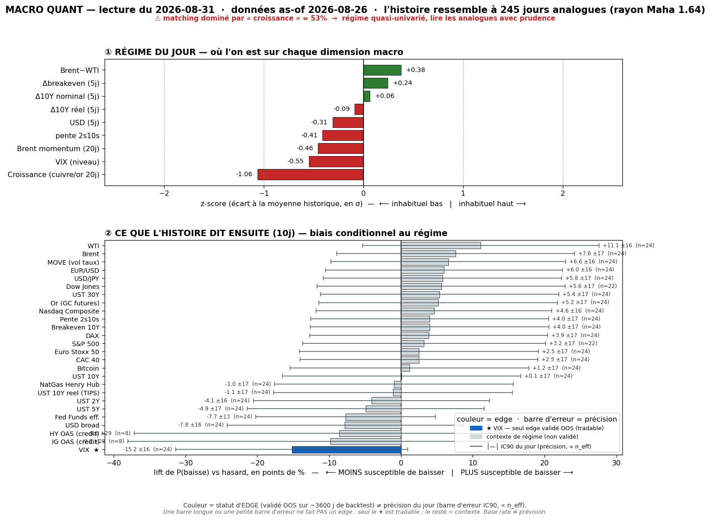
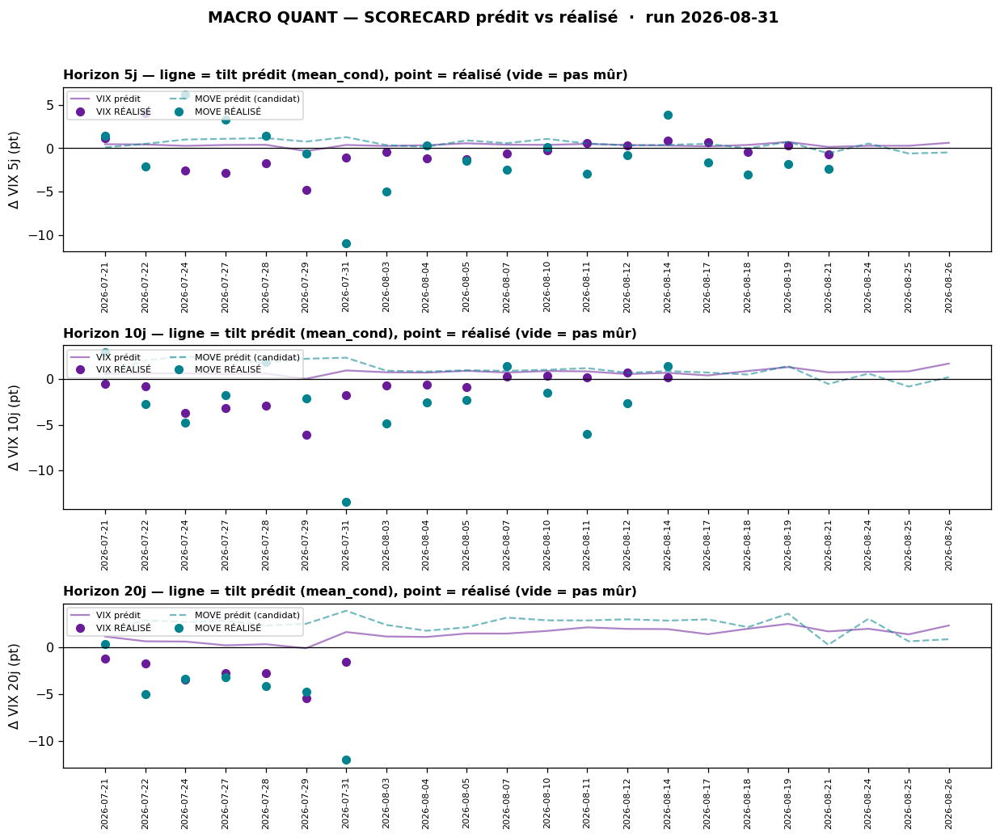

# Macro Quant Daily — Couche 2 (base rates conditionnels)

> **Couche 2 = les ODDS**, pas le OÙ. Répond « à quelle fréquence un régime historiquement comparable a été suivi de tel move ». **Le chiffre utile = LIFT** (P_cond − P_uncond), jamais P_cond seule. Base rate ≠ prévision.
> **Données as-of 2026-08-26** (latence FRED ~3-4 j vs run 2026-08-31). Feature dominante = **`growth` (53 % de la distance de matching)** — le régime est piloté par la croissance faible, pas par un choc pétrole/vol live.

## §1 — Régime du jour (features causales, expanding-z)
Analogues retenus : **n = 245** (rayon Mahalanobis 1.64). Tri par |z|.

| Feature | z | Sens |
|---|--:|---|
| growth | **−1.06** | Croissance nettement sous sa norme — **dominante (53 %)** |
| vix_lvl | −0.55 | VIX bas = complaisance |
| brent_mom | −0.46 | Momentum Brent négatif |
| slope (2s10s) | −0.41 | Courbe qui s'aplatit légèrement |
| brwti | +0.38 | Spread Brent-WTI qui s'écarte |
| dusd_5 | −0.31 | USD qui se détend (5 j) |
| dbe_5 | +0.24 | Breakevens 5 j en légère hausse |
| dreal_5 | −0.09 | Taux réels ~stables |
| d10_5 | +0.06 | 10Y ~stable |

**Lecture régime** : *soft-growth + complaisance vol + easing pricé* (USD mou, courbe qui s'aplatit). Pas de choc exogène live — `growth` domine le matching.

## §2 — Base rates forward 10 j (horizon fixe pour TOUS, glanceable)
Lift = mean_cond − mean_uncond (en points/unités de l'asset). Tag : 🔴 n_eff<20 · 🟡 20-60 · 🟢 >60. **statut** : 🎯 = skill OOS validé (direction exploitable) · `ctx` = contexte de régime, **direction non exploitable** (IC OOS ≈ 0 au backtest).

| Asset | lift 10j | cond | uncond | n_eff | tag | statut |
|---|--:|--:|--:|--:|:--:|---|
| VIX | **+1.67** | +1.68 | +0.01 | 24 | 🟡 | 🎯 vol-up |
| HY OAS | +3.33 | +1.83 | −1.50 | 8 | 🔴 | ctx (n_eff faible) |
| UST 30Y | −1.60 | −1.52 | +0.08 | 24 | 🟡 | ctx |
| Breakeven 10Y | −1.58 | −1.59 | −0.01 | 24 | 🟡 | ctx |
| Fed Funds | −1.41 | −1.74 | −0.33 | 24 | 🟡 | ctx |
| UST 10Y | −1.28 | −1.29 | −0.01 | 24 | 🟡 | ctx |
| WTI | −1.25 | −1.16 | +0.10 | 24 | 🟡 | ctx |
| Brent | −1.01 | −0.90 | +0.11 | 24 | 🟡 | ctx |
| Bitcoin | +0.84 | +2.54 | +1.70 | 24 | 🟡 | ctx |
| UST 5Y | −0.75 | −0.82 | −0.07 | 24 | 🟡 | ctx |
| 2s10s | −0.69 | −0.57 | +0.12 | 24 | 🟡 | ctx |
| IG OAS | +0.60 | −0.01 | −0.61 | 8 | 🔴 | ctx (n_eff faible) |
| UST 2Y | −0.59 | −0.73 | −0.13 | 24 | 🟡 | ctx |
| DAX | −0.59 | −0.31 | +0.28 | 24 | 🟡 | ctx |
| S&P 500 | −0.51 | −0.00 | +0.51 | 22 | 🟡 | ctx |
| Dow Jones | −0.50 | −0.07 | +0.43 | 22 | 🟡 | ctx |
| CAC 40 | −0.46 | −0.38 | +0.09 | 24 | 🟡 | ctx |
| Euro Stoxx 50 | −0.46 | −0.37 | +0.09 | 24 | 🟡 | ctx |
| NatGas | +0.45 | +0.27 | −0.18 | 24 | 🟡 | ctx |
| Nasdaq | −0.40 | +0.08 | +0.48 | 24 | 🟡 | ctx |
| Or | −0.25 | +0.14 | +0.39 | 24 | 🟡 | ctx |
| USD/JPY | −0.20 | −0.14 | +0.06 | 24 | 🟡 | ctx |
| MOVE | +0.16 | +0.19 | +0.04 | 24 | 🟡 | ctx (resp-only) |
| USD broad | +0.14 | +0.18 | +0.04 | 24 | 🟡 | ctx |
| EUR/USD | −0.14 | −0.16 | −0.02 | 24 | 🟡 | ctx |

> **⚠️ Un seul asset exploitable en direction = VIX.** Tout le reste est du **contexte de régime** (IC OOS ≈ 0 → présenté, pas parié). HY/IG OAS 🔴 n_eff=8 = quasi anecdotique. La cohérence *yields-down + oil-down + breakevens-down + equities lift négatif* décrit un **régime risk-off/disinflation modéré**, mais n'est PAS un pari directionnel action.

## §2bis — Term-structure VIX (seul asset à skill OOS)
| Horizon | lift | cond | n_eff | pneg_cond | CI90 | tag |
|---|--:|--:|--:|--:|:--:|:--:|
| 5 j | +0.61 | +0.62 | 49 | 44.9 % | [0.26, 0.99] | 🟡 |
| 10 j | +1.67 | +1.68 | 24 | 38.4 % | [1.25, 2.17] | 🟡 |
| 20 j | +2.26 | +2.28 | 12 | 43.3 % | [1.19, 3.46] | 🔴 |

Tilt **vol-up croissant avec l'horizon**, mais n_eff s'effondre (49→12) → le 20 j est 🔴, à lire comme direction, pas amplitude. **pneg_cond 38 % à 10 j** = le VIX monte ~62 % du temps dans ce régime (baseline 47 %) — mais **il baisse 38 % du temps** (contre-exemples non négligeables).

## §2ter — Track-record live du signal (prédit vs réalisé)

Scorecard VIX (calls mûrs, biais = réalisé − prédit) :
- **@5 j** : 19 calls mûrs · biais **−0.87 pt** (VIX a monté *moins* que prédit) · IC rang **+0.54** · 5/30 calls indépendants → 🔒 verrouillé en contexte.
- **@10 j** : 15 calls mûrs · biais **−1.97 pt** · IC rang **+0.68** · 2/30 indép.
- **@20 j** : 7 calls mûrs · biais **−3.31 pt** · IC rang **+0.79** · 1/30 indép.

> **Lecture honnête** : le modèle **sur-prédit l'amplitude** de la hausse VIX (réalisé systématiquement sous le prédit → tilt recalibré par shrink w=0.41-0.66), MAIS le **classement (rang) reste bon** (IC +0.54 à +0.79). (a) Fenêtres chevauchantes + régime persistant ⇒ calls corrélés, hit-rate non parlant tant que l'échantillon indépendant est petit (2-5/30) — track-record qui **se remplit dans le temps**. (b) VIX = verdict, MOVE = contexte (série `^MOVE` souvent périmée, non notable). (c) Ne PAS invalider le signal du jour là-dessus : le tilt vol-up reste directionnellement correct, il faut juste **dé-scaler l'amplitude** (~×0.6 à 10 j).

## §3 — Conclusion statistique
- **Régime** : soft-growth (`growth` z −1.06, dominante) + complaisance vol + easing pricé.
- **Seul pari lisible (VIX)** : tilt **vol-up** à 10 j (lift +1.67, recalibré ~+1.0 pt après shrink), monte ~62 % du temps. Usage = **contexte-vol / multiplicateur de conviction pour DÉ-SIZER** partant d'un VIX bas — **PAS** un trigger, PAS un achat de hedge de queue (réfuté net de coûts en C5).
- **Contexte cohérent (non exploitable)** : yields-down / breakevens-down / oil-down / equities lift négatif = décor risk-off-disinflation modéré. À lire comme toile de fond, pas comme signal d'entrée.

## §4 — Confrontation Couche 1 ↔ Couche 2
- **Pas de `Macro/Daily` daté 2026-08-31** (dernier = 2026-08-28). Confrontation partielle.
- Là où ça **converge** : Couche 2 vol-up + complaisance (VIX bas) rejoint la prudence haussière du Cockpit Rotation (US re-concentration IA, pas de broadening sain). Régime « rien à sur-sizer » cohérent des deux côtés.
- **Priorité Couche 1 live** en cas de choc : as-of quant lagué au 2026-08-26, `growth` domine le matching → un catalyseur des 3 derniers jours n'est **pas** capturé ici.

## §5 — À rerunner
- Cadence **daily** via `python3 Macro/Quant/engine/macro_quant/macro_quant_daily.py` (vintage fraîche 1×/j, base append-only, idempotent).
- Backtest OOS **trimestriel** (`macro_quant_backtest.py`) = re-teste l'univers validé (VIX seul aujourd'hui ; MOVE candidat resp-only).
- Cockpit : [[Cockpit Quant]].

---
*Source : `/tmp/macro_quant_report.json` (moteur 2026-08-31, as-of 2026-08-26). Chiffres dérivés de features causales + base rates bootstrap, reproductibles → hallucination-risk LOW. Filtre OOS : VIX seul exploitable en direction ; tout le reste = contexte de régime. decay-date 2026-09-07.*
