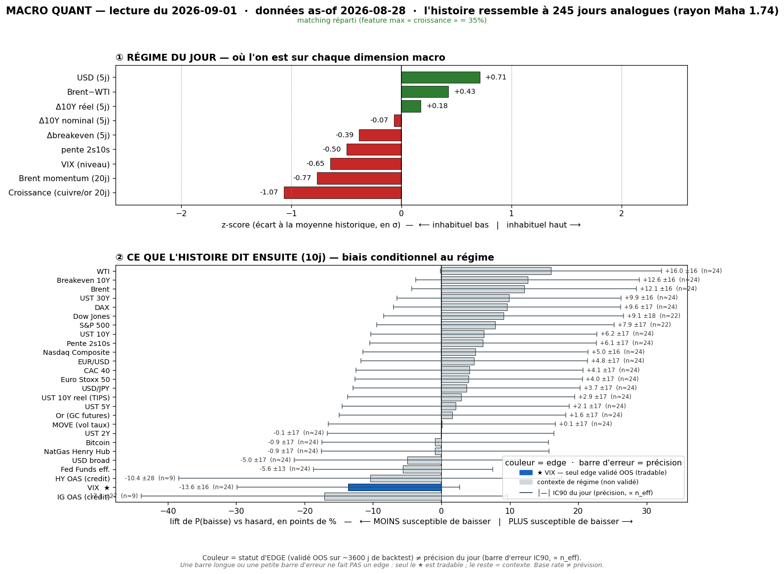
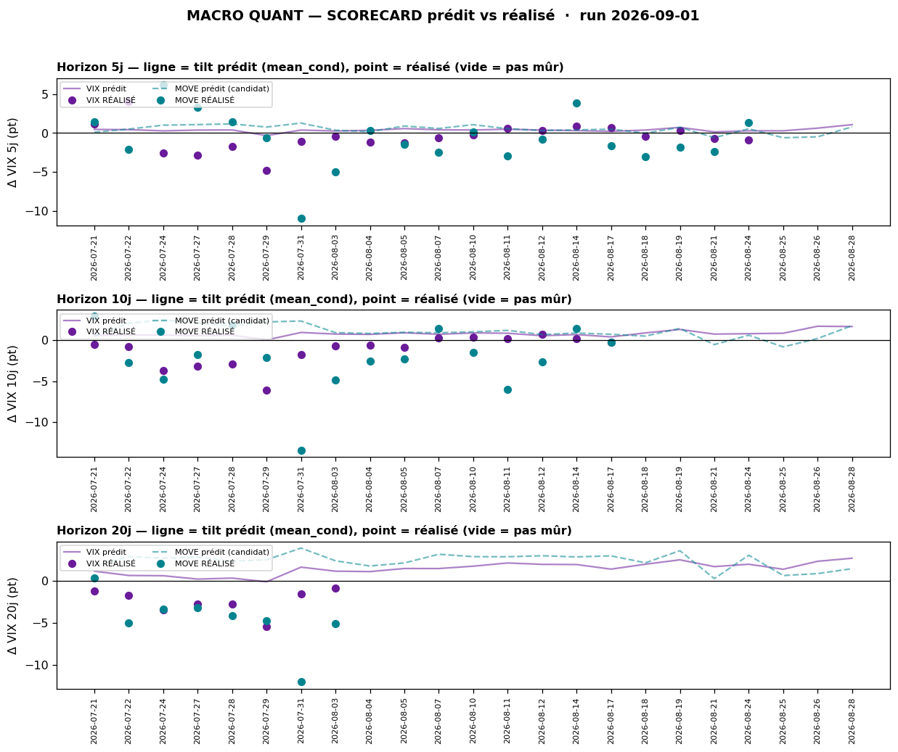

# Macro Quant Daily — 2026-09-01 (données as-of 2026-08-28)

> **Couche 2 — les ODDS.** À quelle fréquence un régime historiquement comparable a été suivi de tel move. Le chiffre utile = **lift** (P_cond − P_uncond), jamais P_cond seule. Base rate ≠ prévision. **Filtre OOS dur** : direction exploitable **VIX seul** ; tout le reste = contexte de régime (IC OOS ≈ 0).

> ✅ **Latence week-end résorbée.** Les données FRED avancent au **28/08** (contre 26/08 figé sur les runs 28/08 et 31/08, week-end) → la vintage **capture enfin la séance Warsh (28/08)**. Plus de feature dominante (`growth` 34,9 %, flag False) — match plus équilibré qu'au 28/08 (mono-feature growth 53 %). La note du 31/08 (as-of 26/08, données identiques au 28/08) reste valable comme réplique week-end ; **celle-ci est le premier run post-Warsh à jour.**

## §1 — Régime du jour (z-scores, as-of 2026-08-28)

Analogues retenus : **245** (rayon Mahalanobis 1,74 · k-impulse 5). **Pas de feature dominante** (`growth` 34,9 %, flag False).

| Feature | z | Sens |
|---|---|---|
| growth | **−1,07** | proxy croissance nettement sous tendance (feature la plus pesante, 34,9 %) |
| brent_mom | −0,77 | momentum Brent qui casse à la baisse |
| dusd_5 | **+0,71** | USD broad en **hausse** sur 5j (bascule hawkish vs repli des jours précédents) |
| vix_lvl | −0,65 | VIX bas |
| slope | −0,50 | pente 2s10s qui s'aplatit |
| brwti | +0,43 | spread Brent-WTI encore légèrement positif |
| dbe_5 | −0,39 | breakevens 10Y en **baisse** (désinflation) |
| dreal_5 | +0,18 | taux réels quasi neutres |
| d10_5 | −0,07 | 10Y quasi neutre |

> Signature : **growth-scare + jambe hawkish/désinflation** — croissance molle + oil qui casse, MAIS **USD qui remonte (dusd_5 +0,71) et breakevens qui baissent (dbe_5 −0,39)**. Bascule vs 28/08 : ce n'est plus un pur risk-off détente, c'est un ralentissement **avec USD ferme et inflation anticipée qui reflue** (cohérent avec le post-PCE chaud + Warsh). Le VIX bas dans ces données est le carburant du signal vol-up ci-dessous.

## §2 — Base rates forward 10j (horizon fixe, tous assets — contexte glanceable)

Direction exploitable **VIX seul**. Toutes les autres lignes = **contexte de régime, direction non exploitable (pas de skill OOS)**.

| Asset | lift 10j | cond | uncond | n_eff | tag | statut |
|---|---|---|---|---|---|---|
| VIX | **+1,64** | +1,65 | +0,01 | 24 | 🟡 | **exploitable (OOS, SIG)** |
| MOVE (vol taux) | +1,72 | +1,76 | +0,04 | 24 | 🟡 | resp-only (SIG) |
| DFF Fed Funds | −0,94 | −1,27 | −0,33 | 24 | 🟡 | resp-only |
| UST 2Y | −2,51 | −2,65 | −0,14 | 24 | 🟡 | resp-only |
| UST 5Y | −3,10 | −3,17 | −0,08 | 24 | 🟡 | resp-only (SIG) |
| UST 10Y | −3,97 | −3,98 | −0,01 | 24 | 🟡 | resp-only (SIG) |
| UST 30Y | −4,36 | −4,28 | +0,08 | 24 | 🟡 | resp-only (SIG) |
| UST 10Y réel | −1,26 | −1,27 | −0,01 | 24 | 🟡 | resp-only |
| Breakeven 10Y | −2,70 | −2,71 | −0,01 | 24 | 🟡 | resp-only (SIG) |
| Pente 2s10s | −1,45 | −1,33 | +0,12 | 24 | 🟡 | resp-only (SIG) |
| HY OAS | +5,00 | +3,47 | −1,53 | **9** | 🔴 | resp-only (n_eff trop faible) |
| IG OAS | +1,33 | +0,72 | −0,61 | **9** | 🔴 | resp-only (n_eff trop faible) |
| USD broad | +0,13 | +0,17 | +0,04 | 24 | 🟡 | resp-only (SIG) |
| USD/JPY | −0,25 | −0,19 | +0,06 | 24 | 🟡 | resp-only (SIG) — yen bid (risk-off) |
| EUR/USD | −0,07 | −0,09 | −0,02 | 24 | 🟡 | resp-only |
| Brent | −1,80 | −1,69 | +0,11 | 24 | 🟡 | resp-only (SIG) |
| WTI | −1,92 | −1,83 | +0,10 | 24 | 🟡 | resp-only (SIG) |
| NatGas | +1,53 | +1,35 | −0,18 | 24 | 🟡 | resp-only |
| Or | +0,17 | +0,56 | +0,39 | 24 | 🟡 | resp-only |
| Nasdaq Comp | −0,48 | +0,00 | +0,48 | 24 | 🟡 | resp-only (SIG) |
| S&P 500 | −0,65 | −0,14 | +0,52 | 22 | 🟡 | resp-only (SIG) |
| Dow Jones | −0,74 | −0,31 | +0,44 | 22 | 🟡 | resp-only (SIG) |
| CAC 40 | −0,47 | −0,38 | +0,09 | 24 | 🟡 | resp-only (SIG) |
| DAX | −0,67 | −0,39 | +0,28 | 24 | 🟡 | resp-only (SIG) |
| Euro Stoxx 50 | −0,41 | −0,33 | +0,09 | 24 | 🟡 | resp-only |
| Bitcoin | +0,72 | +2,42 | +1,70 | 24 | 🟡 | resp-only |

> **Lecture contexte (non exploitable) :** template **risk-off/growth-scare** encore plus marqué qu'au 28/08 — **actions US+EU toutes en lift négatif** (S&P −0,65, Dow −0,74, DAX −0,67 SIG), **taux forward en forte baisse** (30Y −4,36, 10Y −3,97, breakeven −2,70 SIG = flight-to-quality + désinflation), **USD+yen bid** (USD/JPY −0,25 SIG), **oil en forte baisse** (Brent −1,80, WTI −1,92 SIG), **vol taux en hausse** (MOVE +1,72 SIG). Cohérent avec l'analogue growth-scare. **Rien de tradeable hors VIX** (IC OOS ≈ 0). Crédit HY/IG = **n_eff 9 → 🔴, à ignorer**.

## §2bis — Term-structure VIX (seul asset à skill OOS)

| Horizon | lift | cond | uncond | n_eff | tag | SIG | CI90 | rang live |
|---|---|---|---|---|---|---|---|---|
| 5j | +1,06 | +1,07 | +0,01 | 49 | 🟡 | **oui** | [+0,59 ; +1,54] | P100 |
| 10j | **+1,64** | +1,65 | +0,01 | 24 | 🟡 | **oui** | [+0,94 ; +2,38] | P96 |
| 20j | +2,62 | +2,64 | +0,02 | 12 | 🔴 | oui | [+1,41 ; +4,05] | P100 |

> **Signal vol-up qui s'intensifie** : SIG sur les 3 horizons, CI strictement >0 partout, **rang live P96-P100 sur tous les horizons = extrême**. Le 5j est passé P95→P100 vs 28/08. Configuration **complacency textbook** (VIX bas −0,65z + tilt vol-up extrême). **Usage** = cadran de dé-sizing / resserrement. **Interdit** : trigger directionnel, short-vol, hedge de queue. Contre-exemple : même à P100, le VIX baisse quand même **~40 %** du temps à 10j (pneg_cond 40,0) — et c'est précisément ce qui s'est produit ces 4 dernières semaines (§2ter).

## §2ter — Track-record live (scorecard : prédit vs réalisé)

Calls @10j récemment mûrs — **le signal vol-up a lourdement raté, le VIX a baissé** pendant tout le drift :

| as-of → échéance | prédit | réalisé | dir. |
|---|---|---|---|
| 29/07 → 26/08 | +2,46 | **−4,74** (74,2→69,4) | ❌ |
| 31/07 → 28/08 | +3,85 | **−12,05** (83,0→71,0) | ❌ |
| 03/08 → 31/08 | +2,34 | **−5,16** (80,5→75,3) | ❌ |

| Horizon | calls mûrs | biais réalisé−prédit | IC rang | tilt recalibré (shrink) | porte promo |
|---|---|---|---|---|---|
| 5j | 20 | −0,89 pt | +0,54 | +0,48 pt | 5/30 · 🔒 verrouillé contexte |
| 10j | 16 | **−1,88 pt** | +0,60 | +0,49 pt | 2/30 · 🔒 verrouillé contexte |
| 20j | 8 | −3,15 pt | +0,81 | +1,24 pt | 1/30 · 🔒 verrouillé contexte |

> **Honnêteté brutale** : le base rate vol-up **a perdu de l'argent tout le mois d'août** — les 3 derniers calls @10j mûrs ont tous prédit vol-up et réalisé **vol-down franc** (jusqu'à −12 pt sur le call 31/07). Le VIX a **baissé** pendant que le modèle criait vol-up. Pourtant aujourd'hui le signal re-flashe P96-P100. Deux lectures cohabitent : (i) le tilt brut est si extrême qu'il **survit à la recalibration** (+0,49 pt @10j net du biais −1,88) → le modèle « insiste » ; (ii) MAIS le track-record dit que cette insistance a été systématiquement démentie en régime de complaisance persistante. **Caveats obligatoires** : (a) les 3 calls mûrs sont chevauchants/corrélés → PAS un 0/3 indépendant ; le sous-échantillon indépendant reste **5/2/1 sur 30** → hit-rate non parlant, se remplit dans le temps ; (b) MOVE = contexte seul ; (c) **ne PAS trader ce signal en direction** — il reste un cadran de contexte, et son track-record récent invite à la **prudence sur sa fiabilité de niveau**. Signal **🔒 verrouillé en contexte** (non promu).

## §3 — Conclusion statistique

- **Signal directionnel exploitable (VIX) :** **vol-up extrême et persistant** (lift 10j +1,64 SIG, rang P96-P100 sur les 3 horizons, survit à la recalibration sur tous). Sur le papier c'est le signal le plus fort de la séquence. **MAIS** son track-record d'août est un **désaveu net** (VIX baissé de 4 à 12 pt là où il prédisait la hausse). Conclusion mesurée : **contexte-vol haussier à traiter comme signal de prudence/dé-sizing, PAS comme conviction** — d'autant que le régime de complaisance qui l'a fait échouer tout le mois est **toujours en place** (VIX bas −0,65z). Le signal ne « paiera » que si un catalyseur casse enfin la complaisance.
- **Contexte de régime (non exploitable) :** template **risk-off/growth-scare + désinflation** homogène et intense (actions down SIG, taux down SIG, oil down SIG, USD/JPY bid, MOVE up). Toile de fond prudente, **jamais des paris** (IC OOS ≈ 0).
- **Fiabilité du run :** match plus équilibré qu'au 28/08 (dominance growth retombée à 34,9 %), données à jour (28/08, post-Warsh). Latence oil résiduelle légère (feature brent_mom au 28/08).

## §4 — Confrontation Couche 1 ↔ Couche 2

⚠️ **Pas de Macro Daily du 01/09** (dernier = [[Macro/Daily/2026-08-28 - Macro Daily]], jour de Warsh) → confrontation live limitée, à recroiser dès qu'un daily est produit.

- **Rappel Couche 1 (28/08, dernier live)** : jour de Warsh, VIX rebâti à **17,44** (hedge dans l'event), « la vol est le seul tell prudent », crédit ferme (HYG 79,86), coil au contact du pivot 7 757. Les données du run capturent désormais cette séance (as-of 28/08).
- **CONVERGENCE — la vol.** Le signal Couche 2 vol-up P96-P100 **prolonge** le tell prudent de la Couche 1 (VIX rebâti dans Warsh). Les deux pointent un **contexte-vol haussier latent** → posture de **resserrement/dé-sizing** maintenue. Mais le track-record d'août tempère : la même configuration a échoué 4 semaines de suite → **conviction basse tant que la complaisance n'est pas cassée**.
- **DIVERGENCE (rappel du 28/08) — taux.** Couche 2 = template growth-scare → **taux forward en forte baisse** (flight-to-quality), tandis que le live du 28/08 était **hawkish/rates-firm** (post-PCE). Le moteur matche un ralentissement/désinflation ; le narratif live restait « Fed hike this year ». **Priorité Couche 1 live** pour la direction taux (et resp-only de toute façon). À réarbitrer avec le prochain daily : le ton post-Warsh a-t-il basculé vers le growth-scare que le moteur capte ?
- **À faire** : produire le `/macro-daily` du 01/09 pour recroiser proprement — notamment vérifier si le VIX **monte enfin** (validation live du signal vol-up récurrent) ou continue de bleed (nouveau démenti).

## §5 — À rerunner

- **Aujourd'hui** : lancer `/macro-daily` (aucun daily depuis le 28/08) pour la confrontation Couche 1 live — priorité, car 3 séances (29/08 week-end, 31/08, 01/09) sans mise en condition.
- **Suivre le VIX live** : le signal vol-up re-flashe pour la ~5ᵉ séance ; **premier vrai test** = un catalyseur de rentrée (payrolls US vendredi 05/09 ?) casse-t-il la complaisance → le signal paie-t-il enfin, ou 5ᵉ démenti ?
- **Backtest trimestriel** : prochain `macro_quant_backtest.py` (+ `analyze_db.py`) pour re-tester MOVE et confirmer VIX comme seul asset OOS validé.
